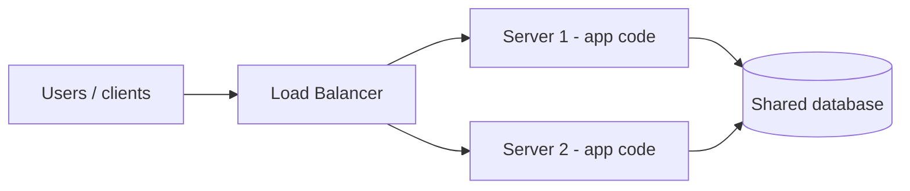

# What is System Design?

The foundation of the whole map — why "code that works" is not the same as a system that survives millions of users. Everything else in these notes hangs off one story told here, so I'm keeping this page tight. Interview gold.

## The opening complaint

- The complaint that starts it all: **"the bank is very slow."**
- No jargon yet — just an annoyed customer staring at a queue.
- The bank has **one cash counter and one cashier**. One person, one window, every customer funneled through the same spot.
- This is the shape of every scaling problem I'll see in interviews: **one resource doing all the work**, queue forming behind it.
- The trick: stay inside this bank metaphor for five issues, and each fix we invent turns out to be a real system-design term.

---

## The Alien Bank story

We're building the **Alien Bank** (the bank gets a fun name). One operation only: a single cash counter, one cashier.

Customer cycle — four steps:

- Visit the counter
- Withdraw or deposit
- Take the receipt from the cashier
- Transaction done, purpose fulfilled

Pedagogy stated up front: face **five issues**, and every solution teaches one system-design concept.

### Issue 1 — the process is just slow

- Cashier takes **~10 minutes per customer**.
- The math: 60 / 10 = **only 6 customers per hour** get served. Rush hour breaks this bank instantly.
- Where the 10 minutes goes — three sinks:
  - Understanding the requirement (deposit? withdraw? back-and-forth conversation)
  - Manual cash counting
  - Preparing the receipt
- Owner's fix: **ask the cashier to be smarter and faster** — train to count rapidly, train to type fast.
- No new hardware, no extra people. Pure skill.
- Result: **10 min → 5 min per customer = 50% process improvement.**
- Later mapped to: **code quality** — this is where LLD and DSA apply (optimize a slow loop, rewrite it as a for-each; no new servers).

### Issue 2 — customer count is increasing

- The bank itself is growing fast; the cashier is already at peak — can't train further.
- Fix targets the *workstation*, not the person:
  - Enlarge the desk/counter
  - Cash-counting machine
  - Advance form so the requirement is captured before reaching the counter (kills the interaction time)
- Result: **5 min → 3 min per customer.**
- Later mapped to: **vertical scaling** — "increase the size of our table," upgrade *the current* server only. An explicit limit exists: past a point you can't upgrade further.

### Issue 3 — people are still waiting

- At 3 minutes each with a **single counter**, the **10th customer waits 27 minutes** (9 customers ahead × 3 min).
- Root cause is no longer skill or hardware: there is only **one cash counter**.
- Fix: **add a second cash counter** — two parallel service points, customers choose either.
- Later mapped to: **horizontal scaling** — add more servers instead of fattening one.

(this one always trips me up in interviews — 27 min is 9 × 3, not 10 × 3.)

### Issue 4 — two counters, two versions of the truth

- Failure mode 1: counter 2 doesn't know a customer who has a valid account at counter 1 — can't serve them.
- Failure mode 2, the bad one: **double withdrawal** — withdraw at counter 1, then again at counter 2. Data isn't synced, so the bank loses money.
- Fix: **one shared register** — a **centralized database** both counters validate against, retrieving and inserting the same account balance.
- Later mapped to: centralized vs distributed database architecture.

### Issue 5 — the idle counter by the gate

- The bank gate sits near counter 1, so most customers pile up there while counter 2 sits idle → wasted capacity, longer waits.
- Fix: a **middleman** customers go to first. He inspects per-counter load — say 10 at counter 1 vs 5 at counter 2, so route the next customers to counter 2 until it balances 11/11.
- Bonus: if counter 1 is down, the middleman routes everyone to counter 2 until it's repaired.
- Later mapped to: the **load balancer**.
- Load balancer's two duties (worth stating twice): **check whether servers are healthy**, and **distribute requests equally across multiple servers**.

---

## ASCII sketch — how the bank evolved

```text
 start:   [ customer ] --> [ 1 counter / 1 cashier ]
                                10 min -> 5 -> 3 min
                                10th customer still waits 27 min

 +counter 2 (horizontal scaling):

          [ customer ] --?--> [ counter 1 ]
                           \-> [ counter 2 ]
                                out of sync -> DOUBLE WITHDRAWAL

 +middleman + shared register (final form):

                    +--> [ MIDDLEMAN = LOAD BALANCER ]
                    |          |              |
                    |          v              v
   [ customers ] ---+     [ counter 1 ]  [ counter 2 ]   (servers + app code)
                           \              /
                            \            /
                       [ SHARED REGISTER = CENTRALIZED DB ]
```

---

## Five issues → five concepts

- Issue 1 (slow cashier) → **code quality** — better logic, LLD, DSA; no new hardware
- Issue 2 (bigger workstation, counting machine, advance form) → **vertical scaling** — upgrade the current server; hard ceiling
- Issue 3 (27-min queue, one counter) → **horizontal scaling** — add more servers
- Issue 4 (double withdrawal) → **centralized database** — one source of truth every server shares
- Issue 5 (idle counter, traffic skew) → **load balancing** — route by health and by load

> Interview takeaway: all five fixes started as a story problem in a bank, not as buzzwords. Rebuild the story and the vocabulary comes with it.

---

## The quote worth memorizing

> "Anyone can write a code that works. A system design is what makes it work for millions of people at once."

- Code works for 10 users at deploy time; the real test is **10 million concurrent users**.
- Named apps that must survive millions of simultaneous users: WhatsApp, YouTube, Instagram, Amazon.
- Interviews: companies won't literally label it "a system design round," but they expect you to decompose a complex problem and solve it.

---

## So what is a system, really?

- **system = components + common goal** — a collection of components working together towards a common goal (one shared purpose, possibly spanning multiple use cases).
- "Design" = choosing components and organizing them around requirement analysis (detail deferred to later notes).
- House rule visible throughout the story: **one component = one responsibility** — cashier serves, register holds the truth, middleman routes.
- Discovered vs engineered: the human body has digestive and respiratory systems — pre-built, we can only do "surgery." IT systems are built by engineers, so *we* pick components per requirement and improve them as load and traffic grow. That freedom is the whole point of system design.

---

## The analogy, one-to-one

No table needed — just line them up:

- **Customers in queue** = requests / traffic
- **Middleman** = load balancer
- **Cash counter** = server
- **Cashier (person at the counter)** = application code
- **Shared register** = centralized database

---

## The evolved bank as a real architecture

Same story, now drawn the way an interviewer expects to see it — users hitting a load balancer, servers running the app code, one shared database behind both:



---

## Mapping it to real components — what comes next

The story already contains the full architecture. From here the map unpacks each piece, one at a time:

- **Client** — mobile app, web app, even an ATM: what the "customer" became
- **DNS** — how a name becomes an address before any request is served
- **Content Delivery Network (CDN)** — putting data physically closer to users
- **Load Balancer** — our middleman: health checks + equal request distribution
- **Application Servers** — where the application code (the cashier's skill) actually runs
- **Database** — the shared register; SQL vs NoSQL categories come later
- **Cache** — frequently used data held close so the database isn't hit every time
- **Message Queue** — the async courier between services (order placement → SMS/mail notification example)

> Data is at the core of every system: WhatsApp, Snapchat, Instagram, YouTube, LinkedIn, Netflix, Amazon, Flipkart all ultimately deliver just images, video, audio, and text. The job is making that data available to users in the form they expect.

---

## High-level design vs low-level design

- **HLD (high-level design)** — the boxes and arrows: which components exist, what talks to what, the protocols between them (REST, gRPC, messaging), and the trade-offs among the pieces. This is exactly what these notes train.
- **LLD (low-level design)** — the code inside one box: classes, interfaces, data structures, the internal algorithm of a single service. That's the cashier's skill again.
- The story splits the two cleanly: fixing Issue 1 (train the cashier to be faster) is LLD — the code-quality fix with no new hardware. Issues 2-5 are HLD — new workstations, a second counter, a shared register, a middleman.
- Interview move: say which level you're on out loud. "The component diagram is HLD; the algorithm inside this service is LLD" — that split reads as knowing where the question is headed.

## The seven moving parts (cheat-sheet)

Every realistic diagram ends up picking from the same seven components; only the sizes change. Each one maps back to a character in the bank:

- **Client** — the surface users touch: web, mobile, ATM. It captures input and renders output; it should hold no shared state.
- **DNS** — the phone book of the internet: a domain name becomes an IP before any connection can start.
- **CDN** — keeps static media near users geographically, so a request never crosses the planet for a logo or a thumbnail.
- **Load balancer** — the middleman: health-checks servers and spreads requests so no single box eats the peak.
- **Application servers** — where the business logic runs; they must be stateless so they can be added and removed horizontally.
- **Database** — the shared register, the source of truth; SQL vs NoSQL is chosen by access pattern, not fashion.
- **Cache + message queue** — not always on the first sketch, almost always in the final one: the cache keeps hot reads close, the queue absorbs bursts and decouples slow work from the request path.

```
client -> load balancer -> app servers -> cache -> database
           |                   |               (write path)
           |                   +-> message queue -> workers
           +-> CDN  (static media served without touching the app)
```

> One-sentence version: users hit a load balancer, stateless servers behind it share a database, a cache sits in the hot read path, and a queue carries everything that shouldn't run inline.

## Capacity math — running the story forward

- One counter at 6 customers/hour is the seed of every scale number in these notes. Push the same story to real traffic and the shapes stay identical:
  - A production system is sized in **RPS (requests per second)**, not customers per hour. 1M daily active users × 10 requests each ≈ 10M requests/day ÷ 86,400 s ≈ **116 RPS** on average; a 10x spike means the design must hold ~1,160 RPS.
  - Storage swells the same way: 1M users × 10 KB of profile ≈ **10 GB** (one server's problem). 400M media objects × 500 KB ≈ **200 TB** — a different league, which is exactly why object storage and CDNs exist.
  - The written habit: multiply DAU by requests-per-user for the RPS target, and object count × average size × replica factor for the storage footprint. Two multiplications out-argue a hundred adjectives in an interview.
- The 10 min → 5 min → 3 min curve previews the same pattern: performance work shrinks the unit cost, and every architecture decision really is a multiplier decision on top of it.

## The 30-second interview arc

How this single note compresses into an answer when a design round opens:

1. Restate the requirement as a concrete story — the bank is what turns "design a checkout" into something I can reason about.
2. Classify the workload before drawing (data-heavy vs compute-heavy — the [next note](02-data-vs-compute-intensive.md)).
3. Draw the five boxes: client → load balancer → servers → database, then add cache/queue where the hot path demands it.
4. Quote the requirements with numbers — availability, latency, peak — drawn from the [requirements note](03-functional-vs-nonfunctional-requirements.md).
5. Finish with the trade-off you accepted and the failure you designed around.

> A system design interview is mostly the Alien Bank at higher numbers — the same five problems, lived at 10 million users.

---

## Quick revision

- One counter, one cashier = one resource doing everything; the queue is the scaling problem.
- 10 min/customer → only 6 served per hour; train to 5 min (code quality), upgrade workstation to 3 min (vertical scaling).
- Single counter at 3 min each → 10th customer waits 27 min → add counter #2 (horizontal scaling).
- Two unsynced counters → double withdrawal → one shared register (centralized database).
- Gate skew + failed counter → middleman (load balancer: health check, then distribute equally).
- system = components + common goal; one component = one responsibility.
- "Anyone can write a code that works. A system design is what makes it work for millions of people at once."

## Interview questions

1. Walk me through the Alien Bank story — which of the five fixes maps to which system-design concept, and why?
2. You add a second server and suddenly get a double-withdrawal bug. What broke, and what is the fix?
3. What are the two core responsibilities of a load balancer, and what happens to traffic when one server dies?