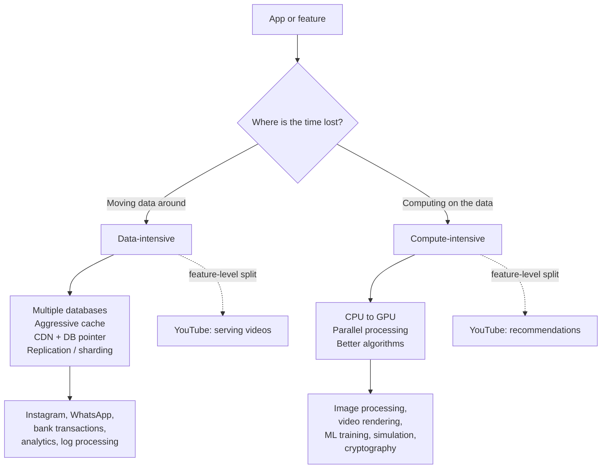

# Data-intensive vs Compute-intensive

Before drawing a single box, this is the fork in the road: is the system data-intensive or compute-intensive? Getting this wrong wastes money and points every later decision in the wrong direction — getting it right is pure interview gold. Follows on from [what is system design](01-what-is-system-design.md).

---

## The very first question

- The anti-pattern to call out: jumping straight into boxes — client, DB, cache, load balancer — **without understanding the app first**.
- > **First question before any solution:** *What is this application — data-intensive or compute-intensive?* Getting this right saves a lot of cost and steers the whole task correctly.
- Setup: two apps, same user count, same network, both facing **latency** (system taking time to respond).
- Candidate fixes on the table:
  - add multiple databases
  - add caching layers / update caching mechanism
  - upgrade GPU or CPU power
- Which vector you pick depends entirely on the type. Wrong vector = money burned on the wrong component.

---

## Data-intensive systems

- **Definition:** core focus is **data** — store it, gather it, move it, keep updating it as new data arrives, write lots of it.
- Calculation is *not* the focus; the job is just moving data DB -> client.
- Bottlenecks live on **our side**, never the client: slow database response, bulky/inefficient network calls, low server configuration. (We're not blaming the client or telling them to upgrade their CPU.)
- The well-known claim: **most applications you work on are data-intensive** — hence all the talk about cache enhancement and sharding.

### Instagram — the running example

- Feed is *not* solved with math; it's "gather a lot of data and show it."
- Feed operations: fetch posts -> sort by time or relevance -> show images/videos -> user ops: like, comment, share.
- The challenge: **millions of users reading and writing at the same time** on millions of pieces of content.
- How Instagram scales:
  - **Multiple databases** — data lives in several places.
  - **Aggressive caching** for fast get/store of hot data.
  - Images/videos are **not** stored in the DB directly — a **CDN** serves them; the DB stores only the location/pointer to the file.
- Crucial insight: to fix latency/scale, "we hardly touch the CPU… or GPU" — the bottleneck is **data movement between components**, not compute.

```
        mobile client
              |
     like / comment / feed request
              v
     +------------------+
     | application code |
     +------------------+
        |            |
    hot data      media file
        v            v
   +---------+   +-------+
   |  cache  |   |  CDN  |  <-- images & videos live here
   +---------+   +-------+
        |            ^ pointer only
        v            |
   +--------------------------+
   | multiple databases       |  <-- posts, likes, comments,
   +--------------------------+      users, metadata
```

### The four worries of data-intensive apps

1. How fast can we **read** data?
2. How **safely** do we store it?
3. How many users can use the **same data simultaneously**?
4. What if a **server / network call / database machine dies**?

- **Solution vocabulary** that grows out of these worries: databases, caching, replication, data sharding, data consistency.
- WhatsApp scale aside: handles roughly **2 to 10 million messages per day** — heavy data-intensive.
- Other examples named: bank transactions, analytics dashboards, log processing systems.

---

## Compute-intensive systems

- **Definition:** exactly the opposite of data-intensive — data retrieved from DB is **low**, but **calculations are heavy**.
- Focus shifts away from DB / caching / replication / sharding -> onto **CPU and GPUs**. Systems are **compute-bounded** (CPU/GPU bound).
- Typical examples:
  - image processing
  - heavy video rendering
  - ML model training / inference
  - simulation
  - cryptography

### The three worries (compute side)

1. How fast can we **compute**?
2. Can we do processes **in parallel** to show data faster? (user keeps using other features while the image processes in the background)
3. How to **reduce computational cost** — can we use GPU instead of CPU?

### The flight-simulator story

- A country hires many pilots yearly; can't spend on real aircraft for untrained pilots -> **simulator machines** train them first, then the real plane.
- Simulator must work **exactly like the actual machine** — terrain, earth, controls computed on the fly.
- That's heavy computation: **no amount of storage or caching fixes it**. Bigger disk = still have to compute every frame.
- Simulator worries: parallel processing? GPU vs CPU? reduce simulator cost? gather good algorithms to do the frequent tasks.
- Recap contrast: in data-intensive apps, focusing on GPU/CPU brings **no big change** — the issue lies in database, network calls, caching algorithms, or server.

---

## Where the money goes

- Components aren't free — putting money in the wrong place = "bad system design for the entire game."
- Money/scale argument: as the user base grows into the **millions**, both cost and architecture diverge. You *must* know which kind you are building before you spend.
- They are **not mutually exclusive**: modern apps do many tasks — intensiveness can depend on the **feature**, not the whole app.

### YouTube — the straddler

- Leans **data-intensive** for serving videos (billions of pieces of content to store, move, deliver).
- Leans **compute-intensive** for recommendations — it must analyze what you're watching to pick what you see next.
- Real systems **mix both**; classify per feature, not just per product.



---

## Capacity estimation, worked

Practice until the arithmetic is reflexive: take the biggest number you're given, multiply by usage, divide by seconds in a day.

- Feed example: **10M daily active users** each making **~20 requests a day** → 200M requests/day ÷ 86,400 ≈ **2,315 RPS** steady state. The architecture gets sized for the spike, not the mean — at a 3x sale-day peak that's ≈ **7,000 RPS**.
- Storage math: 10M users × 10 KB of profile = ~100 GB base; with 3 replicas for durability ≈ **300 GB** just for account metadata. Replication multiplies cost on purpose.
- Media is another league: 40M thumbnails × 500 KB ≈ **20 TB** → that's why images go to object storage/CDN and the DB keeps only a pointer.
- Rule of thumb: if you can express the problem as "requests × payload moved", it's data-intensive; if you can express it as "CPU-seconds of work", it's compute-intensive.

```
DAU 10M x 20 req/user = 200M req/day
                / 86,400 s
                v
        ~2,315 RPS steady      -> design for ~7,000 RPS at 3x peak
        ~100 GB source data    -> x3 replicas = ~300 GB
        40M media x 500 KB     -> 20 TB -> object storage + CDN
```

---

## The trick — classify in one beat

- > **If time is lost in data movement -> data-intensive. If time is lost in the computation itself -> compute-intensive.**
- "This one distinction saves you a lot of money, time and complexity."
- Practical loop:
  1. classify the issue (compute vs data)
  2. *then* pick components
  3. *then* fix
- Tiny sanity sketch of where the minutes go:

```
request arrives
      |
      v
+---------------+     data-intensive:     +------------------+
| spend the time|----> data moving   ---->| DB, cache, CDN,  |
| somewhere     |     between components  | network, servers |
+---------------+                         +------------------+
      |
      | compute-intensive:
      v
+------------------+
| CPU/GPU chewing  |  <-- image render, ML training,
| on the payload   |      simulation, crypto
+------------------+
```

- Wrong call in an interview (or production): pitching sharding and CDNs for a rendering job, or buying GPUs to serve an Instagram feed.

## My classification ritual

- Interview answer template I reuse: "First I'd classify the workload — data-intensive or compute-intensive. For X I'd call it data-intensive because the bottleneck is Y, and here's the number I'd estimate first."
- Then name the resource you expect to spend on (databases/cache/CDN vs CPU/GPU), and draw just enough boxes to prove it — three components that fit beat ten that impress.
- If a feature misfits the app's label (YouTube: serving videos vs recommending), split the answer per feature and say why the split changes the plan.

> Whole note in one breath: where is the time lost — moving data, or computing on it? Everything else is practice at that one answer.

---

## Quick revision

- First question always: **data-intensive or compute-intensive?** Classify before drawing boxes.
- Data-intensive = data volume, transfer, storage, accessibility is the bottleneck; compute is barely touched.
- Instagram playbook: multiple databases + aggressive caching + CDN for media (DB keeps only the pointer).
- Four data worries: fast reads, safe storage, many concurrent users, machine/network dies.
- Compute-intensive = CPU cycles are the bottleneck; fix with GPU, parallelism, better algorithms — storage won't help.
- The trick: time lost moving data -> data; time lost computing -> compute. One distinction, lots of money saved.
- YouTube straddles both: serving videos (data) vs recommendations (compute) — classify per feature.

---

## Interview questions

1. You're designing a photo-sharing feed that's getting slow at 10 million DAU. How do you decide between adding caches/databases and upgrading CPUs/GPUs — and what's your first question?
2. A flight-simulator vendor keeps hitting latency when rendering terrain. Why won't sharding or a CDN fix this, and what should you investigate instead?
3. YouTube seems like one system — where is it data-intensive, where is it compute-intensive, and does that change how you'd split the design interview answer?