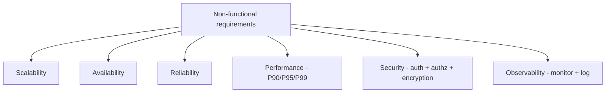

# Functional vs Non-functional Requirements

Every system design interview starts the same way — someone asks "what are the requirements?" and the whole interview is decided by how well you split your answer in two. The requirements-gathering phase is exactly where the interviewer probes for these two buckets (that flow lives over in [how a design interview runs](16-designing-a-system-interview.md)). This note covers the two buckets every requirement falls into: the **functional** (what the system does) and the **non-functional** (how well it does it), using Amazon as the running example. Get this split crisp and the numbers in your head, because interviewers love it.

## The split up front

Requirements come in exactly two flavours:

- **Functional requirements** = all the features, working, actions a user can take — "what our system is going to do."
- **Non-functional requirements** (NFRs) = quality attributes — "how well the system performs", how fast, how available, how secure.

The one-liner I keep repeating until it sticks:

> Functional = **WHAT** the system does. Non-functional = **HOW WELL** it does it.

That one line is basically the whole lecture. Everything below is just practice unpacking it.

```
A requirement is either...

  FUNCTIONAL                          NON-FUNCTIONAL
  "the system must..."                "the system must ... within / at / even when ..."

  register account                      respond in < 200 ms
  add to cart                           stay up ~99.9% (max ~5 min down/day)
  place order                           absorb a 10x sale-day spike
  track order                           encrypt the data

       ^                                     ^
      WHAT it does                        HOW WELL it does it
```

To classify on the fly: if it's an action a user performs and you can demo it by clicking it, it's **functional**. If you can't click it but only *measure* it — time, uptime, scale, data safety — it's **non-functional**. "Search products" is functional; "search returns in under 200 ms" is non-functional. Same feature, two different buckets.

## Functional requirements — the WHAT

Functional requirements are the feature list. If you can click it, type into it, or watch it happen, it's functional. When the lecturer walked through Amazon he listed them in the exact order a customer would experience them:

1. Register
2. Log in
3. See products
4. Search products
5. Filter products
6. Add to cart
7. Apply coupon codes / promotions / discounts
8. Place order
9. Make payments
10. Track order

Also worth noticing: functional requirements are usually written from an **actor's** perspective — in this case the *user*. But there are other actors too: the *admin* (adding/removing products, managing coupons) and the *delivery partner* (updating the tracking status). Each actor gets their own set of functional requirements. In the Amazon walkthrough the lecturer kept it to the customer journey, but interviews love it when you add "and an admin would have a parallel set".


This whole chain is the functional requirement set. Each arrow is one thing the system must let a user do. Nothing here says *how fast* or *how reliably* — that's the second bucket.

### What each step demands

Worth walking the chain one by one, because each step quietly implies a whole subsystem behind it:

- **Register** — the system must accept a new account, validate the inputs and persist identity, so every later feature has a "who am I?" to hang on.
- **Log in** — the system must authenticate a returning user and keep that session alive for the rest of the journey — without it, "your" cart and "your" order mean nothing.
- **See products** — the catalog must be fetched and rendered on screen; a read against a big product data store is itself a requirement.
- **Search products** — the system must find matching items by name/keywords across a huge catalog — logically simple, notoriously heavy to make fast.
- **Filter products** — users must narrow the result set by attributes like category, price or brand; same data, sliced different ways.
- **Add to cart** — the system must let a user collect items before paying, as a temporary, user-scoped list that survives until checkout.
- **Apply coupons / promotions / discounts** — the system must accept codes and recompute cart totals — a business-rule layer sitting on top of the order math.
- **Place order** — the cart converts into a formal order record (items, address, totals); this is the write the business really cares *not* to lose.
- **Make payments** — the system must take money via the user's chosen method and confirm settlement; in real life this alone spawns gateways, retries and fraud checks.
- **Track order** — the system must surface the order status and shipping updates after payment; a read that walks the order through its lifecycle.

Notice every one of these is phrased as *the user can do X*. That's the tell for a functional requirement — it describes an action, not a quality of the action.

## Non-functional requirements — the HOW WELL

Functional requirements say *what*; non-functional requirements say *how well*. The same Amazon feature list could be implemented on a laptop in a basement — functionally identical. The NFRs are what force you to build a real distributed system:

Concrete numbers the lecturer gave for Amazon:

- **~1 million daily active users** — that's the load the system is designed around.
- **Response time under 200 ms per request** — the latency target users actually feel.
- **Availability ~99.9% uptime** — defined through **SLAs** (Service Level Agreements) and **SLOs** (Service Level Objectives).
- **SLA story**: Amazon promises in writing, e.g. max **5 minutes of downtime per day**. If they break the written agreement, customer companies can sue them. That's why SLAs are contracts, not vibes.
- **Peak traffic**: Black Friday / Diwali / Holi sales — normal users can jump up to **8-10x**; the system must absorb it without falling over ([caching](09-caching.md) is one of the first levers for eating that spike).
- **Security**: encrypt the data.
- **Fault tolerance**: no app is perfect — the system must track faults and fix them fast ([there's a whole note on that](14-fault-tolerance.md)).

> Interview gold: know the **5 minutes of downtime per day** framing. 99.9% availability sounds huge until someone works out the yearly number — roughly 8.77 hours a year. And 10x peaks on a sale day are a classic "how would you design for this spike?" trap.

### Why SLA/SLO matters to a customer

The SLA is where an NFR turns into money. When Amazon sells platform capacity to customer companies, availability stops being a nice-to-have: the customer's own storefront is down whenever Amazon is down, and *their* customers leave. So the agreement writes the number down — up to 5 minutes down per day, say — and if the provider crosses it, the written agreement is what gives the customer legal recourse (hence the "they can sue" line). The **SLO** is the target the engineering team works toward internally, and the **SLA** is the contract version with consequences attached. Same number, two different teeth: one is a goal, the other is a promise you're accountable for.

### Reading the Amazon numbers together

Individually each number is trivial; together they are the whole design brief:

- **~1M daily active users** is a *concurrency* problem — so many people reading and writing at once that a single server can't carry it, which is why the fix ends up being multiple databases, caches and load balancers rather than a bigger box.
- **< 200 ms per request** is a promise made **under load**, not on an empty dev machine. It only becomes hard when it has to hold while 1M users are hammering search and checkout at once.
- **10x peak** on Black Friday / Diwali / Holi means capacity is planned for the *peak*, not the average — the system is spec'd for the worst day of the year and mostly idle otherwise. That's the classic "over-engineering vs under-provisioning" tension.
- The **fault tolerance** line is the reality check: whatever you build, it *will* have faults, so the requirement is that you can detect and fix them quickly — which connects straight to observability below.

So the non-functional requirements aren't decoration; they're the reason the architecture looks the way it does. The functional list only tells you *what buttons to build*; the NFRs tell you the system has to burn money on scale, speed and resilience to be worth shipping.

## The generic NFR checklist

Beyond the Amazon-specific ones, the lecturer gave the generic list that shows up in every design discussion. This is the checklist to run when someone says "what are the requirements?":

- **Scalability** — the current server config is sized for today's capacity; what happens when it hits the ceiling? The decision is **horizontal scaling** (add more machines, spread the load) vs **vertical scaling** (beef up one machine — simpler but it tops out). Scalability only really gets *tested* under growth or a spike, which is why the 10x sale-day number is such a common probe.
- **Availability** — uptime guaranteed through SLAs/SLOs; the cloud provider's contract under your own system is the same idea one level down. Practically: 99.9% means the customer-facing number gets scrutinized, not the marketing blurb.
- **Reliability** — no data loss. If a write fails or a node dies, the data is still safe — order and payment data failing is how companies lose customers (or get sued, per the SLA story).
- **Performance** — the latency the user actually feels. Measured as percentile latencies **P90, P95, P99**, not averages (more below — this deserves its own paragraph).
- **Security** — **authentication** (who are you?), **authorization** (what are you allowed to do?), and encryption. The lecturer also stressed keeping the code modular so chunks use different APIs/modules efficiently.
- **Observability** — everything after production: monitoring and logging, tracking user behaviour, improving the system, finding and fixing bugs. It's the bucket that tells you *which* NFR is actually failing in the real world.

### Performance percentiles — P90, P95, P99

Average latency is a liar. If your average response time is 50 ms, that hides a long tail of requests taking a second — and it's the *tail* that makes a user hit refresh and leave. So latency is reported as percentiles: **P90** means 90% of requests finish under that value, **P95** under that higher value, **P99** under a higher one still. P99 is the ruthless one — it drags in the unlucky 1-in-100 request that suffered from a slow cache, a cold node, a network retry. "Response under 200 ms" becomes a real target only once you decide whether it's a P50, a P95 or a P99 promise.

### Authentication vs authorization vs encryption

Three words that interviewers lovingly separate: **authentication** answers "are you who you say you are?" (log in), **authorization** answers "and now that we know you, what are you actually allowed to do?" (a normal shopper must not hit the admin endpoint). Encryption is the data-protection layer — the lecturer flagged it as the security NFR for Amazon: encrypt the data, so even a leak doesn't expose plaintext. All three belong under the same security umbrella, but they're different questions and a good answer names each separately.

### Reliability vs fault tolerance

Easy to conflate, and the lecturer keeps them apart: **reliability** is about data not being lost — a failed write or a dead node must not eat the order. **Fault tolerance** is about the system keeping its head above water even when something inside breaks — "no app is perfect" was the exact framing, so you design to track faults and fix them fast rather than pretend they won't happen. Same general theme of "things go wrong", but one asks for data safety and the other asks for graceful survival (deep dive in [fault tolerance](14-fault-tolerance.md)).



Quick mapping to keep it straight — functional answers "does it do the thing?", non-functional answers "does it do the thing *well enough for millions of users*?":

```
FUNCTIONAL  ->  can a user place an order?         (feature)
NON-FUNC 1  ->  under 200 ms response time         (performance)
NON-FUNC 2  ->  99.9% uptime, max 5 min down/day   (availability)
NON-FUNC 3  ->  survives 10x Black Friday spike    (scalability)
```

## One more thing — the "pause and practice" homework

The lecturer ended with homework: while using Instagram, YouTube, Netflix, Prime, Flipkart, Amazon or WhatsApp, pause and write down 3-4 functional and 3-4 non-functional requirements for that app. Honestly — do this for two apps and the pattern becomes automatic. Match each feature against the buckets here: search in Instagram is functional, but "feed renders in under 200 ms" is non-functional. And it's the best interview warm-up, because in a real [design interview](16-designing-a-system-interview.md) the "what are the requirements?" opening is precisely where you're expected to rattle the two lists off before drawing anything.

---

## Quick revision

- Functional = WHAT the system does (the feature list); non-functional = HOW WELL it does it.
- Amazon functional chain: register → login → view → search → filter → cart → coupons → order → payment → track order.
- The non-functional buckets: scalability, availability, reliability, performance, security, observability.
- Amazon numbers to quote: ~1M daily active users, < 200 ms response, 99.9% availability (≈ a few minutes/day via SLA/SLO).
- 10x traffic spikes on Black Friday / Diwali / Holi sales — the system must scale for peaks, not averages.
- Security = authentication (who you are) + authorization (what you can do) + encryption.
- Performance is measured in P90/P95/P99 percentiles, never averages.

## Interview questions

1. You're asked to design Amazon. Walk me through the functional requirements first — then the non-functional ones. (Can you produce the 10-step chain *and* the 6 NFR buckets?)
2. Why 99.9% availability — what does that actually mean in minutes of downtime, and why are SLAs/SLOs mentioned together?
3. How do scalability and performance differ, and which one does a 10x Black-Friday spike test?