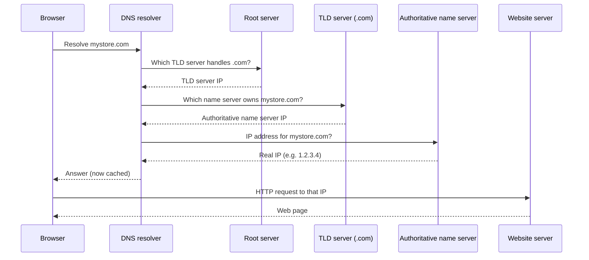
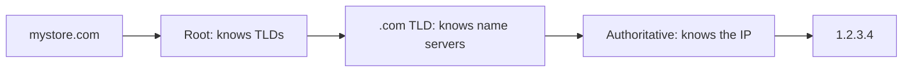

# DNS — the phonebook of the Internet

How does a browser know which server to hit for mystore.com — a name or an IP? Humans remember names, machines only speak IP addresses, and DNS is the quiet translator in between. It sits right after the components preview in [What is System Design?](./01-what-is-system-design.md), and interviews love asking how a lookup walks the chain — so this note is that walkthrough, end to end.

## Names vs numbers

- Starting question: "How does a browser know which web page to hit? By domain name or IP addresses?"
- **DNS = Domain Name System** — the phonebook of the Internet: it maps **domain names to IP addresses**.
- The core gap in one line: **"Humans communicate through names but systems don't communicate through names."** That single sentence is why DNS exists.
- Core vocabulary:
  - **Domain** — mystore.com, google.com, facebook.com.
  - **TLD (top-level domain)** — the tail segment: .com, .net, .gov, .in, .uk, .us, .edu.
  - **Subdomain** — docs.mystore.com, courses.mystore.com; the main domain acts as an umbrella over them.
- **Why the TLD is the routing key** — the root server's whole map is TLDs: .com queries go to the .com server, .in queries to the .in server. The lookup peels the name apart one level at a time.
- **Subdomains aren't separate domains** — docs. and courses. are entries under the same umbrella, which is why they later share a single **zone** (see the last section).

---

## Why we can't just hardcode IPs

Two "obvious" fixes, both dead ends — this is exactly why DNS had to become a whole distributed system.

### Fix 1: store the domain list inside the browser

- There are **350+ million registered domains**. A domain-to-IP table that big inside every browser means:
  - massive storage on every machine;
  - a heavier browser;
  - a performance hit for every user, forever.
- Worse, IPs are not stable. Real example: a domain was bought on **GoDaddy**, later moved to **Google Domains**, and the IP behind the name changed with it. If browsers held the list, you'd have to update every browser in the world.

### Fix 2: one central server holding the whole table

- A single machine holding the full 350M-row table (google.com → 1.2.3.4, and so on) is a **single point of failure**.
- Blast radius: every device online would ask that same box for every name lookup — one copy, no side door, nothing else to fall back on.
- If that box breaks, "the entire internet will break" — not one site, all of them, because no browser could translate any name into an address anymore.

### What both failures teach

- Fix 1 fails by copying the mapping to the edge (every browser in the world); Fix 2 fails by concentrating it in the middle (one server for the world).
- DNS does the opposite of both: a distributed set of small, specialized servers — nobody stores the whole table, and no single box holds the internet's fate.

> Interview takeaway: DNS exists because the mapping is too big to ship to every client, too volatile to hardcode, and too critical to centralize on one machine.

---

## The lookup chain

The resolver never needs the full table. Each hop only answers **"who do I ask next?"** until someone finally returns the real IP.

- The phonebook is never downloaded anywhere — not to the browser, not to the resolver. It gets *consulted*, one referral at a time, hop by hop.



Walk it end to end — a trace of typing **mystore.com**, narrating what each hop knows and doesn't know:

1. **Machine → ISP (or router) → DNS resolver.** All the browser holds is the name I typed — no IP yet — so the resolver takes over the quest.
2. **Resolver → root server.** Root flat-out doesn't know mystore.com's IP; roots never store individual site records. What it *does* know is TLDs, so it answers "ask the .com TLD server" and hands over that server's IP.
3. **Root → .com TLD server.** Resolver now asks: "who is authoritative for mystore.com?" The TLD still won't give the final IP — it returns the **authoritative name server's** IP instead.
4. **TLD → authoritative name server.** One question left. This server owns the records for the domain, so it finally returns the site's **real IP** (say, 1.2.3.4).
5. **Resolver → browser.** The answer is handed back — and the resolver has stored it for next time.
6. **Browser → site server directly.** HTTP call to that IP; the web page comes back. DNS is done.

The pattern worth memorizing: **root knows TLDs, TLD knows name servers, authoritative knows the IP.** Except for the last hop, every step only answered "who do I ask next?" — that's the recursive part of the lookup.

### Why the chain is shaped this way

- Nobody in the world holds the full 350M-row table: roots map only TLDs, each TLD tracks only the name servers for its extension, each authoritative server owns only its own zone.
- Authority is sliced by ownership instead of stacked on one machine — the single-point-of-failure disaster from Fix 2 structurally can't happen here.
- The **authoritative name server** is the only hop that truly *knows* mystore.com; everything above it is just a referral directory pointing at who to ask next.



Reading the chain twice is the trick that locks it in: resolver → root (which TLD?) → TLD (which name server?) → authoritative (final IP) → fetch the page.

Finding the address is only half the job — once the browser has the IP, the actual conversation with the server happens over [APIs](./05-apis.md), the next note.

```
resolver ──> root        "which TLD?"
         ──> TLD         "which name server?"
         ──> authoritative   "final IP?"
                            returns 1.2.3.4
browser ──> site (direct HTTP call) ──> web page
```

### Who actually runs the roots?

- **13 root servers**, logically labelled **A through M** — the thin top of the hierarchy that every single lookup for every site passes through.
- Not 13 physical machines — each letter is a **logical server with many replicas** behind it, run by **~30 organizations**.
- The replica point matters: even if one machine behind a letter fails, that letter still answers from elsewhere — the roots are built to avoid the exact single-point-of-failure trap from Fix 2.
- So quote the fact carefully in interviews: 13 identities, not 13 boxes (this one always trips people up).

---

## Caching — why the chain isn't that expensive

- Three extra lookups before you even reach the site do feel heavy — so they're paid **only the first time**. Afterwards the value comes from cache.
- **Three definite cache locations:**
  1. **DNS resolver cache** (held at the ISP).
  2. **Operating system cache**.
  3. **Browser cache**.

### What each cache actually holds

- **Browser cache** — the IP this browser got last time; every revisit or new tab in that browser answers instantly with zero network traffic.
- **Operating system cache** — the answer the whole machine got last time; any process (not just the browser) can reuse it without re-triggering the chain.
- **DNS resolver cache (ISP)** — shared by everyone behind that resolver. First visitor pays the 3-lookup cost; everyone else on the same ISP is served from the stored answer.
- Because the resolver caches, the root, TLD, and authoritative servers aren't hit by every browser on Earth — most questions die at the ISP tier.
- A cache only stays valid while its value does. When the IP behind a name changes — the GoDaddy → Google Domains move — older tiers keep serving the stale address until they're refreshed or cleared; that's why flushing DNS fixes "site won't load but it works on my phone."

### Cold path vs warm path

- The six-step walk above is the **cold path**: the first time this machine and its resolver have asked for the name.
- Every later visit is the **warm path**: whichever cache answers first ends the lookup — a browser hit never reaches the OS, an OS hit never reaches the ISP resolver.
- Roots, TLDs, and the authoritative server only ever see cold traffic. That's why "3 lookups feel heavy" stops being a worry after a single visit.

```
first visit:   browser → OS → resolver → root → TLD → authoritative   (full chain)
warm visit:    browser → OS → resolver   (stops at the first cache hit)
```

> Noted for interviews: if a site's IP changes and you still see the old one, you're probably looking at a stale cache tier — flushing DNS is literally clearing one of these three.

---

## Zones & registrars

- **Registrar** — where you register a domain name: GoDaddy, Hostinger. You buy mystore.com there, and zone settings are configured at the registrar.
- Configuring the zone at the registrar is what actually wires things up: it arranges which authoritative name server will speak for your domain and what records live under it — the apex name plus every subdomain entry.
- **Zone** — the set of records the **authoritative name server** holds for a name. Subdomains create entries inside the zone: the mystore zone holds mystore.com plus the docs. and courses. subdomains.
- Why they share one zone: docs.mystore.com and courses.mystore.com aren't separate purchases — they hang under the same umbrella domain, so the same authoritative server (the same zone) answers the final hop for all three names. There's no separate registrar setup for docs.; it's just another entry in the same zone.
- Earlier hops never touch your zone directly: root and TLD only ever point the resolver *toward* it — the zone gets contacted exactly once, at the final step of the chain.
- The registrar itself never sits in the lookup chain: once it has registered the name and holds your zone config, lookups only ever touch root → TLD → your authoritative server.
- Division of ownership, put simply: the registrar is who sold you the name; the zone on the authoritative name server is who actually answers "what's the IP?" for you and your subdomains. The lookup chain always ends at that zone.

---

## Record types, and the TTL that keeps caches honest

The zone on the authoritative server isn't one row per domain — it's a set of **typed records**, each answering a different question:

- **A** — name → IPv4 address (the classic lookup most people mean by a DNS record).
- **AAAA** — the same job for **IPv6** (quad-A).
- **CNAME** — a *canonical alias*: `www.mystore.com` → `mystore.com`, so a name inherits another name's records instead of duplicating them.
- **MX** — **mail exchange**: where `@mystore.com` email should be delivered.
- **TXT** — arbitrary text: SPF/DMARC email validation, `_acme-challenge` proofs, domain verification strings.
- **NS** — **name server**: which authoritative server holds this zone — the exact pointer a TLD lookup returns.
- **SOA** — **Start of Authority**: the zone's master record (primary NS plus refresh/retry/expiry timings) that defines the whole zone.
- Every record carries a **TTL (Time To Live)** in seconds — how long any cache (browser, OS, ISP resolver) may treat its answer as fresh.
- **TTL is a freshness-vs-traffic trade-off**: a short TTL (60s) propagates IP changes fast but re-queries constantly; a long one (86400 = one day) is cheap but keeps stale answers alive longer.
- Interview tie-in: "the site changed DNS but still hits the old server" is almost always a long TTL expiring — `dig` shows the remaining TTL on the record so you can predict when the flip completes.

---

## Quick revision

- DNS = Domain Name System, the phonebook mapping domain names → IP addresses; humans use names, machines need IPs.
- Can't ship 350+ million domains into every browser; can't hardcode IPs (GoDaddy → Google Domains changes them); can't run one central table (single point of failure).
- Chain: resolver → root (which TLD?) → TLD (which name server?) → authoritative (final IP) → browser fetches the page directly.
- 13 root servers A–M are logical identities with many replicas each, run by ~30 organizations — not 13 physical machines.
- Full lookup happens only the first time; after that, cache at the resolver (ISP), the operating system, or the browser answers.
- TLDs are the tails (.com, .net, .gov, .in, .uk, .edu); subdomains like docs.mystore.com hang off the main domain.
- Registrar registers the name (GoDaddy, Hostinger); the zone lives on the authoritative name server and holds typed records (**A, AAAA, CNAME, MX, TXT, NS, SOA**), each with a **TTL** that decides how long caches may keep the answer.

## Interview questions

1. Walk me through what happens from the moment I type mystore.com in a browser until the page loads — which DNS servers get involved, and what does each one answer?
2. Why can't we keep a single central server — or an in-browser table — mapping every domain to its IP address?
3. What is the difference between a root server, a TLD server, and an authoritative name server? Where do caching and zones fit into that picture?