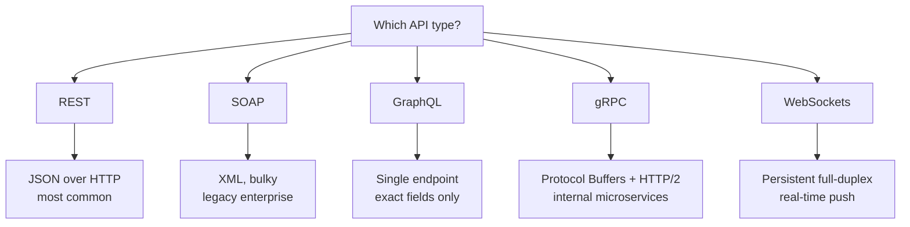

# APIs — how programs talk to each other

Notes from the API lecture: why APIs exist, why we never hand our database to strangers,
and the **five API types** we'll keep meeting all course. Small topic, but pure interview
gold — "which API would you pick and why?" is a classic follow-up.

---

## The story first

- Zomato, Uber, Ola, Rapido, Swiggy — all of them show a **map** inside the app.
  Did each company build its own mapping engine from scratch? No. They all call
  **Google Maps APIs**.
- That is the whole idea: reuse a finished capability instead of rebuilding it.
- Movie-app example: one app already curates movies + ratings + reviews (IMDb style).
  Another developer wants the same data. Two options:
  - Build their own engine and re-curate everything from the ground up, or
  - **Call the existing app's endpoints/APIs** — same data, zero rebuild.
- So APIs are **building blocks for other software**: capabilities you plug into your
  product, not systems you recreate every time.

---

## Why not just open the database?

Tempting shortcut: hand the consumer direct DB access. Lecturer's verdict —
*"This can be dangerous."*

- The consumer would have to handle **DB query scenarios** themselves — they need our
  schema and must craft queries against it. That is **schema coupling**: change a
  table and their integration silently breaks.
- They could **delete important data**, **affecting all other consumers** — one bad
  query (or bad actor) turns into a shared outage. Pure **security** risk.
- **Writes are already handled** by our existing endpoints — validation, rules, the
  whole flow. Raw DB access skips that gate entirely.
- Every consumer hammering the shared database directly multiplies **load**, with no
  layer to throttle, validate, or cache — and every schema/version change would
  break whoever coupled to the old shape.

```
  [other app] ----X---->  your database                   dangerous

  [other app] --> [ your API layer ] --> your database     safe
```

> **Interview point:** an API is a controlled facade — we expose **operations**,
> never **storage**.

---

## So what actually is an API?

- **API = Application Programming Interface.**
- Plain English: **how a program talks to another program** — a contract of
  endpoints, methods and payloads, not a screen meant for humans.
- **Language-agnostic**: front end in React, back end in Swift — both happily consume
  the same API because neither cares what language the other side used.
  **Any client, any server.**
- **Open vs restricted/private**: we choose the audience — open so other applications
  can integrate, or restricted to our own front end only. *"It is up to us how do we
  want to expose our APIs."*

Two main use cases for exposing APIs:

1. Give **another application** access to what we've built (open APIs).
2. Give **our own front end** (web and/or mobile) access to our back end.

---

## The five API types

*"These are the most used five types of APIs"* — the core list, in lecture order.

### 1. REST — Representational State Transfer

- The **most common** style today, prized for its *"easiness, its structure and its
  ability to easily maintain a large amount of data with low volume."*
- Ships data as **JSON** over **HTTP** — readable, simple, huge ecosystem.
- Gets a full lesson of its own next: [REST APIs](./06-rest-apis.md).

### 2. SOAP — Simple Object Access Protocol

- Older, **cross-platform** protocol; payload format is **XML**.
- XML is **bulky** — tags/attributes repeated for every object and array — which is
  exactly why JSON replaced it for new work.
- Lingers in **legacy enterprise** systems (banks and the like): either you must know
  XML to integrate, or drop **middleware** in front that converts XML to JSON.

### 3. GraphQL — Graph Query Language

- Exposes a **single endpoint**; the client sends different **queries** instead of
  calling a bunch of fixed endpoints.
- Query language feels similar to **SQL** — you describe the shape of data you want.
- The client asks for **exactly the fields it needs** → no **over-fetching**, no
  hauling back data the screen will throw away.

### 4. gRPC — Google's Remote Procedure Call framework

- **g + RPC** = Remote Procedure Calls; the *g* is often said to stand for **Google**.
- Payload format = **Protocol Buffers** (binary) — *"very much efficient than JSON and
  XML combined"*; much smaller size means **faster transfer**.
- Runs over **HTTP/2**; primary job is **microservice-to-microservice** internal calls
  where latency must stay low. *(this one always trips me up in interviews)*

### 5. WebSockets

- Architecture differs: not plain request → response. The first request opens a
  **persistent, full-duplex channel** between front end and back end.
- Once established, the **backend can initiate** the conversation — push **chat
  messages, live scores, notifications** — instead of the front end constantly
  **polling** for updates.
- Lecture example: Telusko's own **quiz platform** keeps quiz connections alive over
  WebSockets — marks scored by response time + answer correctness, and GIFs and
  notifications ride the same channel.



Polling loop vs WebSocket channel:

```
  classic request/response          websocket channel

  FE --> BE --> FE                  FE <=============> BE
  FE --> BE --> FE  (ask again)          once open,
  FE --> BE --> FE                        either side can push
```

---

## Which one do I pick?

- Public web/mobile CRUD with a big ecosystem → **REST** (the safe default).
- Old bank/enterprise system still speaking XML → **SOAP**, or XML→JSON middleware.
- Screens need odd, partial shapes of data → **GraphQL** (client names the fields).
- Fast, chatty internal calls between your own microservices → **gRPC**.
- Server must push in real time — chat, live scores, notifications → **WebSockets**.

> Decide with three questions: **who is calling, how real-time must it be, and what
> payload format fits** — not by whatever is trending this year.

---

## Quick revision

- **API = Application Programming Interface** — program-to-program contract;
  language-agnostic, so any client can talk to any server.
- Never share the database: coupling, deleted rows, unthrottled load — expose
  **operations**, never **storage**.
- **REST** = JSON/HTTP, most common; **SOAP** = XML, bulky, legacy enterprise.
- **GraphQL** = one endpoint, client asks for exactly the fields (no over-fetching).
- **gRPC** = Protocol Buffers over HTTP/2, binary and fast, for internal microservices.
- **WebSockets** = persistent full-duplex channel for real-time push (chat, scores,
  notifications) — no more polling.
- Open APIs feed other apps; restricted APIs feed only our own front end.

---

## Interview questions

1. Why shouldn't another team connect directly to our database? Walk through at least
   three risks and say what the API layer does instead.
2. We need a quiz platform that scores answers by response time and pushes live
   notifications — which API type fits, and how does it differ from normal
   request/response?
3. Compare REST, GraphQL and gRPC: when would you pick each, and what payload format
   does each one use?
