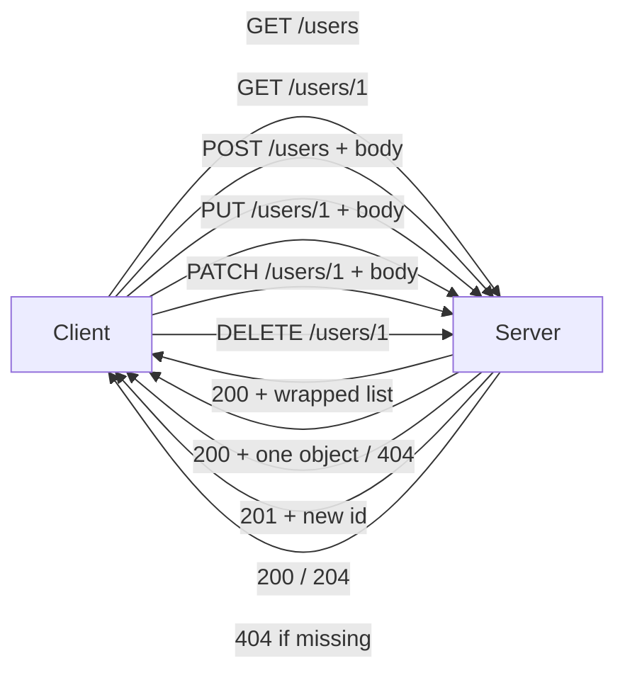
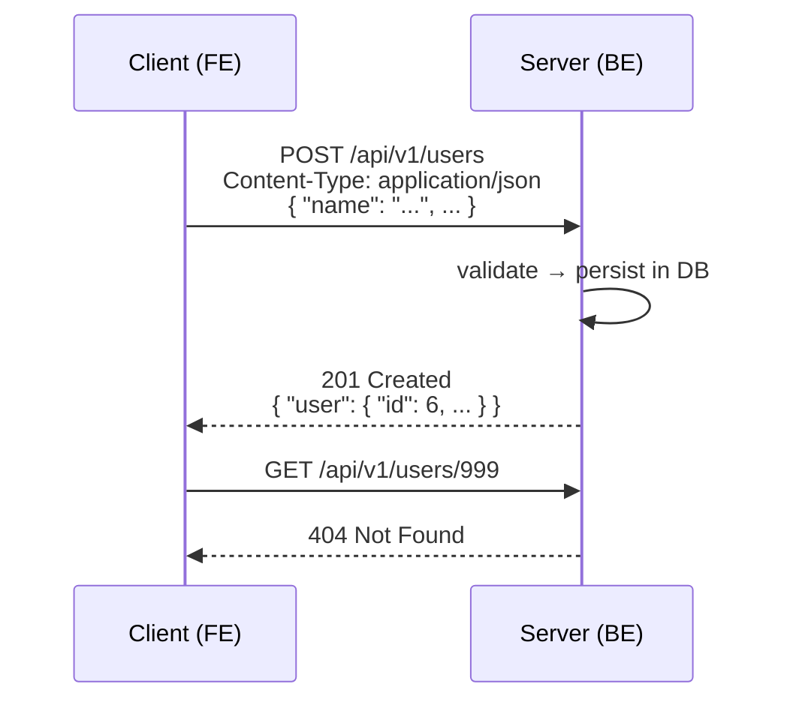

# REST APIs — requests, responses, and the rules behind good URLs

REST is the most used API style out there, so this note is pure interview gold: how a URL is built, which HTTP method maps to which CRUD action, what every status code actually means, and the design rules (wrapping responses, plural resources, path vs query vs body) that separate a beginner API from a production one.

---

## First, what is REST again?

- **REST** = **Representational State Transfer** — just a way for applications to communicate: front end to back end, or app to app.
- The whole conversation is a **stateless request/response** cycle over **HTTP**: the client sends a request, the server sends a response, and neither remembers the previous exchange (every request carries everything it needs).
- Data is exchanged as **JSON** — the standard format for sharing data in REST. We send JSON, we retrieve JSON.

### JSON in one breath

- JSON = **objects** of **key–value pairs**, comma-separated, plus **arrays**.
- Keys must be in **double quotes**: `{ "name": "Ash", "age": 25 }`
- Accepted value types:
  - **string** — `"Ash"`
  - **number** — `25`
  - **boolean** — `true` / `false`
  - **null** — no value
  - **array** — `[1, 2, 3]`
  - **object** — another `{ ... }` nest inside

> Interview point: REST is a *style*, HTTP is the *protocol*, JSON is the *format*. Three different layers — don't mix them up.

---

## Anatomy of a URL

The canonical example:

```
http://mysite.com/api/v1/resource
└──┬──┘ └─┬─┘ └┬┘ └─┬┘ └──┬───┘
   │      │    │    │     └─ resource  (the entity: user, course, coupon…)
   │      │    │    └────── version    (v1, v2 — breaking changes)
   │      │    └─────────── /api      (everything under one prefix)
   │      └──────────────── domain    (mysite.com)
   └─────────────────────── protocol  (http / https)
```

- **Protocol** — `http` (or `https` in production).
- **Domain** — `mysite.com`, where the server lives.
- **`/api` prefix** — keeps all API routes separate from normal site pages.
- **Version** — `v1`; when the API changes in a breaking way, you ship `v2` instead of breaking existing clients.
- **Resource** — the entity you're navigating to get or pass data: a product, a coupon, a user on an e-commerce site; a student or course on an LMS.

**Endpoint = method + path.** GET with a path reads data; POST against the same path adds data — the method decides the action, the URL only names the resource.

Shorthand convention when talking: drop the protocol, domain, version and `/api` — just say `users`, `blogs/3/comments`.

---

## CRUD meets HTTP

The four data operations (create, read, update, delete) map onto HTTP methods — plus **PATCH** for partial updates:

- **GET** — **read**. `GET /users` → all users; `GET /users/1` → just user 1.
- **POST** — **create**. Same URL `users`, method says "add this". JSON body holds the new record; server persists it.
- **PUT** — **update / replace** an existing record: `PUT /users/1`.
- **PATCH** — **partial update** — only the fields you send.
- **DELETE** — **remove**: `DELETE /users/1` → user with ID 1 is gone.

The same map works on plain LMS entities: `GET /courses` lists courses, `POST /courses` adds one, `GET /students/2` fetches a student, `DELETE /students/2` removes them.



### PUT vs PATCH — the distinction that always shows up

- User entity has: `id`, `name`, `username`, `age`.
- You only want to change the username: `ash` → `ak`.
- **PUT** takes the **ENTIRE** object and replaces it with what you sent. Send only `username` and every other field resets to default/null — name, age, all gone. So PUT is wrong for partial edits.
- **PATCH** updates **only the fields present** in the body; everything else stays untouched.

> (I keep confusing PUT vs PATCH too — mnemonic: PUT = put the whole thing in the box again; PATCH = patch a hole.)

- Rule of thumb: for partial updates, **always use PATCH**.

---

## HTTP status codes — the server's shorthand

The server never sends "just data" — it sends a **status code** saying what happened:

- **200 OK** — everything working as expected; here's your data.
- **201 Created** — a new entity was created in the DB (classic POST success).
- **204 No Content** — success, but nothing to return — e.g. a successful DELETE.
- **301 Moved Permanently** — permanent redirect (the old URL is gone for good).
- **302 Found** — temporary redirect (come back here tomorrow and you'll be sent elsewhere again).
- **400 Bad Request** — problem with the *request*: body data incorrect, validation failure, missing required fields.
- **401 Unauthorized** — you're not authorized for this info (usually: not logged in / bad credentials).
- **403 Forbidden** — you *are* logged in, but not allowed. LMS example: you open a course video you haven't enrolled in — the resource exists and your identity is known, yet access is denied.
- **404 Not Found** — wrong URL or the resource doesn't exist (`GET /users/999` when 999 isn't in the DB).
- **500 Internal Server Error** — something broke on the backend: syntax, logic, missing data, DB connection.
  - **Rule: log the details, never expose them to the client.** Send a generic 500; read the stack trace from your logs and fix it there. Users must not see internals.

Mnemonic for the 4xx block: **400** = your *data* is wrong, **401** = *who are you*, **403** = *I know who you are, still no*, **404** = *doesn't exist*.

---

## Three ways to pass data (and the security trade-off)

1. **Path parameters** — only for **unique identifiers**: IDs or slugs.
   - `users/3` — the ID.
   - `blog/what-is-java` — a **slug**: short human-readable form of a post, unique across the site.
2. **Query parameters** — for **filtering, sorting, searching, pagination**:
   - `blogs?sort=asc` / `?sort=desc` (latest first)
   - `?search=java` or `?q=java`
   - e-commerce multi-dimension filtering: color, price range; page numbers for pagination.
3. **Body** — the actual payload of the request (JSON), used by **POST / PUT / PATCH**.

**The trade-off:** anything in the **path or query is visible in the URL** — URLs get shared, bookmarked, and written to server logs. So *never* send sensitive info there. The **body is not exposed** in the URL — the login example: username + password go in the body, and that's the "safe" way.

> Rule recap: **path = unique IDs/slugs · query = filtering/sorting · body = sensitive/actual data.**

---

## Designing good URLs

### Nested URLs for clear relationships

Blog-site story: entities are **users** (readers), **blogs** (content), **comments** — and a user can't comment without a blog.

- `blogs/{blogId}/comments` + GET → all comments on that blog.
- `users/{userId}/comments` + GET → all comments created by that user.
- Same entity (`comments`) reachable through two parent paths — that's relational/nested URL design.
- Updating or deleting *one* comment goes flat: `comments/{commentId}`.

Same pattern on the LMS: `courses/1/students` → everyone enrolled in course 1.

**Why nest instead of passing `post_id` in the body?** You *could* send the relationship in the body, but when the relationship is direct and obvious, nesting in the URL is simply easier to read and reason about.

- **Rule:** straightforward relationship → **nest**; complex relationship or filtering → **query params** (`comments?post_id=X`).

### Query params for filtering, sorting, pagination

Already covered above — the point is: don't invent nested URLs when you're really *filtering* a collection. `blogs?search=java` is a filter on one resource, not a child resource.

### Plural nouns, no verbs

- URLs name **resources (nouns)**, the **method carries the verb**.
  - Good: `GET /users`, `POST /users`.
  - Bad: `GET /getUser`, `POST /createUser` — verb + method is saying "get get" or "create create".
- Use **plural** resource names: `/users`, `/courses`, `/comments` — not `/user`. A resource holds *many* records, so plural is the safer convention; the same rule shows up again for DB tables in [07-sql-databases](07-sql-databases.md).

---

## Anatomy of a request and a response

**Request — four parts:**

1. **Method** — GET / POST / PUT / PATCH / DELETE
2. **Path** — versioned: `/api/v3/users`
3. **Metadata (headers)** — e.g. `Content-Type: application/json` (XML is the legacy alternative)
4. **Body** — the JSON payload (present for POST/PUT/PATCH)

**Response — three parts:**

1. **Status code** — 200 / 201 / 404 / 500 …
2. **Headers** — metadata about the response
3. **Body** — the JSON payload coming back



### Request type → typical response map

- **GET many** (`/users`) → **200** + list wrapped in an object; 401 if unauthorized.
- **GET one** (`/users/1`) → **200** + `{"user": {...}}`; **404** if the ID isn't in the DB.
- **POST** (create) → **201** + the new ID or new object (200 also seen); **400** on validation failure; **500** on backend trouble.
- **DELETE** (`/users/1`) → **200** or **204** if deleted with empty body; **404** if ID doesn't exist; **500** if dependencies aren't handled; **401** if caller isn't authorized.

---

## The wrapping rule — always an object, never a bare array

Tutorials love returning a bare array:

```json
[ { "id": 1, "name": "Ash" }, { "id": 2, "name": "Gorav" } ]
```

This is a well-known anti-pattern. **Every response body should be an object** — wrap the array under a key:

```json
{
  "users": [
    { "id": 1, "name": "Ash" },
    { "id": 2, "name": "Gorav" }
  ],
  "count": 2
}
```

**Why bother?** Extensibility. Today you return user details; tomorrow you add `"userCount": 29` — just extend the object, front end unchanged. With a bare array, adding any extra metadata means re-architecting the response shape (and breaking every client). Wrapped responses are the "more long-lasting code" way.

Same for single records: `{"user": {...}}`, never the bare object — same extensibility logic.

---

## Worked example — creating a user, end to end

**Request:**

```
POST /api/v1/users HTTP/1.1
Host: mysite.com
Content-Type: application/json
```

```json
{
  "name": "Ash",
  "username": "ash",
  "age": 25
}
```

Server validates the body → persists the row → responds:

```
HTTP/1.1 201 Created
Content-Type: application/json
```

```json
{
  "user": {
    "id": 6,
    "name": "Ash",
    "username": "ash",
    "age": 25
  },
  "message": "user created"
}
```

Failure paths, same endpoint:

- Missing `name` → **400 Bad Request** (validation failure in the body).
- Not logged in → **401 Unauthorized**.
- DB connection dies → **500 Internal Server Error**, details only in the server logs.

And the classic PUT/PATCH pair: `PATCH /users/6` with body `{"username": "ak"}` → only the username changes, `name` and `age` survive. The same body sent via **PUT** would wipe `name` and `age` — that's the whole PUT/PATCH story in one request.

---

## Caching, idempotency, and versioning — the production concerns

### Caching responses with headers

- **Cache-Control** tells browsers, CDNs and proxies how long a response may be reused — `max-age=3600` says "safe for an hour", `no-cache` says "recheck with the server", `no-store` says "never persist it" (right for anything holding credentials).
- **ETag** is a fingerprint of the body. A client sends `If-None-Match: <etag>` and a matching server replies **304 Not Modified** with an empty body — cache wins, bandwidth saved.
- The trade-off worth naming: public catalog pages get long `max-age`; per-user private data gets `no-store`.

### Idempotency — repeat a request, same result

- **PUT is idempotent**: the same full-body PUT twice leaves the row identical, so it's safe to retry on a timeout.
- **POST is not**: two identical POSTs create two rows — which is why money/order-creating endpoints take an **idempotency key** (a client-generated UUID) and return the stored first response on repeats.
- Interview phrasing: "make mutating requests retry-safe" → PUT semantics up front + idempotency keys on POST.

### Versioning — change the API without breaking clients

- **URL path versioning** (`/api/v1/...`, `/api/v2/...`) is obvious, cache-friendly and easy to route; the catch is old versions linger forever.
- **Header versioning** (`Accept: application/vnd.mysite.v2+json`) keeps one URL but is harder to see and debug.
- Either way the rules hold: additive changes (new optional fields) are safe; deleting or renaming fields is exactly what forces a `v2` — and old clients get a deprecation window, never a hard break.

---

## Quick revision

- REST = Representational State Transfer; stateless request/response over HTTP, JSON as the exchange format; endpoint = **method + path** (URL: protocol → domain → `/api` → version → resource).
- CRUD map: GET read · POST create · PUT replace-all · PATCH partial · DELETE remove — PUT wipes fields you didn't send, PATCH doesn't.
- 2xx ok (200/201/204) · 3xx redirect (301 permanent, 302 temporary) · 4xx client fault (400 body, 401 who, 403 enrolled?, 404 missing) · 500 = log it, never show internals.
- Path/query params are **visible in the URL** → sensitive data goes in the **body**.
- URLs: **plural nouns only** (`/users`), nest clear relations (`/courses/1/students`), query params for filter/sort/paginate.
- Response bodies: **always wrap** — `{"users": [...], "count": N}` — so you can add fields tomorrow without breaking clients.
- Production polish: **Cache-Control + ETag** for fast reads, **idempotent PUT / idempotency keys on POST** so retries don't double-write, and **URL versioning** (`/api/v2`) so breaking changes never break live clients.

## Interview questions

1. PUT vs PATCH — when would you use each, and what happens to untouched fields if you send a partial body with PUT?
2. You're building an LMS API. A logged-in student who hasn't enrolled tries to open a course video — which status code do they get, and how is that different from 401 and 404?
3. Why do we wrap every response array in an object like `{"users": [...]}` instead of returning the bare array? What breaks if we don't?