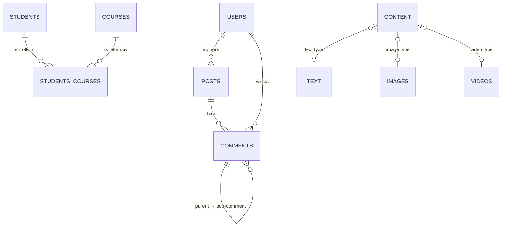
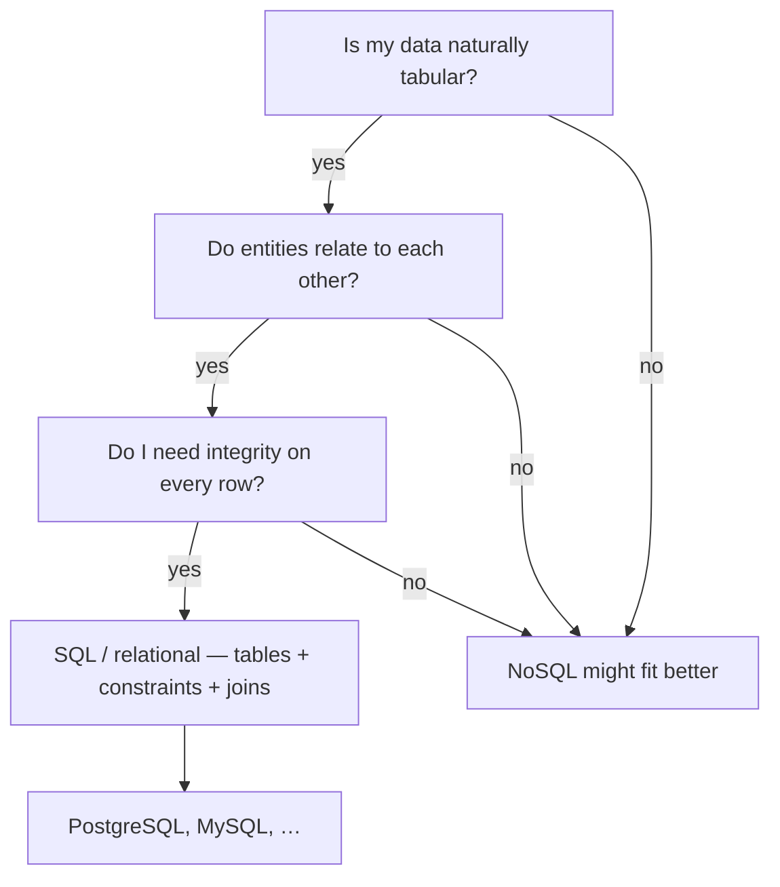

# SQL databases — tables, constraints, and relations

The lecture finally lands on actual databases. Everything REST so far assumed the server
just *remembers* things — this lesson is the fix: **SQL / relational databases**, laid out
as tables of rows and columns, glued together with keys and joins. Heavy on constraints
("force correct data entry") and on the four relationship shapes. Interview gold — I've
been asked about primary keys and the many-to-many junction table in pretty much every
round.

---

## The problem first: why do we need a database at all

- Client (web/mobile app) talks to the server.
- A server-only model keeps everything in memory — **every restart wipes it all out**.
- Your data has to survive past the session: login, profile, orders — "most applications
  can't live without databases."

```
Client ──requests──▶ Server ──reads/writes──▶ Database (persistent)
                        │
                        └── restart! memory lost ── data still safe in the DB
```

That "survives a restart" requirement is the whole point of this part of the course —
the persistence story loops back to the big picture from [system design
fundamentals](01-what-is-system-design.md).

---

## SQL vs NoSQL in one breath

- **SQL** = Structured Query Language, the category we call *relational* DBs
  (RDBMS). Think **tables, rows, columns, and relations through joins**.
  Software: **PostgreSQL, MySQL**.
- **NoSQL** is not one thing — it's an umbrella over several sub-models:
  **key-value, columnar, graph (nodes), document** stores. Software:
  **MongoDB, Cassandra**.
- The lecturer's analogy that stuck with me:
  > "Saying SQL and NoSQL is like saying Java and No Java."

  Nobody knows what "not Java" is — same with NoSQL: it's a family, not a product.
  The deep dive on those sub-models is the next lesson →
  [NoSQL databases](08-nosql-databases.md).

---

## Tables: rows are records, columns are attributes

- A relational DB stores data in **tables**; every table is loosely **an entity**
  (users, comments, posts, videos…).
- **Columns** = the attributes of the entity.
- **Row** = one complete record.
- Walked example — a `users` table:

```
users
+----+-----------+-----------+--------------+
| id | fname     | lname     | phone        |   ← columns = attributes
+----+-----------+-----------+--------------+
| 1  | A         | Agarwal   | 98765431…    |   ← row = one full record
| 2  | …         | …         | …            |
+----+-----------+-----------+--------------+
```

- **Plural naming convention**: `users`, `comments`, `posts`, `videos` — a table holds
  *many* records, so plural names feel "safer". Not a hard rule, just a convention.

> Key takeaway: **fixed schema** is the SQL signature — you decide the columns and their
> rules up front. NoSQL documents (next lesson) are the flexible alternative.

---

## Constraints — make bad data impossible

The motivation is blunt:
> "Every wrong data and every faulty data is of no use."

If garbage gets in, it poisons every query. Six constraints do the policing:

- **UNIQUE** — the value appears *once* in the whole table. Example: `username`. Ties to
  real life — Instagram / Gmail: when a name is taken, they suggest the same name with
  extra characters; no second user can register the taken name.
- **NOT NULL** — the field must hold a value. Example: `first_name` is required.
- **PRIMARY KEY** — the unique identifier of a record; no two rows share it.
  `WHERE id = 3` returns exactly one row. It's also the value that gets *handed into
  other tables* — see FOREIGN KEY below.
- **CHECK** — authenticity rules on a column. Examples from the lecture:
  - password length > 8
  - password must contain numeric values, maybe 1–2 special characters
  - phone number numeric only
  - first-name length >= 2 (aside: the shortest first name anyone could think of is two
    chars)
- **FOREIGN KEY** — the glue between tables. Story: an `authors` table (id, first/last
  name; two authors) and a `posts` table (id, content plus `author_id` that references
  the author's primary key). The FK means you never duplicate author details — you only
  carry the primary key across.

```
authors                  posts
+----+---------+-------+
| id | fname   | lname |                 +----+-------------+-----------+
| 1  | A       | …     |                 | id | content     | author_id |
| 2  | G       | …     |                 | 1  | HTML post   | 2         |
+----+---------+-------+                 | 2  | AI post     | 1         |
        ▲                                 +----+-------------+-----------+
        └─────── FK: author_id ──▶ references authors.id
```

- **DEFAULT** — fills in a value when the field isn't mandatory but null isn't
  acceptable. Examples: free-subscription default; the learn.telusko.com LMS — most users
  are students, so default `role = student/learner`; if someone gets hired at Telusko as a
  trainer, the role is updated over time.

> Mnemonic I repeat out loud until it's muscle memory: **UNIQUE, NOT NULL, PRIMARY KEY,
> CHECK, FOREIGN KEY, DEFAULT.**

---

## Joins: associating tables

A **join** = associating two tables / managing their relationship. The lecture walks the
*shapes*:

### One-to-many (and its mirror, many-to-one)

- `users` (id, fname; e.g. A, Gorov) and `blogs` (id, content, `author_id`:
  HTML → Ash, AI → Gorav, system design → A).
- **One-to-many**: a single user row owns *multiple* blog rows.
- **Many-to-one** is the same relationship viewed backwards: many blogs point at a single
  user.

### Many-to-many — the junction table

- LMS example: `students` (id, fname) and `courses` (id, name: *Master Java*, *Master AI*).
- A student enrolls in multiple courses; a course has multiple students. Two tables can't
  hold that directly — you need a **junction / join table in the middle**, e.g.
  `students_courses`, holding its own unique ID (optional, use-case dependent) plus
  `student_id` and `course_id`. Four rows = four (student, course) pairings.

```
students               students_courses                      courses
+----+-------+         +----+------------+-----------+       +----+-------------+
| id | fname |         | id | student_id | course_id |       | id | name        |
| 1  | A     |         | 1  | 1          | 1         |       | 1  | Master Java |
| 2  | B     |         | 2  | 1          | 2         |       | 2  | Master AI   |
+----+-------+         | 3  | 2          | 1         |       +----+-------------+
                       | 4  | 2          | 2         |
                       +----+------------+-----------+
```

### One-to-one — splitting heavy content by type

- Scenario: a platform with text (blogs), audio (podcasts), and video, each processed
  differently.
- **Approach A (bad)**: one heavy `contents` table with a `type` field. Problems —
  filtering forces scanning every record, and the table gets heavy: latency and size both
  grow.
- **Approach B (recommended)**: separate `videos`, `audios`, `blogs` tables, each with its
  **own primary key**, plus a slim `contents` catalog holding **metadata only** — name,
  type, keywords, slugs — referencing the real content's ID by FK. Content ID 1 with
  type `video` → fetch from `videos` where `id = 1`.
- This is the **one-to-one** shape: one content row points to exactly one detail row.

---

## Quick aside: posts, comments, and sub-comments

The lecture reworked the same idea into a cleaner picture (then got cut off):

- A `post` (id, content; content could be image / text / video).
- Managing three sub-tables — `images`, `videos`, `text` — by **ID** is cleaner than one
  mega-table with everything mixed in. So now there are four: `images`, `videos`, `text`,
  `content`.
- `comments` table: comment id + comment; supports **sub-comments via a parent comment
  ID** — the table references itself (self-referencing FK).
- And comments obviously need a `users` table too (the lecture was cut mid-sentence here).



---

## When to reach for SQL

Tying it together from the lecture's own framing — pick SQL / relational when:

- Your data is **naturally tabular** — entities with fixed attributes (rows + columns),
  structure decided up front.
- Entities **relate to each other** and you need joins to associate them (1:N, M:N, 1:1).
- You need **integrity on every entry** — constraints exist precisely because "every wrong
  data is of no use"; strong validation is a feature, not a burden.

(One honest note: this lesson stops at joins. Transactions and ACID guarantees get their
own moment later in the course — nothing here is about money-transfer atomicity yet.)



---

## Quick revision

- SQL = relational DB: **tables (entities), columns (attributes), rows (records)**;
  plural table names (`users`, `posts`).
- Fixed schema up front — the flip side of NoSQL's flexible documents.
- Six constraints: **UNIQUE, NOT NULL, PRIMARY KEY, CHECK, FOREIGN KEY, DEFAULT** —
  all in service of "every wrong data is of no use."
- PRIMARY KEY uniquely identifies a row; FOREIGN KEY carries another table's PK to relate
  the two without duplicating data.
- Joins come in four shapes: **one-to-many / many-to-one** (a user → many blogs),
  **many-to-many** (junction table like `students_courses`), **one-to-one** (slim
  `contents` catalog pointing at type-specific detail tables).
- Heavy `contents` table with a `type` column = bad scan-everything design; split by type
  and link by ID = better.
- Pick SQL when data is structured/relational and integrity matters.

## Interview questions

- Explain PRIMARY KEY vs FOREIGN KEY, and walk through why a many-to-many
  relationship (students ↔ courses) needs a third junction table.
- The DB has a `contents` table holding blogs, audio, and video. Would you store all of
  them with a `type` column in one big table? Defend your choice.
- Name the six constraints you'd reach for when designing a `users` table, and give one
  real-world example of each.