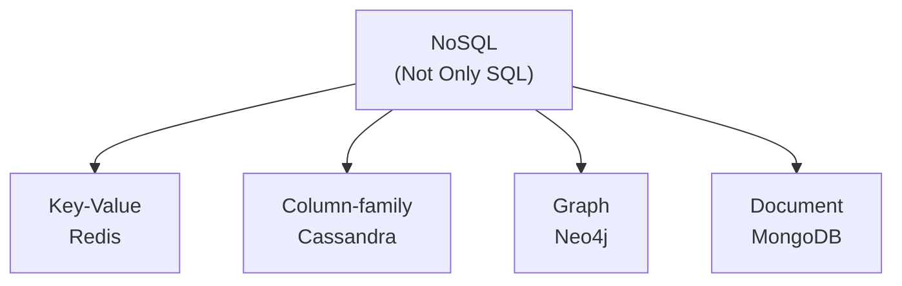
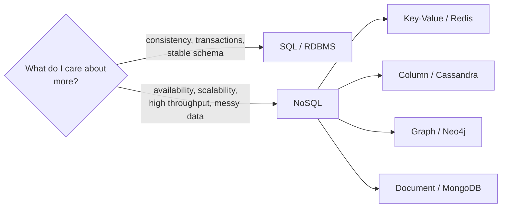

# NoSQL — "Not Only SQL"

Notes from the lecture that follows the SQL deep-dive from [07-sql-databases](07-sql-databases.md).
This one covers what NoSQL actually means, *why* it had to exist, the **four families**
(key-value, column-family, graph, document), and the honest trade-offs when you pick it.
Interview gold — the "which do I choose and why" answer comes straight from here.

## The story first — how we got here

Recap from the SQL video: relational databases kept data in **tables = entities**, linked
rows using **primary and foreign keys**, and we fetched across those links with **joins**.
Siblings are PostgreSQL, MySQL. Solid, but the lecture's point was: the moment your app
grows, the relational model starts asking questions.

- Even a *small* blog site (posts + comments + users) already needs roughly **4-6 tables**
  plus maintained relationships to answer one page view.
- Each new feature meant a new schema decision and a new join to traverse.
- And remember the "why databases exist" bit — without a DB, a client-server app loses
  everything on restart. Databases persist, no app lives without one. The *kind* of
  database is the question here.

Then the punchline analogy, verbatim: **"Saying SQL and NoSQL is like saying Java and
No Java."** You can't contrast Java with "not Java" — that's not a thing. Same with NoSQL.

```ascii
        "Java vs No Java"     ->   meaningless (this is a joke, ok?)
        "SQL  vs NoSQL"       ->   same trap!

   NoSQL is NOT one thing. It is an UMBRELLA
   under which sit FOUR different data models:
     key-value  |  column  |  graph  |  document
```

## What "Not Only SQL" really means

- The name is the hint: **Not Only SQL** — not "No S-Q-L", not "anti-SQL".
- It says: the relational model is *one* way to store and query data, but it isn't the
  *only* way. NoSQL spans several models that drop some relational rules on purpose.
- A NoSQL system can still expose a SQL-ish query language — the label is about the
  underlying *data model*, not the language you type.

> **Key takeaway:** in an interview, "NoSQL means no SQL" is a wrong answer.
> Correct answer: "Not Only SQL — an umbrella term covering key-value, columnar,
> graph, and document data models."

## Why NoSQL exists — the three pushes

The lecture framed it as three things SQL genuinely struggles with:

1. **Scale** — millions of users, massive read/write loads. One shared relational store
   behind the whole planet (Amazon, Twitter, Netflix-sized traffic) stops being enough.
2. **Flexible schema** — real data is messy: semi-structured and unstructured payloads
   that don't come with a fixed column list.
3. **Few or no relationships** — many entities "stand on their own"; you don't need a
   graph of foreign keys to store a user profile or a tweet.

Each of the three pushes maps to a NoSQL advantage, which is how the lecture ordered it —
let's take them one by one.

## Advantage #1 — easy scaling (vertical vs horizontal)

Straight quote: **"We have two options only — scaling vertically or horizontally."** There
is no secret third door.

- **Vertical scaling** — add capacity to the *one* server: bigger CPU, more RAM, more disk.
  Simple to think about, but you can "only expand so far." Eventually the hardware ceiling
  is the ceiling.
- **Horizontal scaling** — spin up *many* servers and spread data across them. This is the
  real growth path at scale, but with relational databases it gets tedious: you must
  maintain **cross-entity relationships across multiple databases**. Joins across machines
  are painful.

```ascii
  VERTICAL                        HORIZONTAL
  (grow the one box)              (grow the fleet)

     +---------+                   +----+  +----+  +----+
     |  BIG    |                   | S1 |  | S2 |  | S3 |
     |  BEAST  |  more CPU/RAM     +----+  +----+  +----+
     |  ↑↑↑    |  -> hits a wall      \      |      /
     | 128GB   |                      data split across,
     +---------+                      relations between DBs = tedious
```

NoSQL advantage: **easy to scale both ways.** Because a document/record carries its own
full context (no foreign keys pointing to distant tables), you can replicate the whole
thing onto another server or split it across partitions without untangling a web of
joins. (Replication and partitioning get their own videos — the lecture just previews them
here.)

## Advantage #2 — schemaless

SQL's fixed-column problem, from the SQL video: you can't keep adding or removing column
types to fit data it wasn't designed for. The lecture's worked example is one `content`
collection holding three wildly different documents:

```ascii
collection:  content

  doc 1   { userId: 1, content: "https://....jpg" }        <- image
  doc 2   { userId: 2, content: "some text..." }           <- text
  doc 3   { userId: 3, heading: "Java", description: ... } <- totally different shape

Same collection. Different fields, different field counts, same collection.
```

- If the document structure is **not fixed**, we call it **schemaless**.
- SQL cannot do this — a table's columns are carved in stone at `CREATE TABLE`.
- Schema decisions stop being up-front design; they become runtime data.

> **Key takeaway:** schemaless ≠ no schema at all. It means the schema isn't enforced by
> the database — you're free to store shape-differing records side by side. The flexibility
> of ground truth, not the absence of it.

## Advantage #3 — few or no relationships

Entities "stand on their own." The lecture put it in key-value terms: the same key can
carry four completely different value shapes.

```ascii
key: "courseID"  ->  "Master Java"                              just a name
key: "courseID"  ->  { name, price, instructor }                an object
key: "courseID"  ->  { ...course, lessons: [ l1, l2, l3 ] }     nested lessons
key: "courseID"  ->  { ...lessons, } + comments inside lessons  comments inside lessons
```

- One key pattern, four structures, zero foreign keys needed.
- The SQL equivalent would force you to model *multiple entities plus relationships* to
  hold the same variety.

## The four NoSQL families

Here's the whole umbrella at a glance — keep this tree in your head, it's the skeleton of
every interview answer about NoSQL:



### Family 1 — Key-Value stores (Redis)

- The simplest model: a unique **key**, and a value that can be **anything** — a JSON
  string, a number, a blob, a byte array, an array, an object, nested objects, combos.
- **Schemaless, no relationships** by design.
- Ubiquitous — front-end and back-end it shows up everywhere: **cache, cookies, sessions,
  plain data storage**. The lecture's example: key `post1` maps to a value holding
  `postId`, `content`, and a `comments` array of `{ commentId, content }` objects.
- Real-world anchor: **Twitter/X uses Redis for caching and its timeline.**

### Family 2 — Column-family (columnar) stores (Cassandra)

- Setup from the lecture: a student table `(ID, name, marks)` with rows `(1, Aka, 90)`,
  `(2, Goro, 95)`; your task is *the class average*.
- **SQL reads row-wise** — left to right — so a marks-average query reads `name` too. With
  3 columns that's trivial; with 17 columns it's wasteful.
- A **columnar DB reads column-wise**: pull only the `marks` column, aggregate it, and
  re-link rows through their common unique ID. You only ever touch the data you need.
- The analytics engines named here: **Google BigQuery, Amazon Redshift, Snowflake**. And
  the classic column-family deployment at scale: **Netflix runs Apache Cassandra for user
  activity data**.
- Trade-off: superb for **reading/analyzing lots of data**, but **writes are slower** —
  the store must append at per-column positions.

> **Key takeaway:** columnar wins for analytical reads across wide tables; it pays the
> cost on the write path. That's why you see it in warehousing/analytics stacks.

### Family 3 — Graph databases (Neo4j)

- The lecture's analogy: detective movies. Photos pinned on a wall, joined by threads.
  **Photos = nodes, threads = edges.**
- **Nodes are entities; edges are relationships.** Both can carry properties.
- Example: a `student` node and a `course` node joined by an `enrolled` relationship that
  itself carries properties — year, marks, year of passing. Plus `student —studiesIn→
  college` and `college —provides→ course`.
- Use cases: data scientists finding hidden **patterns**, customer-behavior analysis at
  scale — anything where the *connections* are the point, not just the records.
- Query languages mentioned: **Gremlin, SPARQL, Cypher** (Cypher is the Neo4j query
  language).
- Honest downside from the lecture: **complex, and a bit slow** when you have many entities
  plus relationship properties to walk.

### Family 4 — Document databases (MongoDB)

- Keeps **JSON-like documents of any length**: flexible, schemaless, no required
  relationships.
- The named engines: **CouchDB, MongoDB**. Real-world anchor: **Uber runs MongoDB for
  flexible, real-time data**.
- Natural fits: **logging** (log line shapes keep changing), **profiles** (users fill
  different subsets of fields), and **content** — Instagram/Facebook posts live as one
  document in one collection.
- The lecture flagged **GraphQL as a "borderline exception"** — it *does* express
  relationships and relationship properties while staying broadly under the NoSQL umbrella.

## Who uses what — the adoption map

The lecture's real-world list is the quickest way to remember each family:

- **Netflix → Apache Cassandra** (user activities)
- **Amazon → DynamoDB** (scaling their application)
- **Facebook/Meta → HBase** (user messaging, large-scale storage)
- **Uber → MongoDB** (flexible, real-time data)
- **Twitter/X → Redis** (caching and timeline)

```ascii
   Cassandra  <--  Netflix         HBase     <--  Meta
   DynamoDB   <--  Amazon          MongoDB   <--  Uber
   Redis      <--  Twitter/X
```

## SQL vs NoSQL — the decision framework

The lecture gave the cleaner one-liner I've seen on this topic: pick based on what you can
afford to de-prioritize.

> **"Whenever consistency is on more priority than availability, we can easily pick SQL.
> When availability and scalability are on more priority than strict consistency, we can
> choose NoSQL."**

- **Go SQL when:** payments, transactions, anything needing **ACID consistency**, a stable
  schema, and real relationships between entities.
- **Go NoSQL when:** **scaling and speed** matter (one document vs SQL traversing several
  joined tables), and your data is **unstructured or semi-structured**.



The comparison boiled down to the lecture's terms:

- **Structured, fixed schema** vs **flexible / schemaless**.
- **Vertical scaling** (and very hard horizontal) vs **easy horizontal scale-out**.
- **ACID transactions, joins, consistency** vs **eventual consistency, no joins, high
  throughput**.
- Full relational mechanics live in [07-sql-databases](07-sql-databases.md) — this note is
  the "other side of the coin."

## The trade-off — what NoSQL quietly gives up

Nothing free. When you take the four families, you're usually forfeiting:

- **ACID guarantees** — a key-value put or a document write isn't a multi-table transaction
  you can roll back atomically. You get **eventual consistency** instead: read an old value
  for a while, and it catches up later.
- **Joins** — because entities stand alone, cross-entity queries are on *you* (either
  embed the data or do the join in application code).
- **Schema enforcement** — flexible is a feature until a field you assumed exists isn't
  there.

That consistency-vs-availability tension is exactly what **CAP theorem** formalizes — and
that note ([12-cap-theorem](12-cap-theorem.md)) is where it gets rigorous. For now, the
one-liner to carry: NoSQL trades *immediate, global consistency* for **speed, scale, and
availability**.

> **Key takeaway:** the SQL-vs-NoSQL answer is rarely "which is better" — it's "what are
> you optimizing for?" Consistency → SQL. Availability + scale + throughput → NoSQL. And
> real systems usually run *both*.

## Quick revision

- NoSQL = **Not Only SQL**: an umbrella over four models, not "no SQL" and not one thing.
- Three reasons it exists: **scale** (millions of users), **schemaless** (flexible,
  semi-structured data), **few relationships**.
- Scaling story: vertical hits a wall; horizontal works but is tedious with joins across
  databases — NoSQL scales both ways via replication/partitioning.
- Four families: **Key-Value (Redis)** caching/sessions, **Column-family (Cassandra)**
  analytics reads, **Graph (Neo4j)** relationship-heavy pattern finding, **Document
  (MongoDB)** flexible JSON-ish content.
- Adoption anchors: Netflix→Cassandra, Amazon→DynamoDB, Meta→HBase, Uber→MongoDB,
  Twitter→Redis.
- Decision rule: **consistency > availability → SQL; availability + scale > consistency →
  NoSQL** (the CAP flavor).
- The cost: **ACID and joins are sacrificed** for speed, scale, and eventual consistency.

## Interview questions

1. "NoSQL means there's no SQL involved — true or false?" — and why.
2. You're designing a payments service and a news-feed service. Which of SQL/NoSQL for
   each, and what trade-off drives your choice?
3. Walk me through the four NoSQL families, one real-world company using each, and the
   load type each store is good at.