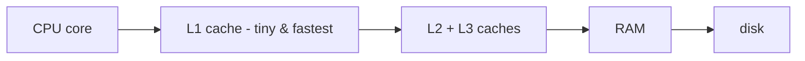
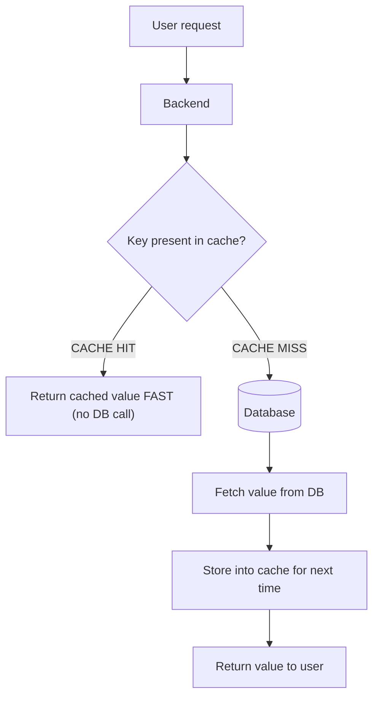

# Caching

This note is the full deep-dive on **Component 4** from the components walkthrough — the cache. In the first video it got one line ("a layer that holds frequently used data so the DB isn't hit every time"); in the caching lecture Akshay gave us the whole story: *why* we need it, *where* it lives, how data moves in and out (the four strategies), how entries die (TTL), and how we pick what to throw away (eviction). Interview gold — cache questions show up in almost every round.

---

## The story first — the telusko.com homepage

The lecture opens with a concrete case study instead of theory. Request path when you open the homepage:

- user -> mobile app -> backend -> database -> render back.
- Every single piece of information on the page = one database hit.

The homepage shows the 3 most popular courses, and each course card needs:

- **thumbnail** / static image — served via DNS.
- **name** — `courses` table.
- **price + discounted price** — a separate `prices` table (price varies by country/currency, so it lives on its own).
- **important-section content** — `course_info` table.

So one homepage view fans out into **4 resources** (3 tables + 1 DNS static fetch). Now do the math:

- 3 popular courses today, **10,000 daily active users** -> 10,000 hits on *each* resource.
- Courses grow from 3 to 6 -> 10,000 x 6 = **60,000 requests** just for the course list.
- Per user: 6 courses x 4 sections = **24 requests per single homepage view**.

> "For every user, we are hitting 24 requests. This is totally going to break our system." — and he's right. 10k users x 24 = a quarter-million DB calls just to load one page. That latency is what a cache eats, and that latency "nobody wants to wait" for.

This is also the same lesson as the [functional vs non-functional requirements](03-functional-vs-nonfunctional-requirements.md) note: the system is fine at average load and drowns at **peak**. The 10x spike story? A cache is exactly what absorbs that spike — the same hot data gets served over and over to the crowd.

---

## So what exactly is a cache?

- A **cache** = a memory storage (RAM) holding *frequently accessed* data, sitting **away from the database** — either in the frontend or the backend — so resources load faster.
- Think of the processor: your CPU has the tiny **L1 / L2 / L3 caches** between it and the slow main memory. The fastest, most-reused data lives closest. Same idea one level up: the cache sits between your code and the database.



- The whole point: **"It is easy to find something in a limited space than in the entire database. That is why cache is faster."** Search 1000 items vs search 100 million — no contest.

### Why cache at all (a.k.a. the three reasons)

- **Latency** — a cache hit is a memory read (sub-millisecond); a DB hit is a disk/network trip. Users feel the difference on that homepage.
- **Database load** — the DB stays focused on writes and cold data instead of serving the same 3 courses to 10,000 people. Under the 10x peak (see [the requirements note](03-functional-vs-nonfunctional-requirements.md)) the DB is usually the first thing to die — the cache shields it.
- **Cost** — fewer DB machines doing fewer heavy queries means cheaper infra. It's one of the named fixes in the data-intensive bucket from the components video: "cache enhancement."

### Why the cache must stay SMALL

Two reasons straight from the lecture:

- The cache is fast *partly because* it only holds what's frequently used — keep it that way.
- If the cache is ~ the size of the whole database, there is **no latency win at all** — you've just built a second database.

> Do not cache the entire DB. Cache the *hot* data. That's the entire trick in one sentence.

---

## Where caches live

The taxonomy from the lecture is three tiers:

- **Client-side cache** — on the device / in the web app (browser storage). Nothing leaves the user's machine.
- **Server-side cache** — in the backend, the classic Redis-style store. This is where Twitter/X keeps its cache + timeline (that's the real-world note from the NoSQL section: Twitter -> Redis).
- **Database cache** — the DB itself hot-stores the most-requested info in its own buffer.

```
      BROWSER / DEVICE            <- client-side cache
             |
         APP / BACKEND            <- server-side cache  (Redis & friends)
             |
        DATABASE                  <- database cache (DB hot-stores hot rows)
```

Static homepage data gets fetched once and parked on the backend **and/or** frontend storage — the slow DB re-render disappears for returning users.

---

## Cache hit, cache miss, and TTL

- **Cache hit** — the key is in the cache: return it, no DB call, super fast.
- **Cache miss** — the key isn't there: fetch from the DB, which is slower. A miss also *populates* the cache so the next request hits.



- **TTL — Time To Live**: how long a key-value pair is allowed to sit in the cache. When it expires, the pair is evicted and makes room.
- **Why refresh at all?** Stale content. The lecture's example: the campaign sells a Java course today, an AI course tomorrow — the homepage must stop showing yesterday's hero course. TTL + eviction keeps the cache *current*.

### The staleness / consistency problem

This is the dark side of caching: an update lands in the database, but the cache still holds the **old value**. Depending on which strategy you use, the delay between "DB updated" and "cache updated" ranges from *immediate* to *eventually*. Plan for it — it's the trade-off you buy speed with.

---

## The four cache strategies

The lecture names exactly four, and here's how each one moves data:

### 1. Read-Through Cache (RTC)

- Handles **reads only**. Writes go straight to the DB, the cache never sees them.
- Hit: backend -> cache returns value -> fast.
- Miss: backend -> cache -> cache asks the DB -> DB -> cache -> backend. **One extra hop, so a miss is slower.**
- Nice property: only data users actually *read* ever enters the cache. Newly written data that nobody re-reads never pollutes it.

### 2. Write-Through Cache (WTC)

- **Writes only**: write to the cache first, and the cache *writes through* to the DB.
- The cache **always holds the latest value** — ideal where freshness matters, e.g. **stock values** at a trading firm.

### 3. Write-Around Cache (WAC)

- A combination of RTC + WTC.
- Write: client -> backend -> **straight to DB**, cache fully bypassed.
- Read: from cache; on a miss the cache calls the DB, **updates itself first**, then returns.
- The Twitter/X example: *"We don't decide the importance of any tweet at the time of its creation. We decide the importance at the time of reading those tweets."* A brand-new tweet isn't cached at birth — it earns its cache slot only when people start reading it.

### 4. Write-Back Cache (WBC)

- Write to the **cache only** — that completes the write op immediately. The DB update happens **asynchronously later**.
- Trade-off spelled out: you *sacrifice consistency for speed*. The async DB update can fail — handle carefully.
- Read: mostly a cache hit; on a miss, DB then update cache.
- The use case: **high write traffic** — food delivery (Swiggy/Zomato). Millions of orders with rapidly changing statuses cached for instant visibility, DB updated in the background.

```
  RTC (reads)      WTC (writes)       WAC (mix)          WBC (writes)
  U -> Cache       U -> Cache         write: U -> DB     U -> Cache  [done!]
   hit -> U        Cache -> DB        read:  U -> Cache   DB update later
   miss -> Cache                       miss:  Cache -> DB (async, in background)
          -> DB                       Cache -> U
          -> Cache
          -> U
```

> **(noted for interviews)** — the classic follow-up is "which strategy for which app?": stock prices -> **write-through** (must always be fresh); tweet/social feed -> **write-around** (importance is decided at read time); order status dashboards -> **write-back** (write-heavy, consistency best-effort).

---

## Eviction policies — choosing what dies

When the cache is full, something has to go. These five policies are the lecture's A-Z:

- **LRU — Least Recently Used**: evict whatever hasn't been touched in the longest time. Analogy: iPhone 17 Pro Max launches, everyone searches it; almost nobody searches iPhone 11 anymore -> 11 is stale, evict it.
- **MRU — Most Recently Used**: evict the *most* recently used. Two examples given: (1) e-commerce — you've already applied your coupon, no need to keep it cached; (2) YouTube streaming — the segments you just watched are unlikely to be re-watched, drop them.
- **LFU — Least Frequently Used**: evict by *frequency of access*. Example: your personal e-com history — "secondary screen" and "clothes" searches recur; the one-off "plant" search (spurred by a YouTube video) never repeats -> plant gets evicted first.
- **FIFO — First In, First Out**: fixed-budget cache (lecture's example: **180 MB**). At capacity, evict the *first-inserted* entry, ignoring recency and frequency entirely.
- **LIFO — Last In, First Out**: stack semantics, last-in is evicted first; the first-inserted item lives longest. Same 180 MB budget example. (No application areas were given for FIFO/LIFO — left as homework for us.)

> LRU is the one interviewers love. Have the iPhone example ready: search-trend data where the "old phone" is never searched again — out it goes.

---

## When the cache fails us

The lecture's honest list of where this bites:

- **Caching too much** — a cache the size of the DB is pointless; no latency win, all cost.
- **Stale data after an update** — the campaign-sells-out example: cache keeps serving yesterday's hero course. Bounded by TTL, or by choosing the right strategy (write-through for "must be fresh").
- **Write-back consistency** — the async DB update can silently lag or fail; you traded correctness for speed, so you must handle failures.
- **Every miss costs more than no cache at all** — RTC's extra hop means a cold cache is *slower* than no cache. That's why a freshly deployed cache (or one that just flushed) takes a while to "warm up."

The lecture doesn't over-engineer this part — the point is: cache is born to serve the *popular few*, and the moment you treat it like the source of truth, you're in trouble.

---

## The bigger picture — serial to parallel

Caching delays the day you need to scale, but it isn't a replacement. The recap flow in the lecture: client (web/mobile) -> DNS (returns the server's address) -> server/backend code -> database -> response. The cache sits between code and DB, trimming DB traffic. But when a single server (the 128 GB box from the lecture — even with all that RAM the processes eat it) peaks out, you stop tuning the one box and go **multi-server** — and now the client can't choose, so DNS stops returning server IPs and starts returning the **load balancer's** IP. That's the next chapter: see [load balancing](10-load-balancing.md).

```
  Client
    |  (1)
    v
   DNS  ---------- returns back-end/LB address
    |
    v
  Backend <---------> Cache      (hot data: hits never reach the DB)
    |
    v
  Database          (source of truth: writes + misses)
```

---

## Quick revision

- A cache is a small, fast store of *frequently used* data in front of the slower source of truth — "easy to find something in a limited space."
- Cache hits are the win; misses are a penalty (extra hop) and also how the cache populates itself.
- TTL sets how long a pair lives; stale content = the consistency problem that TTL + strategy choice manage.
- Four strategies: **read-through** (reads via cache), **write-through** (cache always newest — stocks), **write-around** (writes skip cache — tweets), **write-back** (cache acknowledges, DB updated async — Swiggy/Zomato).
- Eviction: **LRU / MRU / LFU / FIFO / LIFO** — recent vs frequency vs order, pick by access pattern.
- Never cache the whole DB — a copy of everything is a second DB, not a cache.
- Caches absorb peak spikes (the 10x story) but you still scale out when the single server ceiling is hit.

## Interview questions

1. Walk through a cache miss for a read-through cache — which components talk, in what order, and why is a miss more expensive than having no cache at all?
2. Your app needs to always show the latest stock price in the cache — which strategy do you pick and why?
3. A Redis/similar cache is full and a new hot key arrives — name two eviction policies, the difference between them, and a scenario where each is the right call.