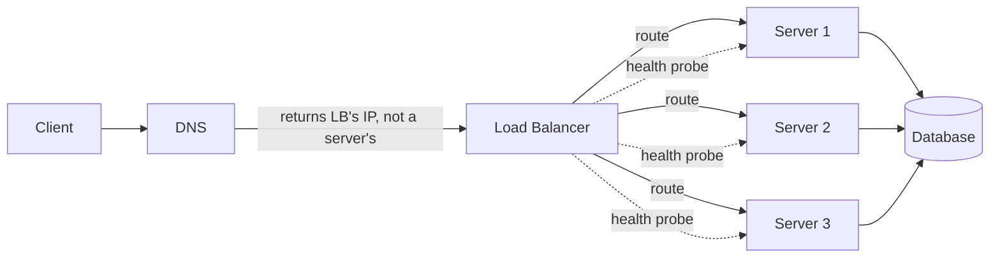
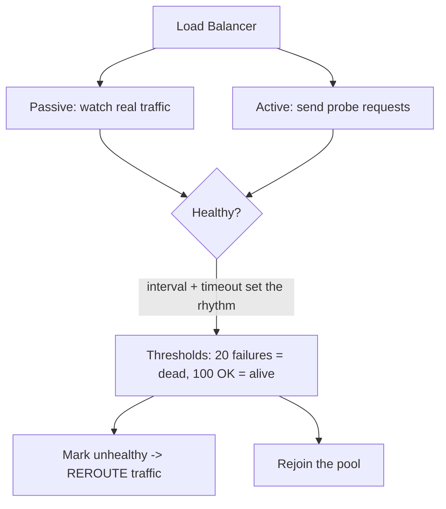

# 10. Load Balancing — the middleman becomes a real job

This note is where the Alien Bank story finally earns its keep. The little middleman who balanced counters 1 and 2 is the single most-asked component in system design interviews, so we go deep: the two core duties, the routing algorithms with their numbers, health checks, and the session problem.

This note sits at the heart of the scaling-and-distribution story, right before replication, partitioning, and the CAP theorem — almost everything later builds on the load balancer's core idea.

## The middleman story, continued

- Back in [what is system design](01-what-is-system-design.md) we built Alien Bank one fix at a time: one counter, then a second counter, then a shared database.
- The escalation had real numbers. A single cashier at 10 min/customer was only 6 customers an hour (rush hour would break the system entirely); training sliced it to 5 min, and better tools — a bigger desk, a cash-counting machine, an advance form that kills the "what do you need?" chat — brought it to 3 min.
- Even at 3 min, one counter meant the 10th customer waited 27 minutes. The fix was counter #2. And the minute there are two counters, "which counter do I stand at?" stops being an idle question.
- The final problem was wasted capacity: the gate sat next to counter 1, so most customers queued there while counter 2 sat idle.
- Fix: a **middleman**. Every customer reports to the middleman first; a peek at both counters shows 10 people at counter 1 vs 5 at counter 2, and the next arrivals get rerouted toward counter 2 until the totals balance around 11/11.
- The best part was the failure mode: one day counter 1 is down, so the middleman just sends everyone to counter 2 until counter 1 is repaired. No customer sees the change, nothing stops.

```
  arrivals            middleman              counters
 (requests)         (load balancer)           (servers)
     |                  |                       |
     |-- 10 waiting --> |--->  C1 --------------+
     |                  |--->  C2 --------------+--->  shared DB
     |                  |
     |                  `--> C1 down? -> send ALL to C2
                              until C1 is repaired
```

- The story maps to terms: customer queue = requests, middleman = load balancer, cash counter = server, person at the counter = application code, common ledger = centralized database.
- Every later concept follows the same arc: Issue 1 (slow cashier) maps to code quality — that is where LLD/DSA live, "optimize a slow loop" style, no new hardware. Issue 2 maps to vertical scaling: upgrade the one machine, knowing there is an explicit ceiling. Issue 3 maps to horizontal scaling: add machines. This note lives in the gap that Issue 3 opens up.
- Fun bridge: the middleman's decision rule — 10 at C1 vs 5 at C2, route to the emptier one — is a poor man's *least connections* algorithm in embryo. We meet it properly below.

> Customer queue = requests, middleman = load balancer, counters = servers, cashier = application code, shared database = the database. The "who decides which counter gets this customer" question is the load balancer's entire reason to exist.

---

## Why we need a load balancer at all

- When there are two servers, the client honestly cannot decide where to fetch from. We do not want a client hard-coding "ask Server 1"; the whole fleet should be a black box.
- So the DNS no longer returns an actual server's IP address — it returns the **load balancer's IP**. Servers S1, S2, S3 live quietly behind it, anonymous to the outside world.
- The pressure that forced several servers in the first place (borrowed from the caching note): a homepage showing 3 popular courses pulls from 4 resources in 4 places — one static/DNS asset plus the courses, prices, and course_info tables. That is 10,000 hits per resource with 10,000 daily active users; grow courses 3 -> 6 and it lands at 60,000 requests; and per user, 6 courses x 4 sections = 24 requests for one homepage view. One server buckles under that.
- And the wall is real: a server with 128 GB of memory, its processes consuming all of it, cannot keep absorbing upgrades forever — the vertical limit.
- The two options on the table: vertical scaling (more power into one node, only expands so far) and horizontal scaling (many nodes — which is exactly where cross-node relationships and data consistency get tedious). The load balancer is the piece that makes option two tolerable to run.
- Three things the load balancer buys us:
  - **Even distribution**: requests spread over all servers so no server overheats and none sits idle.
  - **Failure masking**: a dead server is silently dropped and nobody but the load balancer ever knows.
  - **Horizontal scaling**: adding a server is "tell the load balancer, done"; removing one is the same. That is the whole point of having more than one machine.

## The two jobs of a load balancer

- The whole component comes down to exactly two responsibilities, each with its own mechanism:
  1. **Choose the server** — pick the one that can respond fastest. This is handled by a routing/scheduling algorithm.
  2. **Health-check the servers** — decide which server is "working in a fine condition and can handle the request pretty well." This is handled by health-check parameters.
- Job 1 is governed by the algorithm; job 2 is governed by interval, timeout, and threshold. Everything in this note hangs off these two.
- Duty 1 is only as good as the LB's knowledge of *current* server performance — that is how "no server will be overheated and no server will be underutilized."
- The two only make sense as a pair: routing without health checks keeps sending fresh traffic into dead servers; health checks without routing decide nothing at all.

### What the load balancer is NOT

- It does not store data, run business logic, or format responses — it only *routes*. That is why it can be a thin, fast box in front of otherwise heavy ones.
- "Choose the server + health check" is the complete job description; anything else you see in the wild is configuration wrapped around those two duties.
- And one more: it does not make the work disappear — the pool still answers 100% of the requests. Balancing spreads load so no single machine stands in for all of it; the total work is unchanged.
- That two-sentence answer is a good interview anchor: asked "what does a load balancer do?", stop there and you have it.



## Where the load balancer sits in the big picture

- The full architecture the recap drew: client (mobile/web) -> DNS -> load balancer -> server 1 / server 2, each holding application code -> one or more databases (which may talk to each other to stay consistent) -> third-party services reached through message queues.
- The request path with the LB inserted, end to end: app -> DNS (returns the LB's address, the only address a client ever learns) -> load balancer -> backend code sitting on a server -> database -> response back up the chain.
- Zoom into a microservices topology and the pattern repeats: a load balancer in front of S1, S2, S3, where some services share a database while another owns a completely different one; data flows across them through migration, replication, or partitioning.
- There, the LB "plays a huge role" passing client requests to the right server for each call. It is a routing backbone, not a single trick.
- In the component tour it is component #5 of the seven, and the phrase used for it is strong: the LB *owns every request and connection* in the middle. Clients never dial a server directly.
- It gets watched too: when the monitoring list is drawn, LB health sits right there on it — alongside application errors, full stack traces, and feature regression. If the middleman itself dies, every request walks in unchaperoned, so the router is a single point to keep eyes on.

---

## The routing algorithms

The middleman's "smart routing" is really a choice of algorithm. There are six, each with a worked example plus pros and cons, and a warning at the end that no one algorithm is ever used alone.

- **Round Robin** — the simplest: cycle requests S1 -> S2 -> S3 -> S1, one after another. Only a single counter of state is needed.
  - Pros: trivial to implement; every server handles *almost* exactly the same number of requests.
  - Cons: it ignores hardware completely. In a fleet of S1 = 4 GB RAM / 100 GB storage / 16 cores, S2 = 8 GB / 200 GB / 32 cores, S3 = 16 GB / 500 GB / 64 cores, equal turns means the tiny S1 overheats or stops while the monster S3 is bored. Equal, but not fair — that gap always trips me up in interviews.
  - When it works: a homogeneous fleet, where nobody cares about specs because they are the same.
  - Bonus property: it is deterministic — with N servers the rotation is fully predictable, which makes debugging a repeatable story.

```
round robin, one request per turn:

   request #:   1   2   3   4   5   6   7   8
   server:     S1  S2  S3  S1  S2  S3  S1  S2
                 ^-------- cycle repeats ---------^
```

- **Geo-based routing** — route by where the user is: user in India -> India server, US user -> US server. Only two facts are tracked: where each server lives and where the request came from (never server specs). Cuts latency, and requests keep hitting the same regional server so session info stays in sync — this is what globally visible apps do.
  - Cons, all of them factual tracking trouble:
    - The LB must track more information than the other algorithms.
    - It demands region-local databases, which drags replication/partitioning cost into the picture.
    - If India has servers A and B and A crashes, B needs A's data immediately or it fails too.
    - VPNs and proxies can fake a location and mislead the routing entirely.
- **Least Connection** — count open connections per server, hand the next request to the fewest. S1 has 30 open, S2 has 50, so the next request goes to S1. Only the connection count is tracked.
  - Known flaw: if S1's 30 connections are heavy requests and S2's 50 are trivial, S1 still gets the load — "which is wrong." An AI call is not a chat ping.
  - Why it is used anyway: it pairs beautifully with sticky sessions — WebSocket channels, chat apps, video streaming, gaming — where the behaviour is a long-lived connection, not a burst of one-off calls.
  - More cons: connection counts need constant bookkeeping (one response finishes, 30 becomes 29), and it ignores configuration entirely — a weak S1 with 8 connections still beats a fast S2 with 16 (or even 100).
- **Least Time** (least response time) — track each server's average response time and send the request to the lowest. S1 averages about 50 ms while handling ~1000 requests; S2 averages 10 ms, so the next request goes to S2.
  - The insight: a low response time is the only metric so far that implicitly reflects true server capability — a 10 ms S2 is clearly the beefier box.
  - Use it for latency-critical real-time apps: trading apps and search engines.
  - Cons: the LB must recompute the average for every server on every request — computationally complex — and traffic spikes skew the averages, so "we need to be very careful there."
- **IP Hash** — hash the client's IP to a number, then assign number ranges: S1 owns hashes 1-10, S2 owns 11-20, so a hash of 5 lands on S1.
  - Pros: a user's IP rarely changes within a session, so the same server handles the whole session — no session data to replicate.
  - It also demands healthy servers plus replicated session data as backup — stated explicitly, so keep both in the answer.
  - Cons: if a connection breaks, the next request hits a different server that lacks the session, and the user re-enters data — "a loss case, not recommended at all." And scaling is painful: adding S3 means reconfiguring the hash function and reassigning every range — the 1-10/11-20 split gets redrawn because the hash space has to swallow a third server; any add/remove reshuffles all the mappings. Verdict: "not recommended for most microservices architecture we have today."
  - History: IP hash suited old monolithic/legacy apps; today we use **JWT tokens** so the session survives a server change — "even if the server changes, our request or our session should be consistent."
- **Weighted Round Robin** — round robin with weights proportional to configuration: S1 with 8 GB gets weight 1, S2 with 16 GB gets weight 2, S3 with 32 GB gets weight 3. The new request lands on the highest-weight server first, then the weighted cycle continues. This is the direct fix for round robin's unequal-hardware flaw.
  - Feel the weights: out of every 6 units of work the 1/2/3 split sends roughly one to S1, two to S2, three to S3 — work lands where the RAM is.
- **Hybrids** — a warning: no real system runs one algorithm alone. "We always work with a hybrid approach; the load balancer basically balances multiple algorithms" — IP hash + round robin, least time + least connection, possibly all six at once, blended until the requirement is met.

> Revision anchor: W-R-G-L-L-I — weighted, round robin, geo, least connection, least time, IP hash. Interview punchline: real load balancers blend several of these, never just one.

### The quick map: what each algorithm actually tracks

- Round robin -> one shared counter -> simplest fleets, no knowledge needed.
- Weighted round robin -> one weight per server (RAM size) -> heterogeneous hardware where specs are known.
- Geo-based -> two facts, server region + request origin -> global apps that want locality and regional sessions.
- Least connection -> live count of open connections -> long-lived connections that pair with sticky sessions.
- Least time -> per-server average response time -> latency-critical workloads like trading and search.
- IP hash -> hashed client IP -> legacy/monolith, where pinning the session mattered before JWT made servers swappable.

---

## Session affinity and sticky sessions

- **Sticky sessions**: once a user's first request lands on server S2, keep sending that user's requests to S2 — because S2 holds their in-memory session state.
- Least connection works best with stickiness: chat, video streaming, gaming and WebSockets are long-lived channels where the same server must stay in the conversation for the channel's whole life.
- IP Hash gives stickiness almost for free: same IP -> same hash range -> same server, so there is no session data to replicate.
- Think of the sticky session as a *cache of context*: fast to reuse, painful to rebuild. The cache note's rule applies — keep it small, and have a plan for the miss.
- Concrete how it bites: you apply a coupon mid-checkout on S2; the very next cart update leaves S2, and now S1 neither knows the coupon nor the cart. That is the MRU-side of the cache story — the moment something is "used up" on one node, the pinning stops helping.
- The trade-off (and it echoes the caching note): a sticky session is really *pinning data to one node*, which fights the load balancer's "evenly divide everything" goal — a heavy user stacks all their load on one server, and the moment that server dies or the pin breaks, the context is gone. From the cache world we already know recomputation is expensive; here it means re-login and lost progress.
- That is exactly why the industry drifted to statelessness: keep session state small, or push it out of the servers entirely (JWT-style), so servers become interchangeable again.
- The fallback is to *replicate* the session data the way the DB note replicates databases — the IP Hash section even framed it that way ("no session data to replicate" is the payoff). Either way, the session must not live in exactly one place if servers can die.

## Layer 4 vs Layer 7 — where the load balancer decides

- All of this traffic travels over the connectivity stack from the earlier notes: IP, TCP, HTTP. The load balancer can make its routing decision at two different levels of that stack.
- **Layer 4 — network/transport**: the LB decides using TCP/IP alone. IP Hash literally operates at this level, and a bare network ping is an L4-grade health probe. Fast and cheap, but blind to the actual content of a request.
- **Layer 7 — application**: the LB reads into the HTTP request — the URL, headers, even the JSON body — so it can send /images/* to one pool and /api/* to another, and probe health with a real HTTP call.
- Decision in one line: need raw speed and don't care about content -> L4; need to route by URL/header/endpoint -> L7. (Noted for interviews: the same physical box often does both — the layers are just where you carve the decision.)

---

## Health checks: picking the healthy server

### Passive vs active checks

- **Passive**: the load balancer adds nothing new — it merely observes how servers behave under *real* traffic and tracks it. No probes, no extra load.
- **Active**: the load balancer injects its own probe requests and judges each server's health from their responses.
- Why this matters at all: health data is what drives **scale-up and scale-down**.
  - Scale up when healthy servers are the constraint: daytime and the evening each pull more traffic than the last.
  - Scale down when the fleet is over-provisioned: at night the India-only app is nearly idle, so you shrink the fleet and save cost.
  - The load balancer makes both moves safe, because capacity removal/adding only works when routing knows who is alive.

### The three knobs: interval, timeout, threshold

- **Interval** — how often the health check runs; the example given was every 5 seconds.
- **Timeout** — how long to wait for a response. A normal server answers in 50 ms, with allowances up to 5 seconds. A sudden 10-second response is "an alarming case" — investigate: code issue? bad request? config change? busy server?
  - Read it as a scale: 50 ms is the happy baseline, anywhere under 5 s is tolerated, past 5 s you start watching, and a 10 s hang means something structural, not noise.
  - A side-note worth remembering: check too often and the probing itself adds noise; check too rarely and you route straight into corpses. 5 seconds is the sane middle.
- **Thresholds** — the counts that flip a verdict, in both directions:
  - *Unhealthy*: sound the alarm after e.g. 20 failed calls (configurable per region, code area, route, subdomain, or time of day).
  - *Healthy*: a server returns to service only after e.g. every 100 successful calls, so it comes back only when it demonstrably behaves as expected.
  - Notice the shape: quick to kill (20 failures), slow to forgive (100 OKs). That asymmetry is intentional — you never want a flapping server trading places with the health check.



- The wrap-up: the two duties (routing + health check) plus these three parameters give you a complete load balancer.

### The check lifecycle, end to end

- The cycle is four steps: probe (interval), judge (threshold), act (reroute or admit), re-observe (go again).
- Work one night-staffed server through it with the numbers above: probes land every 5 seconds; 20 silent replies in a row is roughly 100 seconds before the LB stops sending requests its way.
- Surviving servers quietly absorb the traffic during those ~100 seconds — a short enough window that users never stack up behind a silent machine.
- Only a sustained healthy stretch (100 successful calls) earns re-entry, so a flapping box cannot buy its way back with two lucky pings.

## Global server load balancing — the LB one level up

- Everything above assumes a single LB in one place, but a truly global app (US + India + EU) has to route *between* data centers first. That is a second layer in front of the first: **GSLB**.
- **Geo DNS** is the common mechanism: the DNS layer itself returns different LB addresses depending on where the query resolves from, so a US user is handed the US region's LB and an India user the India region's. The app is identical everywhere — only the entry point changes by geography.
- **Latency-based steering** goes further: probe which region is actually fastest *right now* and favour it over the static geo guess. If the US data center is on fire, GSLB quietly hands European traffic to the German region instead of the US one.
- GSLB also does the health-check's job at data-center granularity: a region that stops answering its probes is pulled from the answer set. That is the counter-closed scenario from the bank story, one level up.
- This is the missing link between here and the [replication and partitioning note](11-replication-and-partitioning.md): the DB fix forced "region-local data" earlier in this note, and this is the routing that makes region-local data worth having.

## The load balancer in the real stack

- **DNS round-robin** is the poor man's load balancer: DNS returns S1/S2/S3's addresses in turn, no LB box needed. It works — but it cannot health-check, so dead servers stay in the rotation until someone notices. Good as a first cut; the moment servers need health, you want a real box.
- **The product ladder**: Nginx and HAProxy are the classic software load balancers — ordinary processes that do L4 and L7 and carry every algorithm above — and AWS ALB/NLB are the managed equivalents (ALB routes at L7 by URL path and host header, NLB pushes raw TCP at L4). Same concepts, different hosts.
- **Connection draining** is the polite shutdown most production LBs ship: when a server de-registers, the LB lets in-flight requests finish (up to a drain timeout) instead of cutting them mid-request — the "recovery is gradual" instinct applied to removals. And the same box often fronts both directions: one LB in front of the web fleet, another in front of a read-heavy database pool.

## When a server dies (the counter-down case)

- Bring back the bank: counter 1 down -> middleman routes everyone to counter 2 until repaired. The load balancer does exactly this, automatically.
- The loop: the health check flags the dead server via the thresholds -> the LB stops sending it requests (removes it from the pool) -> surviving servers absorb the load -> once probes pass the healthy threshold again, the server quietly re-enters the pool.
- Recovery is gradual on purpose: a revived server drains back in a little at a time — same instinct as the middleman balancing toward 11/11 rather than dumping everyone on the emptiest counter.
- To the user this is invisible. One server vanishing with zero visible impact is the "mask server failures" promise in action — the same promise the middleman made to the bank's customers.
- This is the load balancer's answer to the data-intense worry list from the components overview: "what if a server / network call / database machine dies?" The LB owns the "server dies" case; the message queue's store-retry-deliver owns delivery failures; the DB notes handle the database machine.
- Note the pattern, because it recurs across every layer of a resilient system: *detect failure, route around it, recover quietly*. The message queue does the same when a consumer is down — it holds the request, retries, and only then reports trouble.
- What breaks the magic: sticky sessions plus a dead server. If S1 held the sessions and S1 dies, those users lose them and must re-enter data — the exact "loss case" from the IP Hash discussion. Statelessness (JWT) or session replication is the insurance.

> Mental model to walk into the interview: requests are interchangeable, servers are not. The load balancer is the component that makes the fleet feel interchangeable to the outside world.

## Why the database needs the same love

- The load balancer buys arbitrary horizontal scaling of *servers*, but the whole fleet still points at one database, and that is the next ceiling.
- The numbers: 100 GB of data in a 200 GB disk is fine; 1 TB or 100 TB eventually fills anything — you cannot expand a single database vertically forever.
- Now scale geography too: servers in the US and in India all hitting one shared database works at low volume, but as users, traffic, and data grow, that single DB cannot serve both regions.
- If the two regions' data genuinely differs, the clean fix is segregation — one database for the Indian server, one for the US server: faster requests, easier maintenance. Caveat: often the data does not differ, and then the answer flips to multiple databases per region for that one region's many servers.
- Multiple databases per region also buy disaster recovery, efficiency, reduced latency, and the option to split portions of the data across databases.
- The two moves named here: **replication** = *copy* data from one DB into another (survives DB1 failure; DB2 can take DB1's load), and **partitioning** = *divide* data, one slice per DB, each catering its own requests.
- Why replicate at all: avoid a single point of failure; availability — data lives in multiple data centers; and performance/locality — a DB near its server answers faster. All three eventually lift read throughput: a single DB does roughly 10,000 requests/sec, and two identical DBs move toward double that.
- All of that is the door into the [replication and partitioning note](11-replication-and-partitioning.md): same logic as the load balancer, exactly one layer down.

## Echoes across the other notes

- The cache depends on an LB-shaped world too: caches sit behind nodes that must stay reachable, and TTL/eviction logic only makes sense when requests land predictably — sticky or not.
- The message queue's store-retry-deliver is the same *route around the broken thing* instinct one layer over, for async delivery instead of request routing.
- Monitoring watches the LB itself, so a routing box quietly failing is caught before the fleet falls apart.
- And every "scale this" instinct in the data notes — replicate, partition, shard — exists because the LB freed the front end; the data layer is where the ceiling moved to. The LB is done worrying only when the database stops being the next bottleneck.

---

## Quick revision

- A load balancer has two jobs: route each request (the algorithm) and decide which servers are healthy (the parameters).
- Round robin is equal but not fair — it ignores hardware, which is why weighted round robin exists.
- Geo routing sends users to the nearest region but demands region-local data and gets fooled by VPNs.
- Least connection pairs with sticky sessions but is blind to heavy-vs-light requests.
- Least time (average response time) is the only algorithm that reflects a server's real capability.
- IP hash pins a session via the IP but reshuffles on scale and loses sessions on failure; JWT/stateless is today's fix.
- Health checks = interval + timeout + thresholds, passive (observe) or active (probe), and they drive scale-up/scale-down.

## Interview questions

- "Three servers sit behind a load balancer, but one is ten times more powerful. Which algorithm do you pick, and why?" -> weighted round robin or least time; explain why plain round robin is *equal* but not *fair*.
- "A user keeps getting logged out because their requests land on different servers. What's happening, and how do you fix it?" -> missing sticky sessions / session affinity; cover IP hash, the loss case, and the JWT/stateless alternative.
- "What three parameters govern a load balancer's health check, and how do passive vs active checks differ?" -> interval, timeout, thresholds; observing real traffic vs injecting probes.