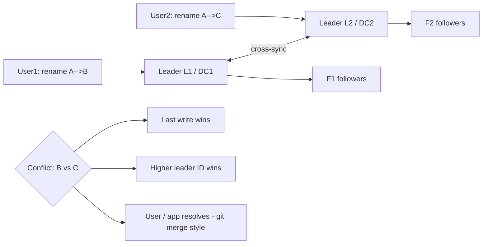
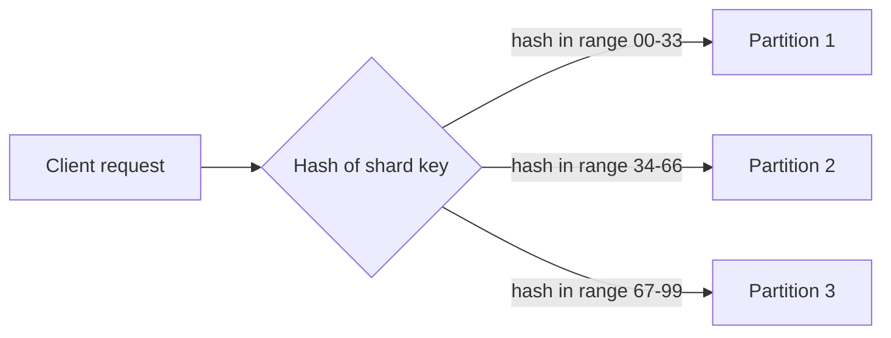

# Replication & Partitioning — when one database isn't enough

This note is the "grow your database" chapter: first we **copy** the same data onto more machines (replication), then we **split** the data across machines (partitioning/sharding). Every interview answer about scaling databases eventually lands on these two words, so the definitions and the trade-offs are pure gold. The same story keeps resurfacing underneath both: copies make the system safer, splits make it bigger, and every single choice re-opens the consistency bill.

---

## The billion-user problem (recap)

Back in [01-what-is-system-design.md](01-what-is-system-design.md) we had the double-withdrawal story: everyone sharing one bank register, two withdrawals hitting the same balance at the same time, and suddenly money "appears" because both reads saw the same old number before either write landed. That one single shared database is the whole reason we're here.

Now scale that thought to a billion users. One database just... cannot:

- One machine can only hold so much data. Put bluntly: 100 GB fits fine in 200 GB of storage, but 1 TB — 100 TB — the disk fills up. You cannot expand a single box vertically forever.
- My [10-load-balancing.md](10-load-balancing.md) servers now live in multiple regions (US, India) but they used to all point at one database. Fine for a handful of requests. At real traffic, one DB can't serve both.

The fix reached for first was **segregation** — one database for the Indian servers, one for the US servers — because it buys disaster recovery, efficiency, reduced latency, and/or the chance to split portions of data across DBs. The one assumption hiding inside that plan: that the regions' data actually *differs*. Often it doesn't, and then the pattern flips — you may instead run *multiple* DBs per region to serve one region's many servers. Either way, we're multiplying databases, and multiplying databases is the subject of this note.

The microservices recap names the whole toolkit in one breath: when multiple services talk to multiple databases, data gets handled across them via **migration, replication, or partitioning**. Migration is the one-time shuffle; the two words in this note's title are the ongoing answer.

So two ideas rescue us, and they are *different* ideas — I keep confusing the pair, so let me sharpen the distinction hard:

- **Replication** = *copy* the same data onto multiple machines.
- **Partitioning / sharding** = *divide* the data, each machine keeps its own slice.

> **(noted for interviews!)** Replication = copies of the SAME data. Partitioning = DIFFERENT data on different machines. If I can blurt that out in one sentence, I've already impressed the interviewer.

---

## Replication first — copies of the same data

**What it is:** copy data from DB1 onto DB2. If DB1 dies, DB2 still has everything and we redirect DB1's load to it. Straightforward. And it's not a standby backup that sits idle — the copies actively take read traffic in normal operation.

**Why we bother** (three reasons, all raising read throughput in the end):

- **Avoid the single point of failure (SPOF)** — one DB down = whole app down. With a replica, no.
- **Availability** — data centers in multiple places mean a regional outage doesn't kill us.
- **Data locality / performance** — a DB sitting next to its server retrieves data faster, and if data is needed at both the India and US sites, put a copy near each.

The math that seals it: a single DB handles roughly **10,000 requests/sec**; two identical DBs ≈ 2x that. Read throughput doubles just by adding copies.

### Master-slave (leader-follower) replication

The classic setup, and the names we say in interviews:

- One node is the **master / leader**. ALL writes go to it. Every write is replicated over to the followers.
- The rest are **slaves / followers / replicas**. They hold copies of the same data and sit there absorbing the reads. Followers *never* accept client writes directly.

Why funnel *every* write through one node? Because one write location serializes them — and a serialized write path is exactly what stops the double-withdrawal story from happening again. If two conflicting writes could land on two different nodes simultaneously, we'd be right back in the shared-register mess. The leader is the single gatekeeper that makes "both saw the same balance" impossible.

```
        write ─────────────────────────► [ MASTER ]
                                             │ replicate
                    ┌────────────────────────┼──────────────────────┐
                    ▼                        ▼                      ▼
               [F1 follower]           [F2 follower]          [F3 follower]
                    ▲                        ▲                      ▲
        read ───────┘              read ────┘              read ───┘
        (spread reads across replicas, take load off the master)
```

The gift: reads fan out across many replicas, so the master isn't the bottleneck for every request. The catch shows up the moment a write happens and reads happen at the same time — that's the **replication lag / consistency** problem. Which brings up the big fork in the road:

**Asynchronous replication** — the leader tells the user "done" immediately, without waiting for the followers to acknowledge, then pushes the change to them in the background; they ACK later. If a follower is down, the leader has already confirmed the write and simply replays the change when the follower recovers. Fast, never blocks a resource — but you *trade consistency*: a user who reads from a follower right after a write can see **stale data** for a moment.

**Synchronous replication** — the leader waits for an OK from *both* followers before telling the user anything. Every follower is always current, and failover becomes trivial (promote any follower). But more followers = more waiting, and the write blocks that resource — often called "an impractical approach; we always prefer async." So my automatic answer can be: async for the flow; reserve sync for the rare case where being wrong hurts more than being slow.

> The tension here is *the* hook into [12-cap-theorem.md](12-cap-theorem.md): async replication means, for a tiny window, you choose "answer fast with possibly-stale data" over "perfectly up to date." That trade-off becomes a theorem later.

### The profile-picture example (async, step by step)

User updates a profile picture → the request goes to the leader → leader updates the user's view immediately → change fans out to F1 (slower, farther) and F2 → user has already gotten their "done." The stale window exists mostly on distant/slow followers.

If F1 or F2 is down at push time, the leader has already confirmed the write, so it just holds the change and **replays it when the failed node recovers** — nobody waits, nobody retries anything on the user's side. That's the whole appeal of async: the user's request never blocks on someone else's health.

### Adding a new follower (F3)

You don't just turn it on and hope — there is a 3-step bootstrap, and replicas *can* be bootstrapped from another follower:

1. Take a **snapshot** of the leader (or a follower — but if from F2, F2 must keep acting as the feed source) at, say, 12:55 p.m. capturing the full state; dump it into F3.
2. That copy can take 2–3 hours for huge data, so take a **second snapshot containing only the delta** (everything changed from 12:55 to now) and dump that in too.
3. Once F3 is fully in sync (F3 ↔ F2 ↔ leader all aligned), connect the leader → F3 is live.

### Master fails → elect a new one

Pick the follower with the **latest update timestamp** (most recent info wins), promote it to master, and repoint the other followers to recognize it. There are two concepts that keep showing up in all of this: **fs image** = a full metadata snapshot, and **edit log** = a record of every current change. Image for the baseline, edit log for the deltas — both get used in follower bootstrap *and* leader election.

### Multi-leader (master-master) replication

Now each data center gets its **own leader + followers**: DC1 has L1, DC2 has L2. Writes hit the *local* leader, which fans out to its own followers AND to the other data center's leader, which then updates its followers. This powers collaborative editing — two people on the same Google Sheet, both writing at once, each served fast by their local leader.

Why accept the complexity? Because each region's writes are now answered locally — no round trip to a single faraway master — so you get better performance and per-region fault tolerance. A data center sitting across an ocean from the one leader is exactly the setup that makes single-leader too slow; here, L1 and L2 each serve their neighborhood.

But as soon as there are two masters, writes can **conflict** — and this is the old shared-register danger returning with a different face:

- User1 renames `file A → B` through L1.
- User2 renames `file A → C` through L2.
- Both got an async "OK," nobody knew about the other writer.
- Leaders cross-sync: now the file should be called "B" *and* "C". Conflict.

There are **three classical resolution strategies**, and interviewers love this list:

1. **Last write wins** — whichever operation landed last wins, regardless of which leader it hit.
2. **Higher leader/replica ID wins** — give the leaders IDs (L1 = 10, L2 = 11); the higher ID's change (C) wins regardless of timing.
3. **Application / user resolution** — git-merge style: prompt the user with "your rename says B, another says C — which do you keep?" Needs real application logic, but it's the only one that doesn't silently throw away a user's work. This is literally how Google Docs and git handle concurrent edits — the conflict gets surfaced, not swallowed.

Worth a mental sidebar: tactics 1 and 2 auto-resolve, but they *discard* somebody's operation; tactic 3 keeps both but pushes the decision onto the app. Picking the right one is a product call as much as a tech call.



### Leaderless replication (the third algorithm, brief)

The third model: no designated leader at all in any data center. An update (that profile picture again) fans out to all three nodes; all of them eventually update and ACK — and the three responses get **combined collaboratively**, no single node's word is final. The catch: with a leader, one response tells you success — with no leader, do we wait for *every* replica, or is there another way? The "another way" is the **quorum rule**: with `n` nodes, a write only needs `> n/2` confirmations, and a read must consult `> n/2` nodes too. With 3 nodes, once a majority ACKs the write, we confirm — never wait on that slow third node.

Reads are where the trick lives: a concurrent reader can land on any of the three replicas, one returns the updated profile, another still serves stale data — the system must decide which answer to give. Resolution: if two responses disagree, consult the third and take the **majority** value (or use timestamps / other mechanisms). A true 50/50 split is a rare special case — real large systems run with "more than 10 or 12 servers," so a deciding vote basically always exists.

> Real products run this way — **Amazon DynamoDB, Riak, Cassandra** — the no-leader family. Worth naming in an interview.

Pro: no single-leader dependency or bottleneck. Con: every query touches multiple nodes, and you must reconcile stale vs fresh answers on the read path — the trade-off we keep circling back to.

> Mental map of the whole note: the **three replication algorithms** are single-leader, multi-leader, leaderless; the **four partitioning moves** are range-based, hash-based, and the two index strategies (local, global). Everything else in this file is just consequences.

### Replication costs, in one breath

- **High availability, read scalability, fault tolerance** — the payoff.
- **Consistency headaches / replication lag** — stale reads in async mode.
- **Write conflicts** — the double-withdrawal danger again, now between masters instead of between users. Same root disease: two places believing different things about shared state.

---

## Partitioning / sharding — splitting the data

Replication hit a wall and here's where it fails (two exact complaints):

1. The data can get so huge it won't even fit as a full copy on one node — replicating a 100 TB dataset onto every machine is nonsense.
2. Even with secondary indexes, searching a giant table just gets slower.

So instead of copying everything everywhere, we **divide the data by logic**: put one part on node A, the other part on node B — and then (a preview of the final section) replicate those *smaller* partitions. Both rules of the game, in order:

- **Completeness:** "if we do partitions like this, then if we combine them it should give us the entire data set." No part of the data may be lost in the split.
- **Balance:** no node at 90% while another sits at 10% — an uneven split "beats the reasoning of partitioning."

Capacity thinking: if a node comfortably stores **10,000 records**, and we're at the cap, create a new partition or re-split the existing one into two 5,000-record pieces.

Small vocabulary guardrail: we keep saying we "cannot expand vertically forever" — that's the *scale-up* path of just buying a bigger single machine (more RAM/storage/CPU), which always ends at "the disk fills up." Partitioning is the **horizontal** path — more machines, each holding a slice of the rows. When people say **sharding**, they mean this horizontal splitting; that's what both strategies below are doing.

> The ordering matters: replication buys us *copies*, but the copy + the original are the same size. Replication alone fails as soon as the whole dataset outgrows one node — that's the moment partitioning stops being optional. Partitions also make replication cheaper, because now you can copy a 5,000-record slice instead of the full 100,000.

### Strategy 1 — range-based (key) sharding

Cut the dataset by the value of a key. Stock example: a user table with 100,000 IDs → split 50,000 / 50,000. User **1–50,000 → partition 1**, user **50,001–100,000 → partition 2**. Trivial to retrieve: you know instantly which node owns a given user.

The hidden mess is **geography**. What if IDs 1–50k happen to be India and 50k+ are the US, and the app is popular in the US? Then:

```
partition 1 (user 1–50,000, India)      partition 2 (user 50,001–100,000, US)
   ~100 requests / second                  ~10,000 requests / second
   (idle!)                                 (on fire!)
```

> "A **hotspot** is that partition which is getting more requests compared to other ones." And a hotspot is bad news: the hot node overloads and fails, and then we must redistribute data, reconfigure, replace a node. Surely not recommended.

**Detecting it:** tag a timestamp on every request; if most land on P1, the distribution is bad → rearrange / re-shard.

And the fix is never free: re-sharding means redistributing the data, reconceiving the boundaries, replacing nodes — "redistribute data, reconfigure, replace the node." So we don't wait for the hotspot to burn the node; we watch the request timestamps and act before the imbalance turns into an outage.

### Strategy 2 — hash-based sharding

Run the user ID through a **hash function** → get a unique number → route by that number, possibly by ranges of the hash output (hash 1–10 → one range, 10–15 → another). The two rules of partitioning still govern the hash split — the union has to be the whole dataset, and every range should carry a fair share of the traffic. But here's the honest note: **the same hotspot risk shows up here too.** If huge chunks of the users' keys hash into one narrow range, one node still goes hot. Hashing scrambles the mapping, it doesn't fix the skew.



**Shard key choice** is therefore the real craft: pick a key that spreads requests evenly across partitions. No key saves you from a fundamentally skewed workload — that's the "hot spot / skew" downside written into the strategy.

### Consistent hashing — the shard that survives growth

- Plain hash-based sharding has a re-shard tax: with `hash(user_id) % N`, adding or removing one node changes every key's `% N`, so nearly all the data has to move at once. The fix is **consistent hashing**: keys and nodes hash onto one fixed ring, each key is owned by the next node clockwise, and each node owns a hash *range* rather than a slot number.
- Add a node -> only the range between the new node and its clockwise neighbour re-homes. Remove a node -> its range is absorbed by the next node clockwise. Instead of "everything moves", only the neighbours' slices move. This is why Redis Cluster, Cassandra, and DynamoDB are all built on it.
- The catch that keeps it a craft: range ownership can still come out uneven if nodes land on unlucky hashes. **Virtual nodes** fix that — each physical node claims *many* small token positions on the ring, so ownership statistically evens out.

### Hot keys, and how to cool them

- Consistent hashing spreads *keys* evenly, but user behaviour doesn't: one celebrity's timeline, one viral product on the homepage, one shard value a whole app defaults to. The result is the **hotspot** from the range-based story arriving again — a single shard at ~10,000 req/s while its siblings sleep at ~100.
- Moves that actually cool it:
  - **Replicate the hot key onto extra nodes** and read from whichever answers first (DynamoDB-style), plus a **local per-node cache** in front of the shard so the herd never reaches storage at once.
  - **Split the hot key into sub-keys** on purpose (`timeline_A`, `timeline_B`, ...) to scatter the fan-out across more shards.
  - **Change the shard key** so requests stop colliding on one value — which is why "pick a key that spreads evenly" is the first line of defence, not the last.

### Read-replica failover, end to end

- "Promote the latest follower" has a mechanical form worth memorising:
  1. A health check (or timeout) flags the master as dead.
  2. The most up-to-date follower is promoted — new writes go there, and the other followers repoint their replication source at it.
  3. DNS and the load balancer (see [10-load-balancing.md](10-load-balancing.md)) now route writes to the promoted node; reads keep spreading across the pool.
  4. The old master, once repaired, re-joins as a *follower* and re-syncs from the new leader — never as master, or you risk **split-brain** (two masters both accepting writes). Fencing — stop-the-old-master before start-the-new — is the safety net that guarantees one writer at a time.
- With async replication, promoting the *latest* follower is what minimises lost writes — but "latest" is a guess when nobody heard the master's final acknowledgment. That is why systems with zero tolerance for lost writes pair promotion with quorum reads (the CP flavour that [12-cap-theorem.md](12-cap-theorem.md) formalises) instead of plain last-timestamp-wins.

### The costs, mirrored

Replication and partitioning each come with a bill, and the two bills rhyme:

- **Hot spots / skew** — the partition-level version of imbalance; one shard fries at ~10,000 req/s while its sibling sleeps at ~100. The exact term is **hotspot**.
- **Re-sharding cost** — when the distribution goes bad, we redistribute the data, reconfigure the boundaries, replace nodes. Nothing about it is cheap or automatic; detection (timestamps on requests) has to come first.
- **Cross-shard queries** — any query spanning partitions is slower and heavier; the local vs global index decision is the attempt to make them tolerable.

### Secondary indexes — the single-DB warm-up

Before partitioning, there is a warm-up on **secondary indexes** in one DB. Products table with columns name, color, price, material → a secondary index on `material` lets a query for `material = wood` jump straight to the wood rows instead of scanning the whole (huge) table. Without that index, every `material = wood` query walks the table row by row — which is exactly why search degrades as the table grows. This is complaint #2 from the replication wall: *even with* secondary indexes, searching a giant table just slows down. The index keeps one database fast. The moment we partition, indexes stop being a local thing — and that's the cross-shard problem.

### Cross-shard queries — the second big downside

Once data is split, queries that span partitions get expensive. How do the indexes behave *across* partitions now?

- **Local secondary index (per partition)** — each partition keeps its own index (this is what Cassandra and Elasticsearch do). P1 holds cars 200–400 with its color index (blue → 209, 305; red → 350, 359); P2 holds cars 500–700 with its own (blue → 509, 609). Query for a blue car? Collect matches from *both* partitions and combine. Silver car? P1's index quickly says "none here," so we skip it entirely. Con: indexes live in every partition, so every query still fans out to partitions that could have zero matches — wasted traffic and a heavier system.
- **Global / common index** — keep the secondary index in one chosen partition/data center. Global map: `blue → {209, 305} in P1, {509, 609} in P2` → route the query *only* to P1 and P2; P3 and P4 are left in peace. Reads improve a lot — but **writes get harder**: inserting a blue car with ID 1011 into P79 now *also* means updating the global index. Precise reads, costlier writes. That's the trade-off in one sentence.

Either strategy, the takeaway is the same: partition boundaries make writes neat and local, but every read that crosses a boundary pays a price. The shard key is what decides how often a query stays inside one partition.

---

## Putting the two together

Replication and partitioning aren't either/or — real systems run them as a stack. In prose, the two-region picture from the load-balancer note looks like this underneath:

```
India slice (partition A) ── replicated → A1, A2      US slice (partition B) ── replicated → B1, B2
   writer ──► Master A                                 writer ──► Master B
   reads ───► A1, A2                                   reads ───► B1, B2
```

Reading the stack top to bottom:

- **Partition first, then replicate the smaller pieces.** Put part of the data on node A, part on node B — then take a *copy* of each partition onto another machine so no one partition becomes a fresh single point of failure. Partitioning shrinks each working set; replication protects whichever shard it lands on.
- **Inside one region, it's master-slave.** The region's writer goes to the master; reads fan out to replicas, and (tying back to the last note) the **load balancer** is what spreads those reads so no replica overheats and none sits idle — the "no server overheated, no server underutilized" goal, now applied to databases. The replicas are what keep the region alive if the master dies and we have to elect a successor (latest timestamp wins, remember).
- **The region-split itself is the partition.** In [10-load-balancing.md](10-load-balancing.md) geo-routing forced each region to have its own data; here's the "why" spelled out — one DB per region (partition by geography / principal of locality), and that assumes India's and the US's data genuinely differ. If they don't, you stop partitioning by region and instead replicate the whole dataset across regions — and eat the consistency lag rather than split it.

The failure drill makes the design click: if **Master A** dies, replica A1 already holds the full India slice → promote A1 (latest timestamp wins) → the partition keeps serving reads and writes. A single node dying never takes the slice down; only losing *all* replicas of one partition loses that data. Which is precisely why we replicate partitions in the first place.

End to end, the round trip is now coherent with the whole design: a read flows client → load balancer → nearest region → a replica, while a write flows client → load balancer → region → the master. Locality (the replica near the user) covers reads, serialization (one master) covers writes.

In one line for interviews: **partition to scale (write/read) capacity, replicate to scale availability — and master-slave replication layered on top of shards is the most common practical shape.**

---

## Quick revision

- **Replication** = copies of the SAME data; **partitioning** = DIFFERENT slices across machines — say both out loud before any DB-scaling answer.
- Replicate for 3 reasons: kill the SPOF, availability, data locality — and all three just boost read throughput (~10k req/s per DB).
- Master-slave: writes only to the leader, reads spread across followers; async replication is preferred but creates **stale reads** (consistency ≠ latency).
- New follower: snapshot + delta snapshot, then sync; dead leader: promote the follower with the latest timestamp.
- Master-master conflicts (rename A→B vs A→C) resolve via last-write-wins, higher leader ID, or user/application resolution.
- Partitioning needs completeness (union = whole dataset) + balance (no 90/10 nodes).
- Range-based sharding is easy but skews (100 vs 10,000 req/s); hash-based spreads better but can still hotspot; cross-partition queries need local or global secondary indexes.

## Interview questions

1. Walk me through why a single database can't serve a billion users, and the difference between replication and partitioning you'd introduce first.
2. In master-slave setup with async replication, a user reads stale data right after a write. Explain why, and which mechanisms (sync, quorum reads) would fix it.
3. Users in India are hammering one shard while the US shard idles. Is that range-based or hash-based sharding, how would you detect it, and what could you change (shard key, hash range) to fix the hotspot?