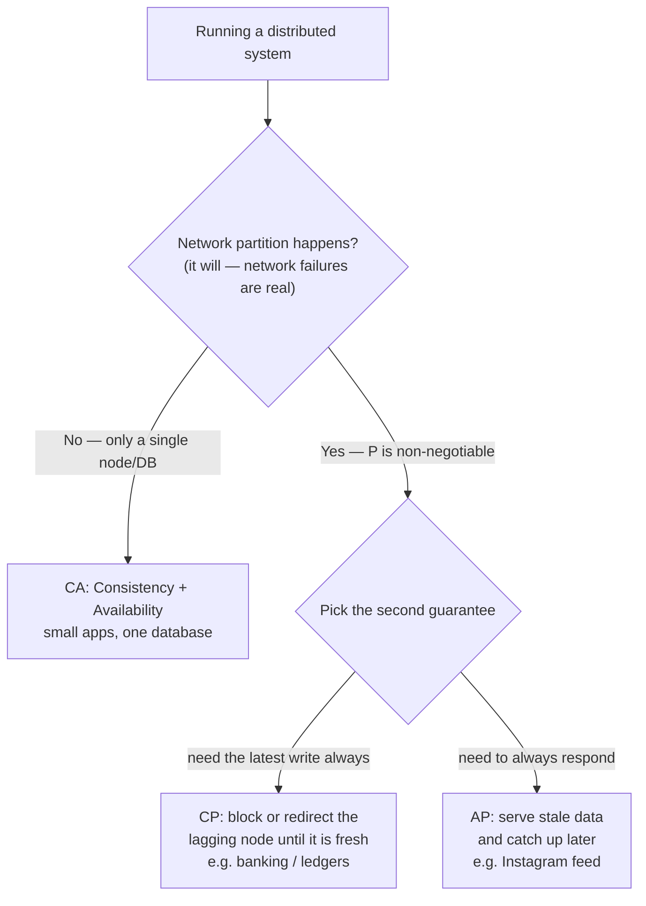
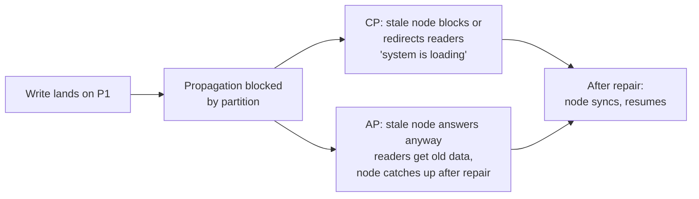

# CAP Theorem — you can only pick two (and the network picks the fight)

This note covers the **CAP theorem** — Consistency, Availability, Partition tolerance — and why, in any real distributed system, the choice collapses to **CP vs AP**. Small topic, huge interview weight: every "what happens when a node goes down" question is secretly a CAP question.

---

## The three guarantees

Distributed system = multiple nodes/data centers holding copies of the same data (built on top of [replication and partitioning](11-replication-and-partitioning.md)). We want three things from it:

- **Consistency** — *every read gets the latest write.* Every user sees the same, freshest information. Lecture's phrasing: "providing latest information to every user."
  - Example: an update lands on partition/node P1; it takes time to propagate to P2. A reader hitting P2 during that window must **not** see old data — the system shows "system is loading" until P2 catches up. We traded availability for consistency.
- **Availability** — *every request gets a response.* No matter which node you ask, you get an answer — even if that answer is slightly stale. During the same propagation window: no loading icon, user just gets the older data served back.
- **Partition tolerance** — *the system keeps working when nodes lose network contact.* The network of linked nodes is completely broken (a cut cable, a dead data center link, a switch melting). Two options once the partition hits: wait to fix the connection then update, or keep serving (but the lagging side is stale).

ASCII sketch of the propagation window that makes C and A fight:

```
   write "₹100 sent"
         |
         v
   +-----------+   propagation lag   +-----------+
   |   node P1  | =================> |   node P2  |
   |  (fresh)   |     takes time     |  (stale)   |
   +-----------+                     +-----------+
         |                                 |
   reader here:                      reader here:
   sees latest  ----------------->   CP: "loading, wait"
   (Consistent)                     AP: "here's old data"
                                     (Available)
```

> **Interview point:** C and A only clash *during* replication lag or a network partition. On a healthy, fully-synced system all three coexist happily — the tension is structural, not constant.

The classic way I sketch the three corners in my notebook:

```
                 Consistency
                (latest write
                 to everyone)
                    /    \
                   /      \
                  /  pick  \
                 /   only   \
                /    two     \
               /______  ______\
              /   CA   \/   CP  \
             /                    \
   Availability ------------ Partition tolerance
  (always respond)        (survive broken links)
        \
         \-- the AP corner lives down here:
             always respond, even when stale
```

---

## The core claim — only two of three

The theorem's blunt line from the lecture: **"you can only provide two of these three variables."**

Pick any two, lose the third:

- **CA** — Consistent + Available, but no Partition tolerance: works only if the network between nodes can never break... which means essentially a **single database / single node**.
- **CP** — Consistent + Partition-tolerant: when the link breaks, refuse or delay responses on the stale side until it has the latest data. You lose availability.
- **AP** — Available + Partition-tolerant: when the link breaks, keep answering — with stale data. You lose consistency (temporarily).

The choice flowchart the whole lecture hangs on:



### Why Partition tolerance is not negotiable

Here is the twist the lecture insists on: in a distributed system, **partitions WILL happen**. Nodes are linked over a real network; networks fail. You cannot choose to "not have partition tolerance" and still call the system distributed — refusing to handle a partition *is* handling it badly.

So the CA row of the theorem is a mirage at scale. Quote from the notes: with two data centers, during propagation you must either show data (break C) or wait (break A). At scale, **"we don't have an option to pick CA."**

> **Noted for interviews!** The exam-room version of CAP is never "name the three guarantees" — it's "your bank app shows a wrong balance for 4 seconds during a failover. Which guarantee did you sacrifice?" Answer: Availability (that's a CP system).

---

## The trade-off framing — consistency-first stories

Remember the money/bank story from [What is System Design](01-what-is-system-design.md): money must never appear twice or vanish, so we centralize decision-making (the shared register idea) and force everyone to agree on ONE current value before moving on. That is **consistency-first thinking** — correctness of the record beats speed of the response.

CAP is that same argument, generalized:

- **Consistency-first** says: if I can't prove you have the latest write, I would rather *not answer you at all* than answer wrong. (Bank won't show you a balance it isn't sure about.)
- **Availability-first** says: an answer — even a slightly old one — beats silence. Nobody closes an app because a like count lagged by two seconds.

The same tension as sync vs async and leader vs follower; CAP just names the corner you get pushed into when the **network itself** breaks. And it's the reason the bank/register intuition travels everywhere in system design: before you scale *anything* that holds state, you must decide which of C or A dies during a partition — because P is not up for debate.

---

## CP vs AP — the real choice

### CP — Consistency + Partition tolerance

During a broken link:

- The lagging node **processes no requests** until it has the latest data.
- Callers are **redirected** to nodes that are known-consistent.
- Availability is traded away: users on the wrong side of the partition get waits, errors, or "try again."

What the user actually feels on the stale side of the partition:

- Read request arrives → node knows it may not have the latest write →
- either hold the caller in a **loading state** until sync completes, or
- **redirect** the caller to a node that is confirmed up-to-date,
- and if neither is possible yet → request fails / "try again later".
- Correctness is never traded. Silence is acceptable. Wrong data is not.

**Example — banking / ledgers:** you send ₹100; the receiver must wait until the transaction is actually processed and the ledger updated everywhere it matters. Serving "you received ₹100" before the write is durable would be a *blunder* — money stories from lecture one all over again. A bank that answers fast but inconsistently loses trust (and money).

### AP — Availability + Partition tolerance

During the same broken link:

- The node is stale, but it **keeps answering** every request.
- Consistency is traded away: responses reflect the last state that node knew.

What the user feels on the stale side:

- Read request arrives → node serves whatever it has →
- **no loading icon, no error, no redirect** — just a reply,
- possibly built on data that missed the latest write,
- until the partition heals and the node catches up.
- Availability is never traded. A stale answer is acceptable. Silence is not.

**Example — Instagram:** you post a photo/video; followers' feeds can lag 1-2 seconds and nothing of value is lost. The system's job is to *always respond*, then reconcile once the partition heals.

### Side-by-side behavior (same partition, two philosophies)

```
            network link CUT between P1 and P2
  =========================================================
   CP system                         AP system
   ----------                         ----------
   P1 (fresh) serves                 P1 serves fresh data
   P2 refuses / redirects            P2 still serves stale data
   user on P2 side: WAIT             user on P2 side: instant reply
   guarantee kept: C                 guarantee kept: A
  =========================================================
```



### CA — the small-system escape hatch

The lecture is blunt: **CA = every small application / single data.** One database, one node, nothing to partition — of course you can have consistency and availability. It's not a strategy, it's the default of not-yet-distributed. Once you add a second data center for scale or fault-tolerance, CA evaporates and you're on the CP/AP line.

Why two data centers kill CA — the argument step by step:

```
   [ Data Center 1 ]  ~~slow link~~  [ Data Center 2 ]
         |                                 |
      write lands                      reader asks
      here first                       for same row
         |                                 |
         +-------- propagation lag --------+
                     (always > 0)

   During that lag the reader in DC2 has exactly two options:

   A) Serve the row now  ->  gets OLD value  ->  Consistency broken
   B) Wait for the row   ->  request blocked  ->  Availability broken

   Either way, one of C or A is gone. That is CAP in one picture.
```

- Option A keeps A, breaks C → you've drifted toward **AP**.
- Option B keeps C, breaks A → you've drifted toward **CP**.
- A single-node system never faces this fork: there is no second copy to lag behind, hence no partition, hence **CA is trivially true** — and trivially useless once you scale out.

### Eventual catch-up — the AP mindset

AP doesn't mean "wrong forever." The lagging node holds stale data *until the partition is fixed and replicas reconcile* — followers see your Instagram post 1-2 seconds late; the profile-picture fan-out from leaderless replication eventually lands on all three nodes. Correctness arrives **eventually**; AP simply refuses to block on waiting for it. That "keep serving now, become correct later" stance is the whole AP personality. And it is not a free lunch — it means your reads can be wrong for a window, so you need the *writes* to be designed so the eventual convergence is safe. Same reason the leaderless-replication systems in [replication and partitioning](11-replication-and-partitioning.md) had to resolve read conflicts (majority wins, timestamps) instead of trusting any one replica.

> **The one-line version:** CP says "I'd rather be silent than wrong." AP says "I'd rather be wrong for a second than silent."

---

## Where CAP meets SQL vs NoSQL

This is exactly where the lecture parks it — no deeper, no invented taxonomy:

- A **single SQL database** (see [SQL databases](07-sql-databases.md)) for a small app is effectively CA territory: one node, no partition in play, reads always see the last write. Great — until you need more than one node.
- The moment we shard/replicate for scale — which is the entire pitch of [NoSQL databases](08-nosql-databases.md) — **CA is off the table**. Now every design decision is CP or AP:

```
   one SQL instance (small app)
        -> consistency + availability for free (CA)
        -> but it is ONE node: no partition tolerance
   distributed / sharded / replicated (SQL or NoSQL)
        -> partitions unavoidable (P)
        -> now decide: CP (bank-style) or AP (feed-style)
```

- Systems that behave like banks/ledgers choose **CP**: block or redirect until the write is everywhere it needs to be.
- Systems that behave like social feeds/notifications choose **AP**: answer immediately, let replicas converge.
- So the SQL-vs-NoSQL debate and CAP are two views of one question: *do we centralize agreement (consistency-first, the shared-register instinct) or push data outward and tolerate staleness for availability and scale?*

---

## Quick revision

- **C** = every read sees the latest write; **A** = every request gets *a* response; **P** = survive broken links between nodes.
- You can have **only two of three** — and since partitions are inevitable in a distributed system, **P is forced**, so the real choice is **CP vs AP**.
- **CA** only exists for a single database/node; at scale "we don't have an option to pick CA."
- **CP** = block/redirect the stale node until it's fresh → banks, ledgers, anything where a wrong number is a blunder.
- **AP** = keep serving stale data during the partition → Instagram posts, feeds; data converges after repair.
- Same tension as the money/bank story: consistency-first = centralize agreement, refuse to answer rather than answer wrong.
- CAP is what turns the SQL-vs-NoSQL scale conversation into an explicit consistency-vs-availability trade-off.

---

## Interview questions

1. Explain the CAP theorem. If partitions are inevitable, what does the theorem actually force a distributed system designer to choose between — and why is CA not a real option at scale?
2. A banking service and an Instagram-style feed both replicate across two data centers and then lose the link between them. Walk through what users experience on each side of the partition in a CP design vs an AP design.
3. Your read returns data that is a few seconds stale during a failover. Which CAP guarantee was sacrificed, what kind of system (CP/AP) did you likely build, and how does this relate to why a single-node SQL database never seemed to have this problem?
