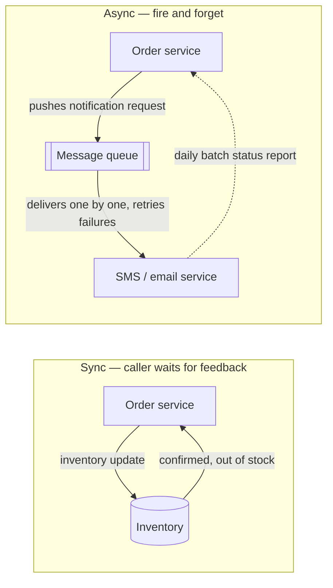

# Message Queues

Notes on the message-queue component from the Telusko series — sync vs async first, then the queue as a buffer/broker, retries, dead letters, and when NOT to add one. Interview gold: almost every "what happens after I click Place Order?" discussion lands here.

## The story first: order placed, don't make the user wait

- Lecture's example: customer places an order on the e-commerce app. Behind that one click sit several sub-tasks:
  - update inventory
  - process the order
  - talk to vendor / delivery partner
  - send confirmation notification (mail / SMS)
- If the order service runs every one of those before replying, the user stares at a spinner while a third-party SMS gateway takes its sweet time.
- So the lecture's point: **placing an order should return fast**, while the SMS/email receipt happens in the background.
- The e-commerce purchase trio, sorted by urgency:
  - **Inventory update** — synchronous, the crucial immediate one. It must instantly go out of stock or "it can create blunders."
  - **Email confirmation** — asynchronous. Fine if it lands 1 minute late; a third-party email service handles it.
  - **Delivery partner notification** — asynchronous. Not in a hurry; hand it off so the system focuses on other tasks.
- Dependent tasks stay sync on purpose — you cannot email order details before the order is even processed.

---

## Synchronous vs asynchronous — the two interaction styles

Definitions straight from the lecture:

- **Synchronous**: caller waits for confirmation/feedback before moving on. Example given: the SMS app notifies the order service "message sent, done" — only then does work continue.
- **Asynchronous**: fire-and-forget. The order service drops the request and moves on with other orders.
- Golden rule for async: *"we can simply fire a request and then our system can forget about that."*

More examples he uses:

- Sync — financial applications (security → immediate response needed).
- Async — email broadcasts; SMS / WhatsApp.
- Async — live matches: latency is 0 seconds up to 7-8-10 seconds depending on network, and nobody panics.
- Async — OTP timers are mostly >30 seconds *"because in 30 seconds our system can handle this request in an async manner."*



> **Key takeaway**: sync when the answer is needed *now* (money, stock levels); async when "later, but reliably" is good enough (receipts, broadcasts, reports).

---

## So what is a message queue?

- The lecture's definition: *"It is like a buffer or we can say broker in between two apps or services."*
- A **buffer / broker** sitting between the two services — in the component preview it is **component 6 of the [7-component architecture](./01-what-is-system-design.md)**.
- Vocabulary (he gives the fun names first):
  - putters = **producers** = publishers
  - takers = **consumers** = subscribers
- Flow in one line: producer **fires a message and forgets**; the queue holds it; the consumer **picks it up when ready**.
- Why not just call the SMS service directly? A direct call keeps the order system busy. The queue satisfies two goals at once:
  - don't keep the caller busy, and
  - still ensure every request gets taken care of.
- Queue duties (digest wording): store each request, deliver one-by-one to the consumer, handle retries/failures, track which requests succeeded.
- "In short our message queues are doing two work": **store requests** + **take charge of delivering/sequencing them**.
- Called out as **vital between multiple microservices**.

```
 [ producer / publisher ]                 [ consumer / subscriber ]
  order service, app code                  SMS svc, email svc, report job
           |                                       ^
           |  fire and forget                      | pick up when ready
           v                                       |
   +-----------------------------------------------------+
   |        MESSAGE QUEUE   (buffer / broker)            |
   |  - holds the requests                               |
   |  - delivers them one by one                         |
   |  - handles failed calls (retry)                     |
   |  - tracks which requests succeeded                  |
   |  - absorbs load aimed at third parties              |
   +-----------------------------------------------------+
```

---

## Why we bother: decoupling and peak traffic

- **Decoupling** is the headline benefit: producer and consumer no longer know or care about each other's internals — they only agree on the queue.
  - Lecture's decoupling use: user analytics (where user lands, why orders fail) and all logging systems — the main app just emits events, downstream picks them up.
- Because they're decoupled, **they scale independently**:
  - heavy order traffic → grow the producers, the queue just gets deeper.
  - slow email vendor → add more consumers, or let the backlog drain at the consumers' own pace.
- **Peak-traffic buffering**: the queue absorbs spikes instead of the system dropping requests or hammering downstream services.
  - Ties directly to the 10x peak-load story in [functional vs non-functional requirements](./03-functional-vs-nonfunctional-requirements.md): at 10x normal traffic you either shed load or queue it — the message queue is the "queue it" answer.
  - He even frames the MQ as a mini load balancer: *"MQ does everything a load balancer does"* — holds requests in queue, hands them to servers/consumers.
- Subscriber health is the queue's job too: if a consumer is dead, redirect to another; the queue knows which consumer is fast/efficient and can route priority work there.

> **Interview point**: a queue trades *instant response* for *guaranteed eventual processing* — that trade is exactly what peak traffic and third-party dependencies need.

---

## Brokers you'll hear named

- **RabbitMQ**, **Kafka**, **SQS** — the common broker names that show up around this topic.
- Lecture's focus was never "pick tool X" — it was the *role*: a buffer between producer and consumer that stores, delivers, retries, and reports. Know the role, name-drop the tools.

---

## How the queue hands work over

Lecture went one level deeper on delivery behaviour — worth noting:

- **FIFO** (first-in-first-out) has two flavours:
  - **Strict order** — processing request #3 breaks → the queue will not proceed; even a recovered consumer can't process #4. His verdict: *"Not recommended at all."* (this blocking behaviour always trips me up in interviews)
  - **Unordered queue** — on failure of #3, the system jumps to other requests; consumer keeps operating; system won't break.
- **Priority queue** — attach a priority number/ID. Example: priorities 10, 3, 8, 1 → consumer serves call 4 → 2 → 3 → 1. Used in the later video-streaming capstone for transcoding work.
- **Pull-based vs push-based**:
  - pull → requests sit in the queue, the *consumer* decides when to pick (communication starts with consumer).
  - push → the MQ initiates and pushes requests to the consumer.
- **Pub/sub** — publishers → MQ → multiple subscribers; one subscriber may pull while another is pushed. *"Pubsub is nothing but the understanding of our message queues only."*
- Two order gotchas he stresses:
  - calls arriving *into* the MQ are async, so their order doesn't matter much;
  - consumption order is **random** — out of 100 requests a consumer may pick the 100th first; even a priority Q doesn't guarantee FIFO.

---

## Failures, retries, and dead letters

- Persistence first: the queue **stores** every request, so a consumer crash doesn't lose the work — retry happens from the stored message, not from the producer's memory.
- **Retries / failed calls** are an explicit queue duty: deliver, fail, try again — the producer already moved on.
- **Poison messages**: messages a subscriber *can't* process — bad/invalid requests, or ones failing after multiple attempts. Re-sending them just burns resources with no result.
- **DLQ (Dead Letter Queue)** — the fix:
  - failed request is diverted to a separate queue owned by the MQ;
  - the main queue continues with the next request (no head-of-line jam);
  - the publisher eventually learns — via failed logs or an async report: *"these many requests passed, these many failed, and the reasons."*
- **Duplicacy**: if subscriber S1 already processed a request, it must never reach S2 — some payloads must not run twice. The MQ deletes a message once processed, and can track provenance (produced by P1, handled by S1).
- Full failure philosophy (hardware/software/human faults, redundancy, alerts) lives in [fault tolerance](./14-fault-tolerance.md).

```
 producers --> [ MAIN QUEUE ] --msg #3--> consumer tries it
                    |                         |
                    | next messages keep flowing
                    v                         X  fails again & again (poison)
               [ DEAD LETTER QUEUE ] <--------+
                    |
                    v
         failure logs / async report  --->  publisher learns what broke
```

---

## Where queues shine — and where to skip them

Where the lecture says **USE** them:

- **Async operations/requests** — "no doubt about it."
- **Decoupling** — user analytics, logging systems (land, clicks, why orders fail).
- **Load balancing** — hold requests, hand them to servers; redirect around dead consumers.
- **Deferred / scheduled jobs** — daily report generation; products added all day go live via an evening scheduled process. (Same idea as the daily batch status report back to the order app in the component preview.)
- **Order pipelines & batch processing** — inventory → process order → vendor/delivery → notification, each as its own hop; heavy work handed off so the interactive path stays light.

Where to **AVOID** them (the trade-offs — queue vs direct call):

- **Cost** — a costly service with low request count doesn't justify a broker; call the subscriber directly.
- **Realtime apps** — need immediate, synchronous response; queueing only adds latency.
- **Acknowledgement needed** — the MQ normally doesn't return a response per request. Delivery is **eventual**, not immediate; the caller won't hear "done" synchronously.
- **Complexity** — one more component to run, monitor, and pay for. Remember the series mantra: *"Every component you add will add the costing of your system — use components for the right reasons."*

> **Bottom line**: queue when the consumer can be late and the producer must stay fast; direct-call when you need the answer now, per request, with no extra moving parts.

---

## Quick revision

- Sync = caller waits for feedback; async = **fire and forget** — order returns fast, SMS/email receipt happens in the background.
- Message queue = **buffer/broker** between **producer** (putters/publishers) and **consumer** (takers/subscribers).
- Queue duties: store requests, deliver one-by-one, retry failures, track status — producer forgets, nothing is lost.
- Decoupling lets producer and consumer **scale independently**; the queue **absorbs 10x peak spikes** instead of dropping requests or hammering third parties.
- Broker names to know: **RabbitMQ, Kafka, SQS**.
- Poison messages → **Dead Letter Queue**: main queue keeps flowing, publisher gets failure logs/async report; processed messages get deleted so they can't run twice.
- Skip the queue for realtime, low-volume/costly, or per-request acknowledgement needs — that's what direct calls are for.

## Interview questions

1. Walk through what happens after a user clicks "Place Order" — which sub-tasks are synchronous, which are asynchronous, and where exactly does the message queue sit?
2. Your email consumer goes down for an hour. What happens to incoming messages, what happens when it comes back, and what happens to a message that keeps failing forever?
3. When would you deliberately NOT put a message queue between two services, even though your team loves adding them everywhere?
