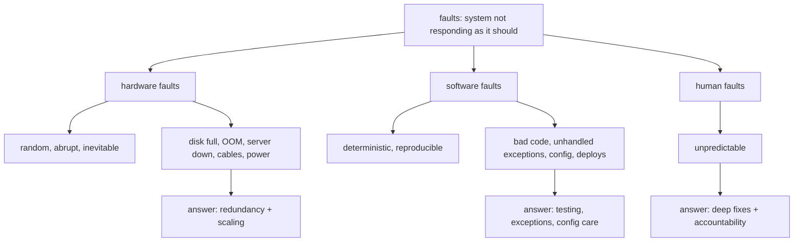
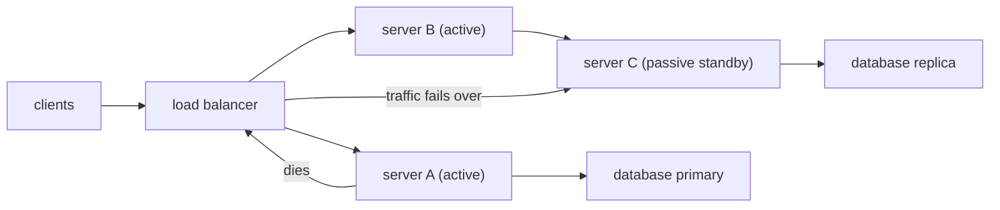
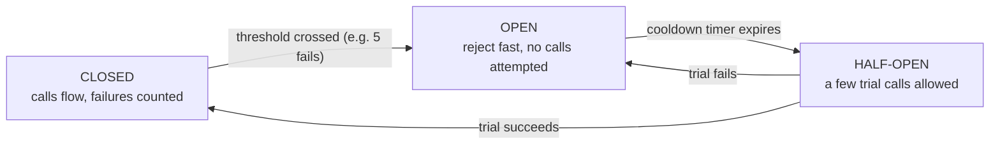

# 14. Fault Tolerance

Fault tolerance rests on a plain confession: *no system is perfect*. This note sits right between message queues and monitoring, and it answers one question: **when things break (and they will), how do we keep the users from noticing?** Interview-gold territory — this is where you stop reciting architecture and start sounding like you've actually lived through a pager going off at 3 a.m.

---

## The story first

It opens with a plain confession: **no application is perfect**. Any moment a system "is not responding the way it should" — that is a **fault/error**. Wide definition on purpose, because faults come at you from everywhere.

The key point: the paths they arrive by are countable:

- **Hardware** — the physical world deciding it's done with you.
- **Software** — code, configuration, or deploys that you wrote wrong.
- **Human** — the people operating all of it.

And one framing sentence that ties the whole story together: fault tolerance is a **non-functional requirement**, the kind we first mapped in [functional vs non-functional requirements](./03-functional-vs-nonfunctional-requirements.md). You don't bolt it on after an outage — you design it in from the start.

> **Key takeaway:** a distributed system WILL experience faults. The whole discipline of fault tolerance is about deciding, in advance, that the users never feel them.

---

## Breaking faults into three buckets

There is a clean taxonomy — **hardware, software, human** — with each bucket having its own personality and its own fix.



If you've read fault-tolerance write-ups before, you'll recognise the same ideas under the classic names: **crash faults** (the server died mid-invocation), **omission faults** (something that should be there isn't — a broken link in the chain, a dropped response), **timing/performance faults** (the answer arrives so late it might as well not have), **Byzantine/corrupt responses** (the node answers, but with garbage). These all fold into the three buckets, so I'll keep the three and tag the classic terms where the examples line up.

### Hardware faults

The canonical list: **disk full, out of memory, server down, damaged network cables, power-supply problems, a misconfigured node, a request spike**, even a **compromised database**.

- They are **random, abrupt, inevitable**. Some give you a bit of warning through alerts; most just happen.
- Because you can't predict them, the response is **redundancy and scaling** — more servers, more databases — so that when one piece dies, the group absorbs it.
- The honest gloss: hardware is the bucket you have the *least* control over.

### Software faults

These trace straight back to something a human did:

- badly written code, unhandled exceptions, edge cases you only ever discover in production;
- bad microservice / API configuration, deployment issues;
- the classic **dev-vs-prod environment mismatch** — "works in prod not dev, or vice versa — day-to-day life of a software developer."

Two extra points:

- **Slow requests also count as a software fault.** A response that arrives too late is a failure for the user who already left — that's the timing/performance flavour.
- The **merge-request pain point**: two developers working on the same feature/file in parallel must both be thoroughly tested, or they break each other on staging/prod — "one of the most painful things of any developer."

The good news that makes up for it: software faults are **deterministic**. Follow the same steps and you get the same break, which means you can reproduce it, then fix carefully and ASAP.

### Human faults

The one often called "not really a fault but it comes into the category" — and **the most important one**.

- Humans are the **most unreliable component** of software development. Inanimate components give you alerts beforehand; people sometimes just don't.
- And yet humans are also the **most powerful**: if they stop working, nothing works. Even AI-generated code (agents, open-source models) still needs a human to rectify it and take accountability.
- The takeaway: that makes you *more* responsible for handling code carefully, not less.

---

## The remediation playbook

One fix per bucket:

- **Human faults** — good behaviour; no sloppy band-aid fixes done wrong. Go deep into the system and fix it entirely, everywhere.
- **Software faults** — don't write bad code; handle exceptions; catch edge cases; thoroughly test every build; configure every environment variable carefully; replicate prod configuration on dev so you can reproduce and solve config issues.
- **Hardware faults** — no real control, mostly unpredictable, so **scale the system**.

---

## Faults must not become failures

The core idea: **a fault in one component must not escalate into a failure of the whole system.** Design so a single dying piece is a local event, never an outage:

```
   BEFORE:                            AFTER:
   component A dies                   component A dies
        |                                  |
        v                                  v
   WHOLE SYSTEM DOWN                 remaining replicas still
   users hit an outage               serve -- no one notices
```

This same principle returns in the monitoring note too — the maintenance checklist literally asks *"if a component is down, do other systems take over (failover)?"*. That expectation is the point. You design the answer to be *yes* before anything ever breaks.

---

## Redundancy, replication and failover

The mechanism is **redundancy**: more than one server, more than one database, so there is always somewhere to hand the work when the current one fails. This is exactly the replication story from [replication and partitioning](./11-replication-and-partitioning.md) paying off at runtime.

The operational word is **failover**:

- **Active (hot) servers** — the ones taking traffic right now. If one dies, the load balancer just stops sending it work and the others absorb the slack.
- **Passive (standby) servers** — fully configured, ready, sitting idle. When the active node dies, the standby takes over so the users don't see a gap.
- Failover is only as good as the detection that triggers it — which is why health checks (next section) and replication go hand in hand: the *data* is already copied, so a different machine can pick up exactly where the dead one stopped.



And the same story in plain ASCII:

```
   request --> load balancer --> server A (active, serving)
                                server B (passive standby)

   server A dies --> LB spots it via health check
                  --> traffic moves to server B
                  --> B becomes active -- clients never noticed
```

> **Key takeaway:** redundancy + replication + failover is the hardware bucket's answer. You can't prevent a disk from filling up, but you can make sure no single disk is ever a single point of failure.

---

## Redundancy patterns and how fast you can come back

Two common arrangements, plus the numbers that say how painful a failover is:

- **Active-passive (N+1)** — one or more standbys sit idle and take over when the active node dies. Cheap-ish; but the standby had no live traffic. Cold standby = slowest takeover (boot, configure, catch-up); warm standby = configured but idle; hot standby = running and synced, so the flip is fast.
- **Active-active** — every node serves traffic and all of them are ready to absorb a node's load immediately. Nobody is idle; a dead node just redistributes its share. You need headroom (budget capacity as if you always ran N+1), but failover is effectively instant and the cluster earns its keep.
- **RTO (Recovery Time Objective)** — how long the system is allowed to be down after a failure; active-active targets seconds, cold standby can be minutes.
- **RPO (Recovery Point Objective)** — how much data you're allowed to lose. Synchronous replication gives RPO ≈ 0; async replication can lose whatever wasn't flushed. These two numbers are the contract your failover design is graded against, and interviewers love to hear them named.

---

## Health checks and retries — the load balancer's eyes

Failover needs something to detect the death, and that something is the **health check** — the same theme we met in the [load balancing](./10-load-balancing.md) note.

- **Passive health checks** — watch the server's real traffic and infer it's sick because it stopped answering.
- **Active health checks** — deliberately probe the component (a ping, a `/health` endpoint) and **constantly watch for 200 responses**; anything else marks it unhealthy and traffic stops being routed there.

This folds into monitoring as part of the three API metrics — **throughput, error codes, health checks** — detailed in [monitoring and observability](./15-monitoring-and-observability.md). (That 200-longing for healthy responses is the thing I keep going back and forth on in interviews.)

Retries are the natural partner, and the message-queue rule from the previous note is the guardrail: a message a subscriber already processed must **never be processed twice**, so the queue deletes a message once handled to guarantee that. Same discipline applies to retrying anything — retrying is safe only when the operation at the other end is safe to run again (idempotent). Retry blindly and a transient timeout turns into a double-processing bug.

---

## Timeouts, retries and circuit breakers

- **Timeouts** decide when you stop waiting. Every external call needs one — a missing timeout means a hung dependency hangs your thread forever. First question on any new dependency: *what's the timeout, and what happens after it fires?*
- **Retries with backoff** — don't retry instantly or in lockstep, or a flapping dependency gets hammered by every caller at the same moment (the *thundering herd*). Use **exponential backoff** (double the wait each attempt) plus **jitter** (randomize it) so retries spread out instead of syncing up.
- **Retry budgets** — cap total attempts and total time; once the budget is gone, surface the error fast rather than hiding in a loop.
- **Idempotency** is the retry safety net: an idempotency key (an order ID, a request UUID) lets the receiver recognize and swallow duplicates — the same idea as the queue deleting a processed message.
- The **circuit breaker** is the meta-tool: it stops you from even *trying* when the dependency is known-broken:
  - **Closed** — normal operation; calls flow through, and failures are counted.
  - **Open** — past the failure threshold (say 5 failures in 30s); reject calls immediately with a fast failure — no wait, no probe.
  - **Half-open** — after a cooldown, allow a few trial calls; success flips back to closed, another failure flips to open again.
  - This converts "every caller waits for a slow timeout" into "callers fail instantly and the dependency gets breathing room to recover."



---

## Bulkheads and graceful degradation

- **Bulkheads** — the ship metaphor, applied to resources: separate thread pools / connection pools / queues per dependency, so one slow consumer exhausts its own pool and not the whole app. A chat service shouldn't die because the payments call this morning is timing out — it should only lose the payments feature.
- **Graceful degradation** — when something is failing, keep serving the parts that still work instead of failing the whole request:
  - serve a **cached or last-known** value instead of the live one;
  - disable expensive or optional features (recommendations, personalization) while the core flow (placing an order) stays up;
  - downgrade richness, not correctness — never silently serve the wrong thing, serve *something stale but labeled*;
  - use **feature flags** to switch degraded modes on and off without a deploy.
- **Chaos-test the containment**: kill a node / cut a dependency in staging and confirm the outage stays local. The "fault must not become failure" principle is only real if you've watched it actually not become one.

---

## Creating is different from maintaining

A line worth stealing: **"creating a product is entirely different from maintaining that product."** The lifecycle is developed → deployed → maintained, and fault tolerance lives in the last phase.

The maintenance checklist — the questions you ask once the system is live:

- Are there errors present?
- Is every component fine — server, microservice, database — what is the health of each?
- Are errors being recorded correctly?
- Are there logs to track every customer request?
- Can we do an **RCA (root cause analysis)** so developers can actually debug?
- If a component is down, do other systems take over (failover)?
- Are proper alert systems in place?

Fault tolerance and monitoring are two halves of one discipline: this note is the *design so it survives* half; [monitoring and observability](./15-monitoring-and-observability.md) is the *keep watching so you find out when it hurts* half.

---

## Quick revision

- No system is perfect; "not responding the way it should" = a **fault/error**, and faults are guaranteed in distributed systems.
- Three buckets: **hardware** (random, abrupt → redundancy + scaling), **software** (deterministic → testing, exceptions, careful config), **human** (unpredictable → deep fixes everywhere + accountability).
- Core principle: a single component's **fault must not become a system failure** — containment by design, proven by chaos-testing.
- The answer is **redundancy + replication** → **failover**: active/passive (N+1, cheaper but slower) vs **active-active** (instant); grade each with **RTO/RPO**.
- Blind retries are dangerous: use **timeouts**, **exponential backoff + jitter**, **idempotency keys**, and a **circuit breaker** (closed → open → half-open).
- **Bulkheads** (separate pools) and **graceful degradation** (stale-but-labeled data, optional features off) keep the rest of the app alive while one thing recovers.
- Failover is blind without **health checks** (passive + active, watch the 200s) — and creating a product ≠ maintaining it, so the checklist ends with failover and alerts wired in.

## Interview questions

- What's the difference between a fault and a failure, and how do you stop one becoming the other?
- Name the fault categories you'd design for and the mitigation strategy you'd apply to each.
- Your service must never go down, but any single server can die at any moment — how do you build that?