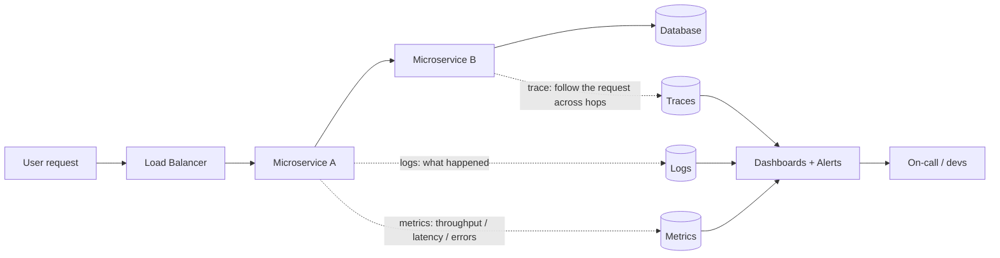
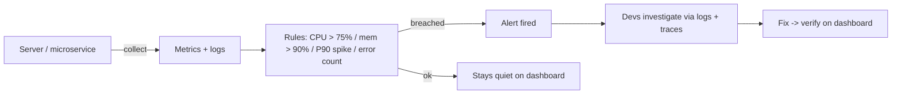

# Monitoring & Observability

The seventh component in the architecture walkthrough and the very last topic of the series — which tells you something. Once you've built the whole stack, you can't just walk away. This note covers why we monitor, the three pillars (logs, metrics, traces), the concrete metrics the lecture named with their thresholds, dashboards & alerting, and how monitoring is the eyes for everything we did in [fault tolerance](14-fault-tolerance.md).

## The story first — you can't fix what you can't see

The core argument for why monitoring exists is almost too obvious: if a server goes down and you don't know about it, your users know before you do. Every company story about a "bad day" starts the same way — a problem surfaced in production, customers complained, and the engineering team had to scramble to figure out what even happened.

So monitoring exists for three jobs:

- **Detect problems before users do** — an alert fires while it's still a metric crossing a line, not a Support ticket.
- **Debug after the fact** — when something *does* fail, you dig into logs and traces to find the root cause, not guess.
- **Post-incident analysis** — after things calm down, you reconstruct what happened so it doesn't repeat. The lecture called this out explicitly: can we do a root cause analysis (RCA) so developers can debug?

The lecturer frames the whole lifecycle as **developed -> deployed -> maintained**, and drops a line worth remembering in interviews: *"creating a product is entirely different from maintaining that product."* Most system design answers stop at the diagram; the maintenance phase is where the real failures live.

> Key takeaway: monitoring is what turns a "down" system from a fire into a routine ticket. The earlier you see the problem, the cheaper it is to fix.

## The maintenance checklist

When the lecture introduced monitoring, it wasn't with a diagram — it was with a checklist of questions you ask about your system *while it's running*:

- Are there errors present anywhere?
- Is every component fine — every server, every component, every database?
- Is the health of the servers / components / databases being watched?
- Are errors being recorded correctly?
- Do we have logs to track every customer request?
- Can we do a proper RCA so developers can debug?
- If a component goes down, do the other systems take over (failover)?
- Do we have a proper alert system?

That last two questions are the direct bridge to [fault tolerance](14-fault-tolerance.md) — we'll come back to it at the end. But notice the shape: monitoring is *not* one tool, it's a pipeline. Logs get written -> metrics get collected -> alerts get fired -> someone acts.

## The three pillars: logs, metrics, traces

The lecture's framing breaks observability into three kinds of signals, and it's worth keeping the names crisp because interviewers love this trio:

- **Logs** — the written record. Every customer request gets logged, every error gets its stack trace saved. Logs answer *"what exactly happened?"* When the lecture listed what to monitor, it included the **complete stack trace of an error** and the ability to reproduce the error locally — both need good logs.
- **Metrics** — the numbers. Throughput, latency, error counts, CPU and memory. Metrics answer *"is something wrong, and how bad?"* They're what you can put a threshold on and alert against.
- **Traces** — the journey of a single request as it hops between microservices. In the first lecture the architecture recap stretched from client -> API -> load balancer -> server -> database -> message queue; when anything in that chain is slow, a trace is how you see *which hop* is the problem.



## Metrics that matter — the API side

The lecture's example was a microservice, which does one of two things: handle the request itself, or redirect it to other microservices. So you monitor **both the API and the machine** running it. On the API side there were four things:

**1. Throughput.** How many requests a server can handle. Example given: a server rated for **10k requests/sec** — if you're already sitting at 9k or 8k, alert and migrate requests to other servers before you hit the ceiling.

**2. Error codes.** Track counts of **500s, 400s, 300s (redirects)** separately. Logs give you the material for RCA; you set a threshold — when errors past it, you get alerted, not discover it via complaints.

**3. Health check.** Two flavors, **passive** and **active** — constantly watching for the 200 OK response so a dead instance is caught fast. This is also the load balancer's job from the first lecture: "check whether our servers are healthy, and distribute requests equally."

**4. Latency — and here the lecture makes a point you should never forget.** Given 10 requests, the **average** latency came out at **~6.8 seconds**, which sounds terrible — but most requests actually completed much faster. Averages flatten the real story. This is why percentiles exist:

- **P50** = 50% of requests finish within this time. Example: 4 seconds.
- **P90** = 90% of requests finish within this time. Example: 12 seconds.
- On large systems you go deeper: **P70, P99, P99.9** and so on.

The gap between P50 = 4s and P90 = 12s is where you investigate — that means users at the tail are waiting 12 seconds even though the median is fine. Optimize the APIs hovering near the 12s mark, not the average. Latency is a [non-functional requirement](03-functional-vs-nonfunctional-requirements.md), and this is exactly the P95/P99-style thinking from that note showing up in practice.

## Metrics that matter — the machine side

The microservice runs on hardware, and hardware has its own signals with the thresholds the lecture gave:

- **CPU usage** — alert when it exceeds **75%** (or 70/90 depending on your system).
- **Memory usage** — at **90%** consumed, the (memory) database won't hold more; scale immediately or check for errors. This is the "out-of-memory" hardware fault from the fault-tolerance note knocking on the door.
- **Disk I/O operations** and **network** — set limits; when they're exceeded, alert.

```
        ┌─────────────────────────────┐
        │          CLIENTS            │
        └──────────────┬──────────────┘
                       │
        ┌──────────────▼──────────────┐
        │   API / LOAD BALANCER       │  health checks (200s), throughput,
        └──────────────┬──────────────┘  error codes (500/400/300), latency
                       │
        ┌──────────────▼──────────────┐
        │   MICROSERVICE SERVER       │  CPU    -> alert past 75%
        └──────────────┬──────────────┘  Memory -> alert past 90%
                       │                 Disk I/O, Network -> set limits
        ┌──────────────▼──────────────┐
        │         DATABASE            │  replication + failover watched too
        └─────────────────────────────┘
```

So monitoring is genuinely two-sided: the **API metrics** tell you the service is doing badly, the **machine metrics** tell you *why* (it's CPU-starved, or the disk is full).

## Dashboards & alerting

Metrics by themselves are just numbers sitting in a database. Two things make them useful:

- **Dashboards** — visual surfaces where the numbers live. If every metric is visible in one place, weirdness is spotted by eye before alarms go off.
- **Alerting** — thresholds that fire notifications. The lecture's examples: CPU past 75%, memory past 90%, throughput approaching the 10k ceiling, error-code counts past their threshold. And the latency one: if your P90 baseline is normally 12s and responses suddenly hit **50s**, that's an **unusual-behavior alert** — fire it and investigate.

The philosophy in one line: the goal is to be **alerted before customers complain**. That's the whole reason thresholds exist.



## The tooling

The lecture keeps the tool names generic — "monitoring tools and logs" — but the standard open-source stack you'll hear in any room where this is discussed is worth having on your tongue:

- **Prometheus** — the metric collection/scraping side of things, the thing that actually gathers and stores the numbers.
- **Grafana** — the dashboard layer drawn on top of the metrics; the pretty panels where CPU/throughput/latency charts live.
- **ELK-style logging** — Elasticsearch + Logstash + Kibana (or the EFK variant with Fluentd) — shoveling all your logs into one searchable place so the "complete stack trace" of an error is findable.
- **Tracing tools** — the ones that follow a request across microservice hops and tell you where the 12 seconds are actually being spent.

> Interview tip: the concepts matter more than the vendor names, but being able to say "metrics in Prometheus, dashboards in Grafana, logs searchable in an ELK stack, traces for the distributed path" shows you've touched the reality, not just the theory.

## Tying it back to fault tolerance

Remember the checklists earlier: "if a component is down, do other systems take over (failover)?" and "proper alert systems." That's the seam where monitoring and [fault tolerance](14-fault-tolerance.md) meet:

- Fault tolerance (redundancy, replication, failover) means the system *keeps working* when something dies — another server quietly takes the load.
- But if you had perfect redundancy, a dead server might fail **silently** — nothing breaks, so nobody looks. The fault is *hidden* by the failover.
- Monitoring is how you detect the fault anyway. In the fault-hierarchy note, hardware faults were called "mostly sudden" with "some control via alerts" — that control *is* this topic. Alerts are the one lever you get against random hardware death.

So the two halves form one story: **redundancy tolerates the fault, monitoring tells you it happened.** One more thread from the very first lecture's Component 7: monitoring also covers **feature regression** — the question of whether adding a new feature broke an old one, which is why there's a whole testing department around this. And the human-fault lesson ends with accountability: someone still has to sit down with the logs and stack traces and fix it — even the "AI-generated code" line of the lecture lands on humans being responsible. That's what the on-call engineer does.

In the [video-streaming capstone](17-case-study-video-streaming.md) the same instinct shows up: every component gets added for a reason and costs money — monitoring is the component you add so you can *see* whether the rest are earning their cost.

## Quick revision

- Monitoring = detect problems **before users do**, debug after the fact, and do RCA post-incident.
- Product lifecycle: developed -> deployed -> maintained — maintaining is a separate discipline from building.
- Three pillars: **logs** (what happened), **metrics** (how bad), **traces** (which hop). Remember the trio.
- API metrics: throughput (10k req/s ceiling), error codes (500/400/300), health checks (200s, passive + active), latency.
- Averages lie — use **percentiles** (P50/P90/P99.9); gap between P50 and P90 is where the tail pain hides.
- Machine metrics: CPU past 75%, memory past 90%, disk I/O and network limits -> alert.
- Alert BEFORE customers complain, and remember: **redundancy covers the fault, monitoring reveals it.**

## Interview questions

- A service's average latency looks fine but users still complain it's slow. What metric are you missing, and how would you investigate?
- Walk me through the three pillars of observability — when would you lean on one over the others?
- Your monitoring shows CPU at 90% and the P90 latency spiking from 12s to 50s. What's your alerting + response flow, and how does redundancy affect what you do?