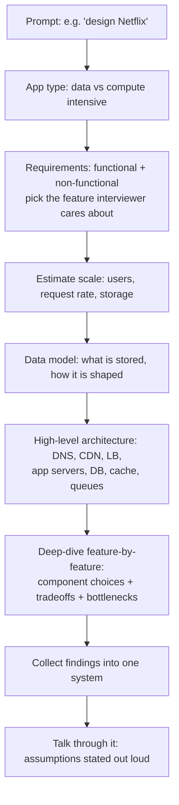
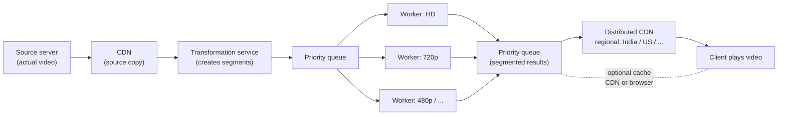

# Designing a System — The Interview Method

How do you actually *start* when the interviewer says "design Netflix"? This note is the method: what interviewers really evaluate, the exact step order that works for ANY prompt, and a video-streaming capstone that proves it. This is the note that ties every earlier note together — pure interview gold.

---

## What the interviewer is actually evaluating

- First thing to remember: **"No one is looking for the perfect solution."** Interviewers want to see **what tradeoffs you make** and **what components you use**.
- So what's on display is your **approach** — think out loud, state every decision specifically, and defend it.
- Knowing all the components does **not** mean using all of them. **Every component you add adds cost** to the system — each one must earn its place for the right reason. (noted for interviews!)
- Communication runs through all of it: talk while you design, pin the scope with the interviewer, and say assumptions/estimates out loud instead of doing silent math.

> **Interview point:** they are not grading one "correct" diagram — they're watching you reason, choose, and defend component by component.

---

## The method — same steps, every prompt

There's no different trick per company. One order of operations:

1. **Pick the app type first** — data-intensive or compute-intensive? That decision steers every later choice (databases, caching, processing). From [Data vs Compute intensive](./02-data-vs-compute-intensive.md).
2. **Jot down requirements** — functional and non-functional before drawing a single box. For a big-company prompt: **pick the one feature the interviewer cares about** and design *that*, feature by feature. From [Functional vs Non-functional requirements](./03-functional-vs-nonfunctional-requirements.md).
3. **Estimate scale** — users → request rate → storage. Rough math, spoken out loud; you're showing method, not calculator precision.
4. **Sketch the data model** — what actually gets stored, how it's shaped; SQL vs NoSQL instinct from the database notes: [SQL](07-sql-databases.md) / [NoSQL](08-nosql-databases.md).
5. **Walk the component checklist** — [the 7 components](./01-what-is-system-design.md): **DNS → CDN → load balancer → app servers → database → cache → message queues**. Add only what the requirements + estimates justify.
6. **Deep-dive feature-by-feature** — why *this* DB, *this* cache, *this* queue? State the tradeoff you're accepting and the bottlenecks at 10x load.
7. **Collect your findings into one system** — you designed piece by piece; now snap it together into the final diagram.



> Every step is spoken. Silent design teaches the interviewer nothing.

---

## Step zero: pin the requirements before anything

The method starts at "pick the app type," but the move that actually saves interviews happens before step 1 — **clarify and restate the requirement in front of the interviewer.** Techniques worth having loaded:

- **Restate aloud in your own words.** "So we're building a service where users can upload and watch short videos, videos are private and keyed to an account..." — mistakes in your mental model die in the first sixty seconds, not in the final diagram.
- **Separate functional from non-functional explicitly.** Functional = *what it does* (create account, upload video, play video). Non-functional = *how well* (latency < 200ms to first frame, 99.9% availability, scale to 100k concurrent viewers). State both as a checklist before a single box is drawn.
- **Ask the narrowing questions.** Which feature matters most to the product? Who are the users (internal tool vs millions of consumers)? Read/write ratio? Data size and growth? Each answer removes a branch of the design tree.
- **Turn answers into numbers you can estimate from.** Instead of "many users," get to **daily active users (DAU)** → peak concurrency → requests per second. A standard back-of-envelope: 5M DAU, ~10% active at peak → **500k concurrent users**; each doing 10 actions/min → **~83k req/s** across the fleet, **~830 req/s per server** over 100 servers — comfortably inside a sane order of magnitude.
- **State your interpretation out loud before proceeding.** You don't need the interviewer to confirm every word — but one "is it fair to assume X?" early on is worth ten compromises later.

---

## Walking the component checklist

The checklist comes from [What is System Design](./01-what-is-system-design.md) — run it top to bottom, but only *keep* what the earlier steps justify:

```
   incoming request
         |
       [DNS]          resolves where your system even lives
         |
       [CDN]          static content served close to the user
         |
   [Load Balancer]    spreads requests across app servers
         |
  +------------------+
  |  App servers xN  |   stateless -> scale horizontally
  +------------------+
         |
    [Database]  <-->  [Cache]     hot reads hit cache first
         |
  [Message Queue]     async, decoupling, deferred jobs
```

- The trap to avoid: memorizing the checklist and **dumping every box into every design**. DNS, cache, queue — each is a real cost line.
- Correct habit: requirements + estimate say *what's needed*, the checklist says *what's available*, you say *why this one*.
- When you add a box: "requirements demand it / estimate shows the load / tradeoff is acceptable." When you skip one: "requirements never mention it / estimate fits on one server / cost is greater than benefit right now." Be ready to give either answer.

---

## Estimating scale — the worked numbers

The rule: estimate **users → request rate → storage** out loud, with round numbers. The capstone gives the full worked example:

- Baseline fact from the streaming discussion: a **1-hour recording @ 30 fps ≈ 2 GB**.
- Capstone source: **50 GB, 20 minutes, 4K, 60 fps** (streaming an entire match).
- Segment count: **20 × 60 = 1,200 seconds → 1,200 one-second segments** (1 segment = 1 second).
- Per-resolution totals: **4K = 50 GB**, **1080p = 20 GB**.
- Per-segment sizes: **1080p = 20 GB / 1200 ≈ 16.6 MB**; **720p ≈ 8.3 MB**; **480p ≈ 4.17 MB**; **240p ≈ 2.08 MB**; 4K implied ≈ **41.7 MB**.
- All quality variants of one aligned segment set ≈ **72.65 MB** — the reaction: *"too huge"* → maybe subdivide into further segments.
- Users: **100 users → 87.5 GB → fits on ONE server**. Scale to **100,000 users** (10,000 also appears in the math) → one server is insufficient → split across more servers, **add message queues, add caching**.
- QPS anchor from the monitoring note: a server handling **10k req/s** is already alerting at 9k–8k and migrating load — that's the order of magnitude you talk in.

```
  rough ladder (spoken, not spreadsheet-ed)

  100 users      -> ~87.5 GB   -> 1 server is fine
  100,000 users  -> ???        -> many servers + MQ + cache

  50 GB / 20 min -> 20 x 60 = 1,200 one-second segments
  1080p segment  = 20 GB / 1200  ~ 16.6 MB
  all qualities  = ~72.65 MB per aligned set   ("too huge")
```

### The estimation cheatsheet (the numbers worth having cold)

You won't do decimal math on a whiteboard — you'll do *order of magnitude* math. Anchor versions of the common ones:

- **One modern app server** handles roughly **1k–10k req/s** for typical API/JSON work — the monitoring note's 10k figure is the optimistic ceiling, alerting near 80% of it.
- **QPS → concurrent connections:** if a request takes ~100ms and you get 10,000 req/s, you need roughly **10,000 × 0.1 = 1,000 in-flight connections** — one server holds that, but not with room to spare.
- **Users → QPS:** peak QPS ≈ **(DAU × actions per user per day) / seconds in the peak hour × a peak factor**. Round everything, and say the rounding out loud.
- **Requests → machines:** divide target QPS by per-server capacity, then **double it for redundancy** — the [fault tolerance](14-fault-tolerance.md) tax every production design pays.
- **Requests → storage:** 10k req/s each writing 1 KB is **~360 GB/hour** before replication — storage usually surprises people first, not compute.

> The point of estimating isn't the exact number — it's showing you can turn *users* into *machines, queues, and cache* before writing any architecture.

---

## Deep-dive: how to go deeper on one component

The middle of the interview tends to stall at "which DB?" — the trick is knowing *how* to go deep on whatever component the interviewer bites on:

- **Pick the component with the loudest failure mode.** If it's the database, drill on: data model, read/write ratio, index strategy, sharding key, replication (leader/follower vs quorum), backup/restore.
- **For a cache:** eviction policy (LRU/LFU/TTL), where it sits (client / CDN / app / DB-facing), write-through vs write-back, and what happens on a cache stampede when a hot key expires.
- **For a message queue:** producer/consumer model, ordering guarantees, at-least-once vs exactly-once, dead-letter queue, backpressure — the [message queues](13-message-queues.md) note has all of it.
- **For a load balancer:** round-robin vs least-connections vs consistent hashing, health checks (passive + active), and session-stickiness consequences.
- **Pattern to follow:** state the choice → give the alternative → say why the alternative loses here → describe the failure mode you're accepting → say what you'd change at 10x load. That five-move cadence reads as seniority even when the answer is simple.

---

## Worked example: applying it to the capstone

**Scope first (step 2 in action).** For the demo, write down one scoped requirement: **how a video travels from server/source to client** — and explicitly ignore login, reviews, ratings. That's the clarifying question doing its job: one feature, designed fully, then assembled.

**Feature-by-feature (steps 4–6 in action):**

- Video = collection of images + audio; **30 fps** = 30 images/sec; 1-hour @ 30fps ≈ **2 GB**.
- Full-download-first is rejected: latency before the first frame, and wasted internet/storage if the user leaves after 10 seconds.
- **TCP** because images/video need sequencing; on top of it **RTMP** (Real-Time Messaging Protocol) and **RTSP** (Real-Time Streaming Protocol).
- Video split into **segments**; the **client pulls them one by one**, paced by the network — deliberately connect this to the **pull/push callbacks** from the [message queues](13-message-queues.md) note.
- **Adaptive Bitrate (ABR):** each segment is transcoded into multiple quality variants. Walkthrough: start at **300 Mbps** on 4K → network drops to **10 Mbps** → pull 480p → back to **150 Mbps** → 1080p → drops to **50 Mbps** → 720p → restores to **300** → final segment back to 4K.
- Decision rule: **throughput > bitrate of downloaded segment → switch quality UP; throughput < bitrate → switch DOWN.** The "auto" quality picker is just this orchestration — exactly how YouTube behaves.

**Assemble into one system (step 7):**



- One worker per target quality — worker 1 downgrades to HD, worker 2 to 720p, and so on.
- Regional CDN: India users hit the India server, US users hit the US server.
- Optional caching noted at CDN level or browser level to hold upcoming segments.
- A rhetorical interview prompt to pocket: **"why a *priority* queue — answer yourself."**
- Capacity check from the math above: 100 users = 87.5 GB on one box; 100,000 = the multi-server + queue + cache design you're now looking at.

---

## Communication advice (the part people skip)

- **Talk while you design.** Think out loud; state decisions specifically — "I'm adding a load balancer *because* my estimate says one app server dies at this request rate."
- **Ask clarifying questions first.** Scope kills more designs than ignorance: which feature? which users? what scale? The Netflix move — pick the feature the interviewer cares about — is that question in action.
- **State assumptions and estimates out loud.** "Assume 100k users, roughly 87.5 GB per 100..." — rough is fine, silent is not.
- **Defend trade-offs, don't hunt perfection.** You'll be wrong sometimes; no one is looking for perfect. They want the *why*.

> "No one is looking for the perfect solution — everyone is looking at what tradeoffs you make and what components you use."
> "Every component you add will add the costing of your system — use components for the right reasons."

---

## The toolbox you're drawing from

The recap is basically the list you should have loaded before the interview — each topic feeds some step of the method:

- What system design is **+ its components** → step 5's checklist ([note 01](./01-what-is-system-design.md)).
- **Data-intensive vs compute-intensive** → step 1 ([note 02](./02-data-vs-compute-intensive.md)).
- **Functional vs non-functional requirements** → step 2 ([note 03](./03-functional-vs-nonfunctional-requirements.md)).
- **DNS, APIs, REST APIs** → how the front door of your architecture works.
- **SQL vs NoSQL** → step 4, the data model choice.
- **Cache** (eviction strategies, what to store) and **load balancing** (mediator between incoming requests and servers) → checklist boxes you must justify.
- **Replication & partitioning**, then the **CAP theorem** — "the most important theorem you'll cover in each and every interview."
- **Message queues**, **fault tolerance**, **monitoring & observability** → the deep-dive and bottleneck conversation.
- Conclusion: with this foundation you're "ready to give any interview or design any system."

---

## Before you walk in

- Your diagram will differ from other candidates' — and that's fine. **"The more you practice, the more you see other designs, the more you read papers — your designs are going to improve."**
- Rehearse the method on old prompts from these notes: app type → requirements → estimate → data model → checklist → deep-dive → assemble, narrated the whole way.
- Know your numbers well enough to say them without pausing — the estimation section above is the template.

---

## Quick revision

- Interviewers want **tradeoffs + component choices**, not a perfect solution — think out loud the entire time.
- One method for every prompt: **app type → requirements → estimate → data model → component checklist → deep-dive → assemble**.
- Step zero: **restate + scope the one feature** the interviewer cares about; design feature-by-feature, then snap into one system.
- **Every component adds cost** — justify each box, and be ready to say why you *skipped* one.
- Estimation out loud: **100 users → 87.5 GB → 1 server; 100,000 users → multi-server + queues + cache**. One server ≈ 1k–10k req/s; double capacity for redundancy.
- Capstone math: **20 min × 60 = 1,200 one-second segments**; 1080p segment ≈ **16.6 MB**; all variants ≈ **72.65 MB** per aligned set.
- ABR rule: **throughput > bitrate → switch up; throughput < bitrate → switch down**.

## Interview questions

1. I say "design a video-streaming app" — walk me through your first three moves in order, and explain why each one comes before drawing any boxes.
2. A candidate adds DNS, a CDN, a cache, and a message queue to a design that serves 100 users. Using the method from this note, what went wrong, and what does the estimation actually justify?
3. Using the capstone numbers: how do you get from 50 GB / 20 min / 4K to 1,200 segments and ~16.6 MB per 1080p segment — and what changes in the architecture when users go from 100 to 100,000?