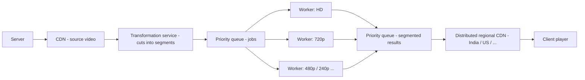
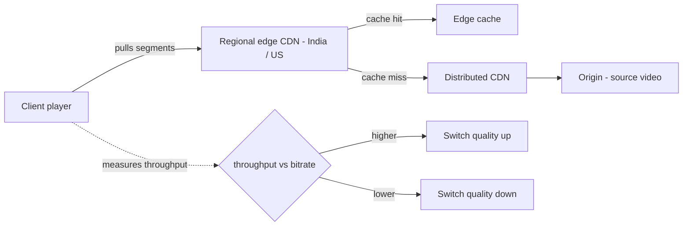

# Case study: designing a video streaming platform

The capstone — we take every tool from these notes and design a YouTube/Netflix-style streaming service, step by step, the way an interviewer would actually ask for it. This note is the full walkthrough: requirements, math, architecture, trade-offs. Interview gold if you can think it out loud.

## The interview frame first

Before drawing boxes, the method (straight from [16 - designing a system in an interview](16-designing-a-system-interview.md)):

- **Think out loud.** State decisions specifically. "No one is looking for the perfect solution" — the interviewer wants to hear **tradeoffs** and **component choices**.
- **Every component must earn its place.** Knowing all components does not mean using all of them — every component adds cost to the system.
- **Requirements first, feature by feature.** For a Netflix-style prompt: pick the one feature the interviewer cares about, design that feature, then the next, then collect the findings into one system.
- **Scope hard for the demo.** The design only covers how a video travels from server/source to client — login, reviews, ratings are explicitly ignored.

> Interview point: you are being scored on reasoning, not a perfect diagram. A few cheap, justified components beat a kitchen-sink architecture every time.

---

## What we are building

**Functional (as framed in the walkthrough):**

- Client streams a video from server to client **without downloading the whole thing first**.
- Video is split into **segments**; the client pulls them one by one, paced by the network.
- Quality is selectable — the picker offers **auto / HD / 720p / 480p** — and "auto" runs the ABR orchestration.
- Uploaded videos get **transcoded into multiple quality variants** before anyone can watch.

**Non-functional (pulled from what the walkthrough cares about):**

- **Low latency** — playback starts fast, no waiting on a 2 GB download.
- **Survive fluctuating bandwidth** — networks are never constant; buffering makes users leave the app.
- **Scale** — one server holds at 100 users; the design must stretch to 10,000 / 100,000.
- **Device-appropriate quality** — every screen gets a sensible resolution rung (ladder below).

---

## Video 101 and why download-first fails

- A video = collection of **images + audio**. FPS = images per second: 30 or 60 common (120/240 exist). **30 fps = 30 images every second** — 60 fps is larger but smoother. We stick with 30 fps.
- Baseline size: **1-hour recording @ 30 fps ≈ 2 GB**.
- Download-the-whole-thing first? Terrible idea:
  - 2 GB down the wire before the first frame → huge **latency**.
  - Viewer may watch only the **first 10 seconds** and dislike it → wasted internet + wasted storage.
  - Need a different approach: play while you fetch.

```
download-first                        segment pull (what we actually do)
[=========== 2 GB ===========] play   [1s][1s][1s][1s]...  pull as network allows
wait ~~~~~~~~~~~~▶                    play ▶  ▶  ▶   quality flexes live
```

---

## Segments, protocols, and the pull model

- Use **TCP** — image/video processing needs correct **sequence**, and TCP guarantees ordering.
- Two protocols ride on top: **RTMP** (Real-Time Messaging Protocol) and **RTSP** (Real-Time Streaming Protocol).
- Video is divided into **segments/chunks**; the client **pulls** segments one by one, paced by the network. The dots connect deliberately to **pull vs push** in [message queues](13-message-queues.md) (noted for interviews!).
- Benefits: **low latency**, no full download; some segments can be **pre-downloaded** so scrubbing feels instant.

---

## The resolution ladder

- Rungs: **4K → HD / 1080p → 720p → 480p → 240p → 144p** (even 64p gets floated, unsure).
- Size is content-dependent — same "1 hour of 4K" walks **2 GB → 4 GB (multi-cam) → 8 GB → 16 GB (outdoor/action sequence)**.
- Per-second rates: **~0.57 MB/s** at 2 GB/hr vs **~4 MB/s** at 16 GB/hr — on a poor network that means **buffering**, and buffering means users quit.
- Devices pick rungs: **watch → 480p; iPad → HD; mobile → HD; laptop → HD or 4K; TV → 4K, no compromise**.
- Networks fluctuate — there is **no constant bandwidth**. That is the problem ABR solves next.

---

## The two paths

Everything downstream splits into two flows (back to [data-intensive vs compute-intensive](02-data-vs-compute-intensive.md)):

- **Upload / processing path** — segmenting + transcoding into every quality: pure **compute-intensive** work. Heavy CPU, happens once per video, before anyone watches.
- **Watch / serving path** — delivering segments to millions of clients: pure **data-intensive** work. Bandwidth, storage, and caching dominate.

---

## Capacity math (the worked numbers)

Baseline storage:

- **1 hour @ 30 fps ≈ 2 GB**; a 4K hour swings **2 → 4 → 8 → 16 GB** with content type.

The capstone example — streaming an entire match:

- Source: **50 GB, 20 minutes, 4K, 60 fps**.
- 20 x 60 = **1,200 seconds** → **1,200 segments** (1 segment = 1 second).
- Full totals per resolution: **4K = 50 GB**, **1080p = 20 GB**.
- One segment at each rung:
  - **4K ≈ 41.7 MB** (implied from the 50 GB total)
  - **1080p = 16.6 MB** (20 GB / 1200)
  - **720p = 8.3 MB**
  - **480p = 4.17 MB**
  - **240p = 2.08 MB**
- One aligned second across **all** resolutions ≈ **72.65 MB** — the reaction: *"too huge I feel — maybe divide into further segments."*
- Users: **100 users → 87.5 GB → fits on a single server**. Push toward **100,000 users** (10,000 also appears in the math) → one server insufficient → **split across more servers, add message queues, add caching**.

A sanity check that ties the numbers together: **50 GB over 20 minutes** = **400 Gb, over 1200 seconds ≈ 333 Mbps** — right in the neighborhood of the **300 Mbps** ABR ceiling used later. The math is self-consistent: the source bitrate literally sets the top rung of the ladder.

> Interview point: do this math live on the whiteboard — segment count, per-quality sizes, then multiply by audience. That is the whole estimation drill.

---

## ABR ladder: why every bitrate exists

Each rung is not a different file — it's the **same 1-second segment transcoded into multiple bitrates**, and the set of all rungs for one second is the **72.65 MB** aligned bundle:

- **The ladder is per segment, not per video.** The entire 20-minute match exists at 4K, 1080p, 720p, 480p, and 240p simultaneously; the client downloads only the next 1-second segment at whichever rung fits the network right now.
- **Manifest + media segments.** Delivery pairs a tiny **manifest** (a playlist describing every rung and segment URL) with the **media segments** themselves. The client reads the manifest once, then fetches segments — that's how the player knows 480p of segment 12 exists before it asks for it.
- **Bitrate rule of thumb:** a rung's bitrate ≈ **(segment size × 8 bits) / segment duration** — a 16.6 MB 1080p segment over 1 second is ≈ **133 Mbps**. Lower rungs shrink both size and network requirement proportionally.
- **Segment duration is a tradeoff.** 1-second segments give the fastest reaction to network changes but multiply manifest/fetch overhead; the 4–10s segments common in DASH/HLS are kinder to the CDN at the cost of slower quality switches. For live content, short segments also mean less latency to the first frame.

---

## DASH vs HLS (the real-world spell-out)

The generic "segments + ladder + pull" design maps onto the two formats you'll actually hear named:

- **HLS (HTTP Live Streaming)** — Apple's format: the manifest is an **.m3u8 playlist**, segments are typically **.ts (MPEG-TS)** or fMP4 files, delivered over plain HTTP. Works natively on iOS/Safari and is effectively universal now.
- **DASH (Dynamic Adaptive Streaming over HTTP)** — the MPEG standard: the manifest is an **.mpd** file, segments are fMP4, codec-independent. Preferred when you want vendor neutrality and cross-device consistency.
- **Both do the same job this design does:** server-side ladder, client-side pull, manifest first. The ABR math (throughput vs bitrate) is protocol-agnostic. Neither needs RTMP/RTSP anymore — they all ride on HTTP + TCP, which is why the earlier protocol pair reads as legacy in production.

---

## Upload path: segment, transcode, ship

The final architecture, component by component:

- **Server → CDN** holds the actual **source video**.
- **Transformation service** cuts the source into **segments**.
- **Priority message queue #1** carries the segmentation jobs. Why a *priority* queue? Answer yourself — that's the interview prompt.
- **Workers** — one worker per target quality: worker 1 transcodes down to HD, worker 2 to 720p, and so on.
- **Priority message queue #2** holds the finished segmented results (again priority).
- **Distributed / regional CDN** — India users hit the India server, US users hit the US server.
- **Client** machine plays the segments.

Optional, noted but not fully wired in: **caching** at CDN level or browser level to hold **upcoming segments** → [caching notes](09-caching.md).



This whole side is **compute-intensive**: transcoding runs once per upload across every worker, then the results become storage + data for the watch side.

---

## Adaptive Bitrate: the client fights the network

- Source video is split into segments, and **each segment is transcoded into multiple quality variants** — every second of a video exists at every rung.
- The client **measures its throughput** while pulling segments and follows one rule:
  - **throughput > bitrate of the downloaded segment → switch quality UP**
  - **throughput < bitrate → switch quality DOWN**
- The walkthrough — exactly how YouTube and other streamers behave:

```
network:   300 Mbps       10 Mbps     300/150 Mbps     50 Mbps      300 Mbps
              |              |              |              |             |
quality:      4K           480p           1080p          720p           4K
segment:    1, 2            ...            ...           ...        final one

rule:  throughput < bitrate => DOWN        throughput > bitrate => UP
```

- Client starts at **300 Mbps** → plays 4K segments 1-2; network drops to **10 Mbps** → pulls data at **480p**; network returns to **300/150 Mbps** → switches up to **1080p**; drops to **50 Mbps** → **720p**; restores to **300 Mbps** → final segment back to **4K**.
- The quality picker (**auto / HD / 720p / 480p**) is just the UI over this — **"auto"** runs the orchestration.
- Real-world players add **buffer-aware logic** on top of raw throughput: if the playout buffer is draining, downgrade preemptively; if it's full, stay or upgrade. Pure "throughput right now" decisions oscillate, so a little **hysteresis** (don't switch unless the headroom persists a few segments) keeps quality stable instead of flapping between rungs.

---

## CDN, edge caching, and origin shielding

The CDN in this design is doing three distinct jobs, worth being able to talk about separately:

- **Edge caching** — popular segments get copied to the edge near users, so a repeat viewer in India never touches the origin for the same segment again. The cache-miss path is the first serious latency hit: a miss means the edge fetches from origin, which is why the *second* viewer of a hot video is the one who pays for its popularity.
- **Origin shielding** — edge caches sit *in front of* the origin so a herd of simultaneous misses (a "thundering herd" on a live match) collapses at the shield layer instead of hammering the source server. Same stampede-protection idea as the [cache](09-caching.md) note, applied at delivery scale.
- **Regional distribution** — geo-routing: India users → India PoP, US users → US PoP. Combined with TCP ordering and pull pacing, a viewer mostly talks to a server a few hundred kilometers away — which is what makes **low first-frame latency** actually reachable.
- **Cost shape:** storage is cheap, the *network path* is what you pay for — caching hot segments at the edge is not just a latency fix, it's the biggest cost reducer in the whole design.

---

## Watch path: serving the crowd

- The client pulls segments from the **nearest regional CDN** — India users → India server, US users → US server.
- **CDN edge caching** for popular content plus **browser cache** for upcoming segments → fewer origin fetches, smoother scrubbing → [caching](09-caching.md).
- Growth story from the math: at **100,000 users** a single server is out → **split across more servers**, add **message queues**, add **caching**. The earlier MQ analysis lands here: an MQ holds requests and hands them to servers — *"MQ does everything a load balancer does"* → [load balancing](10-load-balancing.md), [message queues](13-message-queues.md).
- Pull pacing and the queue-based job flow are the same pull/queue mechanics from [13 - message queues](13-message-queues.md).



What stays deliberately out of scope: the design ends at the delivery path (video server → client) — **login, reviews, ratings ignored**. The rest of a full product (metadata store, replication, fault handling, monitoring — [SQL](07-sql-databases.md) / [NoSQL](08-nosql-databases.md), [replication & partitioning](11-replication-and-partitioning.md), [fault tolerance](14-fault-tolerance.md), [monitoring & observability](15-monitoring-and-observability.md)) belongs to the component notes. Justify that scoping out loud in an interview: every component adds cost.

---

## Trade-offs in the design

- **What to cache:** upcoming segments — at the **CDN edge** and in the **browser** — so playback never waits on the origin.
- **ABR vs fixed quality:** fixed 4K means ~4 MB/s bursts → buffering on bad networks → users leave; fixed low quality wastes good screens (a TV deserves 4K). ABR costs **pre-transcoded storage** — every aligned second across all rungs is ~72.65 MB, *"too huge"* — but keeps playback smooth at any bandwidth.
- **Storage vs compute spend:** transcoding is **compute** paid once per upload (transformation service, priority queues, one worker per quality); every stored variant is **storage** paid forever (**50 GB** at 4K alone for one 20-minute match; **87.5 GB** on the 100-user figure). Scaling to **100,000** means more servers, queues, and cache — more cost, so every component must be justified.
- **Design quality is practiced, not memorized:** *"the more you practice, the more you see other designs, the more you read papers — your designs are going to improve."* Your diagram will differ from someone else's — that's fine.

> Every component you add will add the costing of your system — use components for the right reasons.

---

## Quick revision

- Method: think out loud, requirements first, tradeoffs over perfection — every component adds cost.
- Scope: video server → client only; login, reviews, ratings ignored.
- 1 hr @ 30 fps ≈ 2 GB; match source = 50 GB / 20 min / 4K / 60 fps → **1,200 one-second segments**.
- Segment sizes: 4K ≈ 41.7 MB, 1080p 16.6 MB, 720p 8.3 MB, 480p 4.17 MB, 240p 2.08 MB; all rungs for one aligned second ≈ 72.65 MB.
- ABR rule: **throughput > bitrate → up, throughput < bitrate → down** (the 300 → 10 → 150 → 50 → 300 Mbps walkthrough).
- Upload path = compute (source → segmenter → priority queue → per-quality workers → queue → regional CDN); watch path = data (edge cache + client pull).
- 100 users → 87.5 GB on one server; 100,000 users → more servers + message queues + caching.

## Interview questions

1. Walk me through how a video travels from upload to a viewer's screen — where is the compute, where is the data, and why does each message queue exist?
2. A viewer's bandwidth swings from 300 Mbps to 10 Mbps mid-video — what does the client do, what rule does it apply, and what had to be built beforehand for that to work?
3. We need to support 100,000 concurrent viewers on this design — do the capacity math, name the first component that breaks, and say what you would add and what it costs.